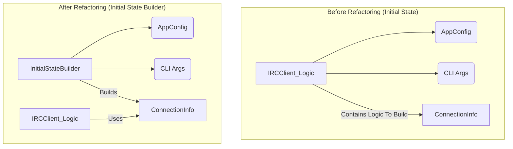

# PyRC Modularization Plan

This document outlines a detailed plan for further modularizing the PyRC application, focusing on unifying the command system and extracting initial state creation logic.

## Phase 1: Unifying the Command System

**Goal:** Refactor the command registration and handling logic so that `CommandHandler` becomes the single source of truth for all core and script-based commands.

### Mermaid Diagram: Before and After

```mermaid
graph TD
    subgraph "Before Refactoring (Command System)"
        A[IRCClient_Logic] --> B[ScriptManager]
        A --> C[CommandHandler]
        B -- Registers Script Commands --> D[ScriptManager.registered_commands]
        B -- Registers Script Aliases --> E[ScriptManager.command_aliases]
        C -- Discovers Core Commands --> F[CommandHandler.command_map]
        C -- Asks ScriptManager for Script Commands --> B
        G[ScriptAPIHandler] -- Calls --> B
    end

    subgraph "After Refactoring (Unified Command System)"
        H[IRCClient_Logic] --> I[CommandHandler]
        H --> J[ScriptManager]
        I -- Holds ALL Commands --> K[CommandHandler.command_map (Core + Script)]
        I -- Holds ALL Aliases --> L[CommandHandler.script_command_aliases (Unified)]
        M[ScriptAPIHandler] -- Calls --> I
        J -- Delegates Registration --> I
    end
```

### Steps for Phase 1:

1.  **Enhance `pyrc_core/commands/command_handler.py`**:

    - **Modify `__init__`**: Ensure `self.script_commands` and `self.script_command_aliases` are properly initialized. (Already present).
    - **Modify `register_script_command`**: This method already exists and correctly populates `self.script_commands` and `self.script_command_aliases`. No major changes needed here.
    - **Modify `process_user_command`**: The current logic of checking `self.command_map` then calling `self.get_script_command_handler(cmd)` is appropriate, as `get_script_command_handler` will now directly access `CommandHandler`'s internal script command registry.
    - **Move and Update Help Methods**:
      - Move the method `get_help_text_for_command` from `pyrc_core/script_manager.py` to `pyrc_core/commands/command_handler.py`.
      - Update the moved method to source help data from `self.command_map` (for core commands) and `self.script_commands` (for script commands). It should also check the `self.ini_help_texts` as a fallback.
      - Move the method `get_all_script_commands_with_help` from `pyrc_core/script_manager.py` to `pyrc_core/commands/command_handler.py` and rename it to `get_all_commands_with_help`. Modify it to return a comprehensive dictionary of all commands (core and script) grouped by their category or script name.

2.  **Update `pyrc_core/scripting/script_api_handler.py`**:

    - **Modify `register_command`**: Confirm that it calls `self.client_logic.command_handler.register_script_command`. (Already confirmed, no change needed).
    - **Remove `register_help_text`**: This method is already marked as deprecated. Remove its implementation and the method itself for a cleaner refactor.
    - **Modify `get_script_commands`**: Confirm it retrieves commands from `self.client_logic.command_handler.script_commands`. (Already confirmed, no change needed).

3.  **Clean up `pyrc_core/script_manager.py`**:
    - **Remove Attributes**:
      - `self.registered_commands`
      - `self.command_aliases`
      - `self.registered_help_texts`
    - **Remove Methods**:
      - `register_command_from_script`
      - `register_help_text_from_script`
      - `get_help_text_for_command`
      - `get_all_script_commands_with_help`
      - `get_script_command_handler_and_data`
    - **Update `load_scripts`**: Ensure that the `ScriptAPIHandler` initialization within `load_scripts` correctly passes `self.client_logic_ref.command_handler` for command registration, and that `ScriptManager` no longer attempts to store command information itself.

## Phase 2: Extract Initial State Creation

**Goal:** Isolate the logic for building the initial `ConnectionInfo` into a dedicated `InitialStateBuilder` class.

### Mermaid Diagram: Before and After



### Steps for Phase 2:

1.  **Create `pyrc_core/client/initial_state_builder.py` (New File)**:

    - Define a new class `InitialStateBuilder`.
    - Its `__init__` should take `config: AppConfig` and `args: argparse.Namespace` as parameters.
    - Implement a method `build() -> Optional[ConnectionInfo]`.
    - **Cut** the logic for creating the `active_config_for_initial_state` and the final `conn_info` object from `IRCClient_Logic._create_initial_state` and **paste** it into this `build()` method.
    - The `build()` method should return the created `ConnectionInfo` object. It should not perform any validation itself; that is the `StateManager`'s job.
    - Add necessary imports (e.g., `logging`, `AppConfig`, `ConnectionInfo`, `ServerConfig`, `asdict`, `Optional`, `Any`, `Set`, `ChannelJoinStatus`).

2.  **Integrate `InitialStateBuilder` into `pyrc_core/client/irc_client_logic.py`**:
    - Delete the `_create_initial_state` method.
    - In the `__init__` method:
      - Import `InitialStateBuilder`.
      - Instantiate the builder: `state_builder = InitialStateBuilder(self.config, self.args)`.
      - Call the builder: `conn_info = state_builder.build()`.
      - Pass this `conn_info` to `self.state_manager.set_connection_info()`.
      - Keep the existing logic for creating initial contexts (`Status`, `DCC`, channels) and setting `pending_initial_joins` within `IRCClient_Logic.__init__`, using the `conn_info` object received from the builder.
