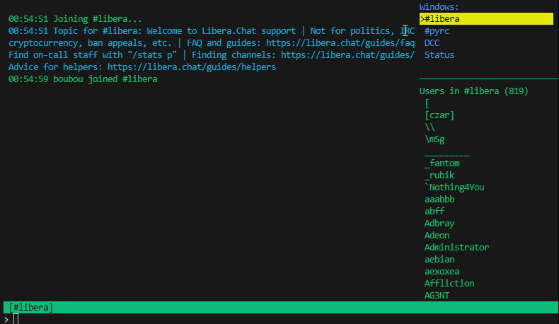

# PyRC - Python Terminal IRC Client

PyRC is a modern, terminal-based IRC (Internet Relay Chat) client written in Python. It provides a feature-rich, lightweight, and user-friendly experience for IRC users who prefer the command line. With a focus on extreme modularity and stability, PyRC enables both traditional IRC usage and programmatic integration with AI agents or other automated systems.



## Key Architectural Features

- **Modular Core (`pyrc_core`):** All core logic is encapsulated within the `pyrc_core` package, separating it from scripts and configuration.
- **Component-Based Design:** The client is broken down into distinct manager components (`StateManager`, `NetworkHandler`, `CommandHandler`, `UIManager`, `ScriptManager`, etc.), each with a single responsibility. `IRCClient_Logic` acts as a high-level orchestrator.
- **Centralized State Management with `StateManager`**

The `StateManager` provides thread-safe, persistent session state that includes:
- Current connection details and authentication state
- List of joined channels and their topics
- User preferences and client settings
- Message history and scrollback positions

State is automatically persisted to disk and restored on startup, ensuring a seamless experience across client restarts.
- **Dynamic Command System:** All core client commands are implemented in individual Python modules within a structured `commands/` directory. They are dynamically discovered and registered at startup, making the client easily extensible.
- **Extensible Scripting System:** A powerful Python scripting system allows for deep customization. Scripts can register commands, subscribe to a wide range of events, and interact with the client through a rich `ScriptAPIHandler`.

PyRC/
├── pyrc.py # Main application entry point.
├── pyterm_irc_config.ini # Main configuration file.
│
├── pyrc_core/ # Core application package.
│ ├── **init**.py
│ ├── app_config.py # Handles loading and saving of all INI configuration values.
│ ├── context_manager.py # Manages windows/contexts (channels, queries, status).
│ ├── event_manager.py # Dispatches events to the scripting system.
│ ├── state_manager.py # Centralized, persistent state management for the client.
│ │
│ ├── client/ # Client-side logic and UI components.
│ │ ├── **init**.py
│ │ ├── input_handler.py # Processes keyboard input, command history, and tab completion.
│ │ ├── irc_client_logic.py # Main orchestrator class, initializes and coordinates all managers.
│ │ ├── state_change_ui_handler.py # Updates the UI in response to state changes.
│ │ └── ui_manager.py # Manages the curses-based text user interface.
│ │
│ ├── commands/ # All built-in command implementations, dynamically loaded.
│ │ ├── channel/ # Commands for channel operations (/join, /part, /kick, etc.).
│ │ ├── core/ # Essential client commands (/help).
│ │ ├── dcc/ # DCC subcommands (/dcc send, /dcc list, etc.).
│ │ ├── information/ # Commands for getting information (/who, /whois, etc.).
│ │ ├── server/ # Commands for server connection (/connect, /quit, etc.).
│ │ ├── ui/ # Commands for controlling the UI (/window, /split, etc.).
│ │ └── user/ # Commands for user interaction (/msg, /query, /ignore, etc.).
│ │
│ ├── dcc/ # DCC (Direct Client-to-Client) feature implementation.
│ │ ├── dcc_manager.py # Main orchestrator for all DCC functionality.
│ │ ├── dcc_protocol.py # Parses and formats DCC CTCP messages.
│ │ ├── dcc_transfer.py # Base classes for DCC send/receive transfer logic.
│ │ └── ... # Other DCC helper and manager modules.
│ │
│ ├── features/ # Self-contained, optional features.
│ │ └── triggers/ # Implementation of the /on command trigger system.
│ │ ├── trigger_commands.py
│ │ └── trigger_manager.py
│ │
│ ├── irc/ # IRC protocol logic and message handling.
│ │ ├── **init**.py
│ │ ├── cap_negotiator.py # Handles IRCv3 capability negotiation.
│ │ ├── irc_message.py # Parses raw IRC lines into structured message objects.
│ │ ├── irc_protocol.py # Main dispatcher for incoming server messages.
│ │ ├── registration_handler.py # Manages the NICK/USER registration sequence.
│ │ ├── sasl_authenticator.py # Handles SASL PLAIN authentication.
│ │ └── handlers/ # Specific handlers for different IRC commands/numerics.
│ │ ├── membership_handlers.py
│ │ ├── message_handlers.py
│ │ └── ...
│ │
│ ├── logging/ # Logging-specific components.
│ │ └── channel_logger.py # Manages per-channel and status window log files.
│ │
│ ├── scripting/ # The Python scripting engine.
│ │ ├── **init**.py
│ │ ├── script_api_handler.py # Provides the `api` object for scripts to interact with the client.
│ │ ├── script_base.py # A base class for scripts to inherit from.
│ │ └── script_manager.py # Discovers, loads, and manages all user scripts.
│ │
│ └── network_handler.py # Manages the raw socket connection, sending, and receiving data.
│
├── scripts/ # Directory for user-provided Python scripts.
│ ├── default_fun_commands.py # Example script with fun commands like /slap, /dice.
│ └── ...
│
├── config/ # Directory for runtime-generated configuration files.
│ └── triggers.json # Stores persistent user-defined triggers.
│
├── data/ # Directory for static data files used by scripts or core.
│ └── default_help/
│ └── command_help.ini # Fallback help texts for core commands.
│
└── logs/ # Default directory for all log files (auto-created).
├── pyrc_core.log # Main application log.
└── dcc.log # Dedicated log for DCC events.

## Project Status

**PyRC is a stable and mature IRC client** that continues to evolve with regular updates and improvements. The current focus is on enhancing stability, improving the user experience, and maintaining compatibility with modern IRC networks. Recent development has focused on robust state management, reliable session persistence, and improved IRCv3 support. We welcome contributions and feedback to help make PyRC even better.

## Recent Changes

### Bug Fixes and Stability Improvements

- **Improved UI Startup Flow:** Fixed an issue where the client would not automatically switch to an auto-joined channel on startup. The UI now reliably starts in the "Status" window and switches focus only after successful channel join.
- **Enhanced Session Persistence:** Resolved a bug where the list of joined channels was not being correctly restored from the session state file, ensuring a consistent experience across restarts.
- **Robust IRCv3 Support:** Improved message parsing for modern IRC servers, fixing issues with IRCv3 message tags and capability negotiation.
- **Reliable State Management:** Fixed an `AttributeError` in the capability negotiator and improved overall state handling for more stable connections.

**UI Improvements:**

- Updated sidebar color scheme with darker backgrounds (black) and cyan/green text for better readability
- Fixed background color application in context list items
- Improved full-width background coloring in sidebar

**State Management:**

- Migrated nick attribute access to use state manager
- Added comprehensive null checks for client and connection info
- Implemented fallback to "UnknownNick" for all error cases
- Enhanced state restoration to reliably maintain joined channels across sessions

**Error Handling:**

- Improved error handling for UI drawing operations
- Added defensive programming for curses window operations
- Resolved all Pylance type checking errors
- Added comprehensive error handling for IRC message parsing and capability negotiation

**Other Recent Work:**

- DCC functionality (port range selection, advertised IP configuration, transfer cleanup)
- Robust event-driven `/server` command
- Enhanced `/help` system
- Reliable headless testing framework

## Key Features

- **Text-based UI:** Clean and navigable interface using the Python `curses` library (optional for headless operation).
- **Split-Screen Support:** Horizontal split-screen mode with independent scrolling and context management for each pane.
- **Multi-Server Configuration & Switching:**
  - Define multiple server connection profiles in `pyterm_irc_config.ini`.
  - Switch between configured servers using the `/server <config_name>` command (now with event-driven disconnect handling).
- **Channel and Query Windows:** Separate, consistently managed contexts for channels (case-insensitive handling) and private messages.
- **Intuitive UI Flow:** The client starts in the "Status" window and reliably switches to the first auto-joined channel upon successful connection and join, providing a smooth and predictable startup experience.
- **IRCv3 Support:**
  - Robust CAP negotiation (including `sasl`, `multi-prefix`, `server-time`, `message-tags`, `account-tag`, `echo-message`, `away-notify`, `chghost`, `userhost-in-names`, `cap-notify`, `extended-join`, `account-notify`, `invite-notify`) with improved error handling and stability.
  - SASL PLAIN authentication for secure login.
  - Reliable IRCv3 Message Tag parsing that handles modern IRC server messages with enhanced compatibility and robustness.
- **Highly Modular Command System:** _All_ core client commands are implemented in individual Python modules within a structured `commands/` directory. These are dynamically discovered and registered at startup. Each command module defines its handler(s), help text (usage, description, supporting dictionary format for richer help), and aliases.
- **Dynamic & Categorized Help System:** The `/help` system is fully dynamic, sourcing information from core command modules and script registrations. It now displays categories first, allowing users to drill down via `/help <category>` or `/help script <script_name>`. Specific command help (`/help <command>`) provides detailed usage, description, and aliases.
- **Comprehensive Command Set:** Supports a wide array of standard IRC commands and client-specific utility commands (see "Basic Commands" section).
- **Dynamic Configuration:** View and modify client settings on-the-fly using `/set`. Changes are saved to `pyterm_irc_config.ini`. Reload with `/rehash`.
- **Ignore System:** Powerful ignore list for users/hostmasks with wildcard support, managed via `/ignore`, `/unignore`, `/listignores`.
- **Extensible Scripting System (Python):**
  - Load custom Python scripts from a `scripts/` directory.
  - **Dependency Management:** Scripts can declare dependencies in their metadata, and `ScriptManager` now attempts to load scripts in an order that satisfies these dependencies, warning about missing or circular dependencies.
  - Rich `ScriptAPIHandler` for client interaction (see "Scripting System" section).
  - Scripts can register commands with structured help (usage, description, aliases).
- **Advanced Event-Driven Trigger System (`/on` command & API):**
  - Define custom actions (client commands or Python code via `PythonTriggerAPI`) based on IRC events.
  - Persistent triggers saved to `config/triggers.json`.
- **Modular Event Management:** A dedicated `EventManager` handles consistent dispatching of script-facing events. Includes a `CLIENT_MESSAGE_ADDED_TO_CONTEXT` event.
- **Headless Operation & Testing:**
  - Full functionality with `--headless` flag.
  - Refactored headless test script (`scripts/test_headless.py`) using an event-driven verification framework for increased reliability.
- **Logging:**
  - Comprehensive main application log (`logs/pyrc_core.log`).
  - Dedicated Status window log (`logs/client_status_messages.log`).
  - Optional per-channel logging. `logs/` directory created automatically.
  - Raw IRC message logging to UI toggleable with `/rawlog`.
- **DCC (Direct Client-to-Client) Support:**
  - SEND and GET (active and passive/reverse offers with tokens).
  - Configurable port range for listening sockets.
  - Option to specify an advertised IP (`dcc_advertised_ip`) for NAT traversal.
  - Automatic cleanup of old/completed DCC transfers to manage resources.
  - File size limits, blocked extensions, auto-accept options.
  - Resume support for sends and receives.
  - Checksum verification (MD5, SHA1, etc.).
  - Bandwidth throttling for sends and receives (KB/s).
  - Dedicated DCC logging.
- **UI Enhancements:**
  - Tab completion for commands and nicks.
  - Ctrl+Y/Ctrl+E scrolling in message windows.
- **SSL/TLS Encryption:** Secure connections, with `verify_ssl_cert` option.

## Prerequisites

- Python 3.8 or higher.
- `pip` (Python package installer).
- On Windows, `windows-curses` is required (`pip install windows-curses`). It's included in `requirements.txt`.
- `pyfiglet` for the `/ascii` command (optional, for `default_fun_commands.py` script). It's included in `requirements.txt`.

## Installation

### Option 1: Install via pip

```bash
pip install pyrc
```

### Option 2: Install from source

1. **Clone the repository:**

   ```bash
   git clone https://github.com/edgeof8/PyRC.git
   cd PyRC
   ```

2. **Create a virtual environment (recommended):**

   ```bash
   python -m venv venv
   ```

3. **Activate it:**

   - Windows: `venv\Scripts\activate`
   - Linux/macOS: `source venv/bin/activate`

4. **Install dependencies:**

   ```bash
   pip install -r requirements.txt
   ```

5. **Install the package:**
   ```bash
   pip install .
   ```

### Option 3: Use standalone executable

Download the latest release from the [Releases](https://github.com/edgeof8/PyRC/releases) page and run the executable for your platform:

- Windows: `pyrc-0.1.0-win64.exe`
- Linux: `pyrc-0.1.0-linux`
- macOS: `pyrc-0.1.0-macos`

## Configuration

PyRC uses `pyterm_irc_config.ini` in its root directory. Copy `pyterm_irc_config.ini.example` and customize.

**Key Config Sections & Settings:**

- **`[Server.YourServerName]`**: Define multiple server profiles.
  - `address`, `port`, `ssl`, `nick`, `channels` (comma-separated).
  - `username`, `realname` (optional, default to nick).
  - `server_password`, `nickserv_password` (optional).
  - `sasl_username`, `sasl_password` (optional, for SASL PLAIN).
  - `verify_ssl_cert` (true/false).
  - `auto_connect` (true for one server).
  - `desired_caps` (optional, comma-separated IRCv3 capabilities).
- **`[UI]`**: `message_history_lines`, `headless_message_history_lines`, `colorscheme`.
- **`[Logging]`**: `log_enabled`, `log_file`, `log_level`, rotation settings, `channel_log_enabled`.
- **`[Features]`**: `enable_trigger_system`.
- **`[Scripts]`**: `disabled_scripts` (comma-separated module names).
- **`[IgnoreList]`**: Managed by `/ignore` commands.
- **`[DCC]`**:
  - `enabled`, `download_dir`, `max_file_size`, `auto_accept`.
  - `blocked_extensions`, `port_range_start`, `port_range_end`, `timeout`.
  - `passive_token_timeout`, `checksum_verify`, `checksum_algorithm`.
  - `bandwidth_limit_send_kbps`, `bandwidth_limit_recv_kbps` (0 for unlimited).
  - `resume_enabled`.
  - `dcc_advertised_ip` (optional manual IP for NAT).
  - `cleanup_enabled`, `cleanup_interval_seconds`, `transfer_max_age_seconds`.
  - DCC logging settings (`log_enabled`, `log_file`, etc.).

Use `/set`, `/rehash`, `/save` in-client to manage configuration.

## Usage

Run PyRC from its root directory:

```bash
python pyrc.py
```

Command-line overrides (creates a temporary "CommandLine" server configuration):

```bash
python pyrc.py [--server <server>] [--port <port>] [--nick <nick>] [--channel <#channel>] [--ssl] [--password <server_pass>] [--nickserv-password <pass>] [--headless] [--disable-script <script_name>]
```

## Basic Commands

PyRC supports a variety of commands, all dynamically loaded. Type `/help` within the client for a list of commands and their aliases, or `/help <command>` for specific command usage. The help system is dynamically built from command module definitions and script registrations, ensuring up-to-date information.

### Connection & Session Management:

- `/connect <server[:port]> [ssl|nossl]`: Connects to the specified IRC server. Uses SSL if 'ssl' is provided, or attempts to infer from port.
- `/server <config_name>` (Alias: `/s`): Switches to a pre-defined server configuration and attempts to connect.
- `/disconnect [reason]` (Alias: `/d`): Disconnects from the current server.
- `/quit [message]` (Alias: `/q`): Disconnects from the server and exits PyRC.
- `/reconnect`: Disconnects and then reconnects to the current server.
- `/nick <newnickname>` (Alias: `/n`): Changes your nickname.
- `/away [message]`: Sets your away status with an optional message. If no message is provided, marks you as no longer away.

### Channel Operations:

- `/join <channel> [#channel2 ...]` (Alias: `/j`): Joins the specified IRC channel(s).
- `/part [channel] [reason]` (Alias: `/p`): Leaves the specified channel or the current channel if none is specified.
- `/topic [<channel>] [<new_topic>]` (Alias: `/t`): Views or sets the topic for a channel. If no channel is specified, uses the current channel. If no new_topic is specified, views the current topic.
- `/invite <nick> [channel]` (Alias: `/i`): Invites a user to a channel. If no channel is specified, uses the current channel.
- `/kick <nick> [reason]` (Alias: `/k`): Kicks a user from the current channel.
- `/cyclechannel` (Alias: `/cc`): Parts and then rejoins the current channel.
- `/ban <nick|hostmask>`: Bans a user or hostmask from the current channel.
- `/unban <hostmask>`: Removes a ban (specified by hostmask) from the current channel.
- `/mode [<target>] <modes_and_params>`: Sets or views channel or user modes. If <target> is omitted for a channel mode, it defaults to the current channel.
- `/op <nick>` (Alias: `/o`): Grants operator status to <nick> in the current channel.
- `/deop <nick>` (Alias: `/do`): Removes operator status from <nick> in the current channel.
- `/voice <nick>` (Alias: `/v`): Grants voice status to <nick> in the current channel.
- `/devoice <nick>` (Alias: `/dv`): Removes voice status from <nick> in the current channel.

### Messaging & Information:

- `/msg <target> <message>` (Alias: `/m`): Sends a private message to a user or a message to a channel.
- `/query <nick> [message]`: Opens a query window with <nick> and optionally sends an initial message.
- `/notice <target> <message>` (Alias: `/no`): Sends a NOTICE to the specified target.
- `/me <action text>`: Sends an action message (CTCP ACTION) to the current channel or query.
- `/whois <nick>` (Alias: `/w`): Retrieves WHOIS information for the specified nickname.
- `/who [channel|nick]`: Shows WHO information for a channel or user.
- `/whowas <nick> [count] [server]`: Shows WHOWAS information for a user, providing historical data about a nickname.
- `/list [pattern]`: Lists channels on the server, optionally filtering by a pattern. Results appear in a new temporary window.
- `/names [channel]`: Shows the list of users in a channel. If no channel is specified, it may list users in the current channel or all visible users depending on the server.

### Client Utility & UI:

- Ctrl+Y/Ctrl+E: Scroll message buffer.
- `/clear` (Alias: `/c`): Clears the message history of the current active window.
- `/close [context_name]` (Aliases: `/wc`, `/partchannel`): Closes the specified window or the current window if none is specified. For channels, this parts the channel.
- `/help [command_name]` (Alias: `/h`): Displays general help or help for a specific command.
- Ctrl+N (or `/nextwindow`, Alias: `/next`): Switch to the next window.
- Ctrl+P (or `/prevwindow`, Alias: `/prev`): Switch to the previous window.
- `/window <name|number>` (Alias: `/win`): Switches to the window specified by name or number.
- `/status`: Switches to the Status window.
- `/prevchannel` (Alias: `/pc`): Switches to the previously active channel or Status window.
- `/split`: Toggle split-screen mode on/off.
- `/focus <top|bottom>`: Switch focus between split panes (top or bottom).
- `/setpane <top|bottom> <context_name>`: Set a context in a specific pane.
- Ctrl+U (or `/userlistscroll [offset|direction]`, Alias: `/u`): Scrolls the user list.
- `/set [<section.key> [<value>]]` (Alias: `/se`): Views or modifies client configuration settings.
- `/rehash`: Reloads the client configuration from the INI file.
- `/save`: Saves the current client configuration to the INI file.
- `/ignore <nick|hostmask>`: Adds a user/hostmask to the ignore list. Simple nicks are converted to nick!_@_.
- `/unignore <nick|hostmask>`: Removes a user/hostmask from the ignore list. Tries to match exact pattern or derived nick!_@_.
- `/listignores` (Alias: `/ignores`): Lists all currently ignored patterns.
- `/rawlog [on|off|toggle]`: Toggles or sets the display of raw IRC messages in the Status window.
- `/lastlog <pattern>`: Searches the message history of the active window for lines containing <pattern>.
- `/raw <raw IRC command>` (Aliases: `/quote`, `/r`): Sends a raw command directly to the IRC server.
- `/on ...`: Manages event-based triggers (see `/help on`).

### Fun Commands (from default_fun_commands.py script):

- `/slap <nickname>`: Slaps a user.
- `/8ball <question>`: Asks the Magic 8-Ball.
- `/dice <NdN>` (Alias: `/roll`): Rolls dice.
- `/rainbow <text>`: Sends text in rainbow colors.
- `/reverse <text>`: Sends text reversed.
- `/wave <text>`: Sends text with a wave effect.
- `/ascii <text>`: Converts text to ASCII art (requires `pyfiglet`).

### DCC (Direct Client-to-Client) Commands:

- `/dcc send [-p|--passive] <nick> <filepath> [filepath2 ...]`: Initiates a DCC SEND to the specified user. Multiple files can be specified and will be queued for sequential transfer. Use `-p` for a passive (reverse) send, where the recipient connects to you after you send them a token.
- `/dcc get <nick> "<filename>" --token <token>`: Accepts a passive DCC SEND offer from `<nick>` for `<filename>` using the provided `<token>`.
- `/dcc accept <nick> "<filename>" <ip> <port> <size>`: Accepts an _active_ incoming DCC SEND offer from a user (where the sender is listening).
- `/dcc list`: Lists current active DCC transfers, recently completed/failed ones, and pending passive offers you've received.
- `/dcc cancel <id_or_token_prefix>` (Alias: `/dcc close`): Cancels an active transfer by its ID prefix or a pending passive offer by its token prefix.
- `/dcc auto [on|off]`: Toggles or sets the global auto-accept feature for incoming DCC offers. Displays current status if no argument.
- `/dcc browse [path]`: Lists contents of the specified local directory path (or current directory if no path given). Useful for finding files to send.
- `/dcc resume <id_or_filename>`: Attempts to resume a previously failed/cancelled outgoing DCC SEND transfer.

## Headless Operation

Run with `--headless`. Core logic, scripting (including `ScriptAPIHandler`), event management (`EventManager`), and the trigger system (if enabled via config) remain fully functional. Ideal for bots and AI integrations.

## Scripting System

PyRC features a Python scripting system in `scripts/`. Scripts inherit from `ScriptBase`, use `ScriptAPIHandler` (`self.api`), and can define dependencies in their `metadata.json`.

### Key `ScriptAPIHandler` Capabilities (Summary):

_(This section can remain largely the same, but ensure it's up-to-date with any API changes.)_

- **Sending:** `send_raw`, `send_message`, `send_action`, etc.
- **UI Interaction:** `add_message_to_context`.
- **Information Retrieval:** `get_client_nick`, `get_context_messages`, etc.
- **Trigger Management API:** `add_trigger`, `remove_trigger`, etc.
- **Command/Help Registration:** `register_command` (now accepts rich help dict), `register_help_text`, `create_command_help`.
- **Logging & Data:** `log_info`, `request_data_file_path`.

### Key Script Events (Dispatched via `EventManager`)

Events are dispatched with a consistent `event_data` dictionary including `timestamp`, `raw_line` (if applicable), and `client_nick`.

**Client Lifecycle Events:**

- `CLIENT_CONNECTED`: Fired when TCP/IP connection is up and CAP negotiation begins.
  - `event_data` additional keys: `server` (str), `port` (int), `nick` (str - current client nick), `ssl` (bool).
- `CLIENT_DISCONNECTED`: Fired when connection is lost/closed.
  - `event_data` additional keys: `server` (str), `port` (int).
- `CLIENT_REGISTERED`: Fired upon receiving RPL_WELCOME (001).
  - `event_data` additional keys: `nick` (str - confirmed client nick), `server_message` (str - welcome message).
- `CLIENT_READY`: Fired after `CLIENT_REGISTERED` and initial auto-join actions (like NickServ IDENTIFY and channel joins) have been initiated. This is a good event for headless scripts to start their primary operations.
  - `event_data` additional keys: `nick` (str - confirmed client nick), `client_logic_ref` (reference to `IRCClient_Logic`).
- `CLIENT_MESSAGE_ADDED_TO_CONTEXT`: Fired when any message is added to any context's buffer by `IRCClient_Logic.add_message`.
  - `event_data` keys: `context_name` (str), `text` (str - the full line added, including timestamp/prefix), `color_key_or_attr` (Any), `source_full_ident` (Optional[str]), `is_privmsg_or_notice` (bool).
- `CLIENT_NICK_CHANGED`: Fired specifically when PyRC's own nickname successfully changes.
  - `event_data` additional keys: `old_nick` (str), `new_nick` (str).
- `CLIENT_SHUTDOWN_FINAL`: Fired just before application exit, _after_ `curses` UI is down (if UI was active).

**IRC Message & Command Events:**

- `PRIVMSG`: For channel and private messages.
  - `event_data` additional keys: `nick` (str), `userhost` (str), `target` (str), `message` (str), `is_channel_msg` (bool), `tags` (Dict[str, Any] - parsed IRCv3 message tags).
- `NOTICE`: For IRC NOTICEs.
  - `event_data` additional keys: `nick` (str), `userhost` (str), `target` (str), `message` (str), `is_channel_notice` (bool), `tags` (Dict[str, Any]).
- `JOIN`: When a user (including client) joins.
  - `event_data` additional keys: `nick` (str), `userhost` (str - if available from server, e.g. with extended-join), `channel` (str), `account` (str - if available, e.g. with extended-join), `real_name` (str - if available, e.g. with extended-join), `is_self` (bool).
- `CHANNEL_FULLY_JOINED`: Fired after a channel is successfully joined and RPL_ENDOFNAMES (or equivalent) is received.
  - `event_data` additional keys: `channel_name` (str).
- `PART`: When a user (including client) parts.
  - `event_data` additional keys: `nick` (str), `userhost` (str), `channel` (str), `reason` (str), `is_self` (bool).
- `QUIT`: When a user quits.
  - `event_data` additional keys: `nick` (str), `userhost` (str), `reason` (str).
- `NICK`: When any user changes their nickname.
  - `event_data` additional keys: `old_nick` (str), `new_nick` (str), `userhost` (str), `is_self` (bool).
- `MODE`: When a mode change occurs (raw event).
  - `event_data` additional keys: `nick` (str - setter), `userhost` (str - setter's host), `target` (str - channel/nick affected), `modes_and_params` (str - raw mode string), `parsed_modes` (List[Dict] - structured mode changes).
- `CHANNEL_MODE_APPLIED`: Fired after a channel MODE is processed and applied.
  - `event_data` additional keys: `channel` (str), `setter_nick` (str), `setter_userhost` (str), `mode_changes` (List[Dict] - structured), `current_channel_modes` (List[str]).
- `TOPIC`: When a channel topic is changed or viewed.
  - `event_data` additional keys: `nick` (str - setter), `userhost` (str), `channel` (str), `topic` (str).
- `CHGHOST`: When a user's host changes.
  - `event_data` additional keys: `nick` (str), `new_ident` (str), `new_host` (str), `userhost` (str - old userhost).

**Raw IRC Lines & Numerics:**

- `RAW_IRC_LINE`: Fired for _every_ complete raw line received from the server _before_ PyRC's internal parsing.
  - `event_data` keys: `raw_line` (str).
- `RAW_IRC_NUMERIC`: Fired for all numeric replies from the server.
  - `event_data` keys: `numeric` (int), `source` (str - server name), `params_list` (List[str] - full parameters), `display_params_list` (List[str] - parameters with client nick removed if first), `trailing` (Optional[str]), `tags` (Dict[str, Any]).

**Key UI Navigation:**

- Ctrl+Y/Ctrl+E: Scroll message buffer.
- Ctrl+N / Ctrl+P: Switch windows.
- Ctrl+U: Scroll user list.
Run with `--headless`. Core logic, scripting (including `ScriptAPIHandler`), `EventManager`, and the trigger system are fully functional. Ideal for bots, AI integrations, and automated testing. The `scripts/test_headless.py` script provides an example and a framework for such tests.

## State Management System

PyRC's `StateManager` provides a robust, thread-safe solution for managing all client state with comprehensive validation, reliable persistence, and efficient change notifications. This core component ensures:

- Single source of truth for all connection and session state
- Predictable state transitions
- Easier debugging and testing
- Better separation of concerns

### Key Features

- **Robust State Validation**
  - Comprehensive type checking and validation for all state updates
  - Smart default values with automatic recovery from invalid states
  - Immutable state snapshots for consistent state representation

- **Efficient Change Notifications**
  - Fine-grained subscription to specific state changes
  - Batched updates to minimize UI redraws and improve performance
  - Thread-safe event dispatching with guaranteed delivery order
  - Automatic reconnection to state updates after client restart

- **State Persistence**
  - Automatic state loading from JSON file
  - Configurable auto-save with interval
  - Manual save capability
  - Error handling for file operations

- **State Validation**
  - Extensible validator system with `StateValidator` base class
  - Per-key validators
  - Validation on state changes
  - Bulk validation capability
  - Error message support

- **State Change Notifications**
  - Event-based notification system
  - Support for key-specific and global handlers
  - Detailed change events with metadata
  - Error handling for handlers

### Usage Example

```python
from state_manager import StateManager, StateValidator

# Create a custom validator
class NumberValidator(StateValidator[int]):
    def __init__(self, min_value: int, max_value: int):
        self.min_value = min_value
        self.max_value = max_value

    def validate(self, value: int) -> bool:
        return self.min_value <= value <= self.max_value

    def get_error_message(self, value: int) -> Optional[str]:
        if value < self.min_value:
            return f"Value {value} is below minimum {self.min_value}"
        if value > self.max_value:
            return f"Value {value} is above maximum {self.max_value}"
        return None

# Initialize state manager
state_manager = StateManager(
    state_file="app_state.json",
    auto_save=True,
    save_interval=30,  # Save every 30 seconds
    validate_on_change=True
)

# Register a validator
state_manager.register_validator("score", NumberValidator(0, 100))

# Register change handlers
def on_score_change(change):
    print(f"Score changed from {change.old_value} to {change.new_value}")

state_manager.register_change_handler("score", on_score_change)

# Use the state manager
state_manager.set("score", 50)  # Valid value
state_manager.set("score", 150)  # Invalid value, will be rejected
score = state_manager.get("score", default=0)  # Get current score
```

### Best Practices

1. **Validation**

   - Always validate state changes
   - Use specific validators for different types
   - Provide clear error messages

2. **Persistence**

   - Enable auto-save for critical state
   - Use appropriate save intervals
   - Handle file operation errors

3. **Change Handling**

   - Register handlers for important state changes
   - Use global handlers for system-wide changes
   - Handle errors in change handlers

4. **Thread Safety**
   - Use the provided thread-safe methods
   - Don't bypass the state manager
   - Handle concurrent access properly

## Contributing

Contributions are welcome! Please:

1.  Fork the repository.
2.  Create a new branch (`git checkout -b feature/your-feature-name`).
3.  Make your changes and commit them (`git commit -am 'Add some feature'`).
4.  Push to the branch (`git push origin feature/your-feature-name`).
5.  Create a new Pull Request.

For major changes, please open an issue first to discuss your ideas.

## License

This project is licensed under the MIT License.

## Building from Source

### Prerequisites

- Python 3.8 or higher
- pip
- build (Python package)
- PyInstaller

### Build Steps

1. **Clone and setup:**

   ```bash
   git clone https://github.com/edgeof8/PyRC.git
   cd PyRC
   python -m venv venv
   # Activate virtual environment (see above)
   pip install -r requirements.txt
   ```

2. **Run the build script:**
   ```bash
   python build.py
   ```

This will:

- Build the Python package (wheel and source distribution)
- Create standalone executables for your platform
- Output artifacts to the `dist/` directory

### Testing the Build

After building, you can validate the package and executable:

```bash
python test_build.py
```

This will run tests to verify:

- Package installation
- Executable functionality
- Headless mode
- Configuration file handling

### Build Output

The build process creates the following files in the `dist/` directory:

- Python package:
  - `pyrc-0.1.0.tar.gz` (source distribution)
  - `pyrc-0.1.0-py3-none-any.whl` (wheel)
- Standalone executable:
  - Windows: `pyrc-0.1.0-win64.exe`
  - Linux: `pyrc-0.1.0-linux`
  - macOS: `pyrc-0.1.0-macos`
