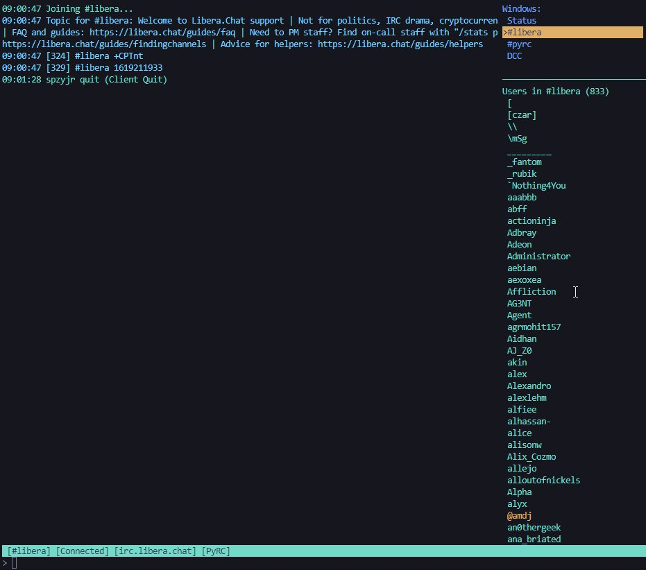

# PyRC - Python Terminal IRC Client

[](https://opensource.org/licenses/MIT)
[](https://www.python.org/)
[](http://makeapullrequest.com)

> 💬 **A modern, modular IRC client built for power users and AI integration**



## 🚀 Features at a Glance

- **🤖 AI-Ready**: Built with AI integration in mind, perfect for building IRC-powered AI agents and chatbots.
- 🚀 **Lightning Fast**: Modern `asyncio`-based core optimized for speed and low resource usage.
- 🧩 **Extremely Modular**: Every component is pluggable and replaceable.
- 💻 **Terminal-First**: Beautiful, responsive UI that stays in your terminal.
- 🔄 **Persistent State**: Never lose your place with automatic session restoration.

PyRC is a modern, terminal-based IRC (Internet Relay Chat) client written in Python. It provides a feature-rich, lightweight, and user-friendly experience for IRC users who prefer the command line. With a focus on extreme modularity and stability, PyRC enables both traditional IRC usage and programmatic integration with AI agents or other automated systems.

## Project Status

**PyRC is a stable and mature IRC client** that has recently undergone a significant architectural refactor to an `asyncio`-based core. This migration enhances performance, stability, and maintainability. The client continues to evolve with regular updates and improvements. The current focus is on leveraging the benefits of asyncio, refining the user experience, and maintaining compatibility with modern IRC networks. We welcome contributions and feedback to help make PyRC even better.

## Architecture Overview

```mermaid
graph TD
    A[pyrc.py] --> B(asyncio.run(IRCClient_Logic.run_main_loop()));
    B --> C{IRCClient_Logic.run_main_loop() (async)};
    C -- Creates --> D[asyncio.Task: NetworkHandler.network_loop (async)];
    C -- Creates --> E[asyncio.Task: InputHandler.async_input_reader (async)];
    D -- Reads/Writes data --> F(Async Network I/O - StreamReader/Writer);
    D -- Dispatches messages --> G(irc_protocol.handle_server_message (async));
    E -- Reads blocking input --> H(asyncio.to_thread(getch));
    E -- Puts input into --> I(asyncio.Queue);
    E -- Gets input from queue --> J(InputHandler.handle_key_press (async));
    J -- Processes commands --> K(CommandHandler.process_user_command (async));
    K -- Sends data --> D;
    G -- Dispatches events --> L(EventManager.dispatch_event (async));
    L -- Calls handlers --> M{ScriptManager.dispatch_event (async)};
    M -- If async handler --> N(asyncio.create_task(handler(event_data)));
    M -- If sync handler --> O(loop.run_in_executor(None, handler, event_data));
    C -- Triggers periodically --> P(IRCClient_Logic._update_ui (async));
    P -- Refreshes UI --> Q(UIManager.refresh_all_windows);
```

## Key Architectural Features

### Asyncio-Based Core
- **Complete Migration to asyncio:** The entire client has been refactored to use Python's `asyncio` framework, eliminating the previous threading-based approach for better performance and simplified concurrency management.
- **Non-blocking I/O:** All network operations, user input handling, and UI updates are handled asynchronously, ensuring a responsive user experience even during heavy network traffic.
- **Efficient Resource Usage:** The single-threaded event loop model reduces context switching overhead and simplifies synchronization.
- **Modern Python Features:** Leverages Python 3.9+ features like `asyncio.to_thread` for running blocking operations without blocking the event loop.
- **Centralized State Management with `StateManager`:**
  - The `StateManager` is the _exclusive_ source of truth for all connection, session, and client-specific runtime state.
  - It provides thread-safe, persistent session state that includes:
    - Current connection details and authentication state (e.g., current nick, server, port, SSL status, SASL/NickServ info).
    - Connection statistics (attempts, last error, etc.).
    - List of joined channels and their join status.
    - User preferences and client settings (e.g., logging levels, DCC settings).
    - Message history and scrollback positions for each context.
  - State is automatically persisted to disk and restored on startup, ensuring a seamless experience across client restarts.
- **Dynamic Command System:** All core client commands are implemented in individual Python modules within a structured `commands/` directory. They are dynamically discovered using `pkgutil.walk_packages` and registered at startup, making the client easily extensible.
- **Extensible Scripting System:** A powerful Python scripting system allows for deep customization. Scripts can register commands, subscribe to a wide range of events, and interact with the client through a rich `ScriptAPIHandler`.

## File Structure

```
PyRC/
├── pyrc.py                     # Main application entry point and asyncio event loop setup
├── pyterm_irc_config.ini       # Main configuration file with server and client settings
│
├── pyrc_core/                  # Core application package
│   ├── __init__.py             # Package initialization
│   ├── app_config.py           # Centralized configuration management using configparser
│   ├── context_manager.py      # Manages chat contexts (channels, queries, server)
│   ├── event_manager.py        # Asynchronous event dispatching system
│   ├── network_handler.py      # Async IRC protocol handling using asyncio.StreamReader/Writer
│   └── state_manager.py        # Thread-safe state management with persistence
│
│   ├── client/                # Client implementation
│   │   ├── __init__.py
│   │   ├── connection_orchestrator.py  # Coordinates connection lifecycle and authentication
│   │   ├── irc_client_logic.py         # Main application logic and component coordination
│   │   ├── input_handler.py            # Async input processing and command dispatching
│   │   └── state_change_ui_handler.py  # Updates UI in response to state changes
│   │
│   ├── ui/                     # Terminal UI components
│   │   ├── __init__.py
│   │   ├── curses_manager.py          # Low-level Curses initialization and teardown
│   │   ├── curses_utils.py            # Safe Curses drawing utilities
│   │   ├── input_line_renderer.py     # Input prompt and text entry
│   │   ├── message_panel_renderer.py  # Chat message display
│   │   ├── sidebar_panel_renderer.py  # Channel/user list
│   │   ├── status_bar_renderer.py     # Status information display
│   │   ├── ui_manager.py              # UI component coordination
│   │   └── window_layout_manager.py   # Window layout calculations
│   │
│   ├── commands/              # Built-in command implementations
│   │   ├── __init__.py
│   │   ├── command_handler.py   # Command registration and dispatch
│   │   │
│   │   ├── channel/           # Commands for channel operations.
│   │   │   ├── __init__.py
│   │   │   ├── ban_commands.py       # /ban, /unban, /kickban
│   │   │   ├── cyclechannel_command.py # /cycle
│   │   │   ├── invite_command.py     # /invite
│   │   │   ├── join_command.py       # /join
│   │   │   ├── kick_command.py       # /kick
│   │   │   ├── mode_command.py       # /mode (channel modes)
│   │   │   ├── part_command.py       # /part
│   │   │   ├── simple_mode_commands.py # /op, /deop, /voice, etc.
│   │   │   └── topic_command.py      # /topic
│   │   │
│   │   ├── core/            # Essential client commands.
│   │   │   ├── __init__.py
│   │   │   └── help_command.py       # /help
│   │   │
│   │   ├── dcc/             # DCC file transfer and chat commands.
│   │   │   ├── __init__.py
│   │   │   ├── dcc_accept_command.py  # /dcc accept
│   │   │   ├── dcc_auto_command.py    # /dcc auto
│   │   │   ├── dcc_browse_command.py  # /dcc browse
│   │   │   ├── dcc_cancel_command.py  # /dcc cancel
│   │   │   ├── dcc_commands.py        # Main DCC command handler
│   │   │   ├── dcc_get_command.py     # /dcc get
│   │   │   ├── dcc_list_command.py    # /dcc list
│   │   │   ├── dcc_resume_command.py  # /dcc resume
│   │   │   └── dcc_send_command.py    # /dcc send
│   │   │
│   │   ├── information/     # Information retrieval commands.
│   │   │   ├── __init__.py
│   │   │   ├── list_command.py        # /list
│   │   │   ├── names_command.py       # /names
│   │   │   ├── who_command.py         # /who
│   │   │   └── whowas_command.py      # /whowas
│   │   │
│   │   ├── server/          # Server connection and management.
│   │   │   ├── __init__.py
│   │   │   ├── connect_command.py     # /connect
│   │   │   ├── disconnect_command.py  # /disconnect
│   │   │   ├── quit_command.py        # /quit
│   │   │   ├── raw_command.py         # /raw
│   │   │   ├── reconnect_command.py   # /reconnect
│   │   │   └── server_command.py      # /server
│   │   │
│   │   ├── ui/              # User interface controls.
│   │   │   ├── __init__.py
│   │   │   ├── close_command.py       # /close
│   │   │   ├── split_screen_commands.py # /split, /unsplit
│   │   │   ├── status_command.py      # /status
│   │   │   ├── userlist_scroll_command.py # /scrollusers
│   │   │   └── window_navigation_commands.py # /window, /next, /prev
│   │   │
│   │   ├── user/            # User interaction commands.
│   │   │   ├── __init__.py
│   │   │   ├── away_command.py        # /away
│   │   │   ├── ignore_commands.py     # /ignore, /unignore, /listignores
│   │   │   ├── me_command.py          # /me
│   │   │   ├── msg_command.py         # /msg
│   │   │   ├── nick_command.py        # /nick
│   │   │   ├── notice_command.py      # /notice
│   │   │   └── query_command.py       # /query
│   │   │
│   │   └── utility/         # Utility and configuration commands.
│   │       ├── __init__.py
│   │       ├── clear_command.py       # /clear
│   │       ├── execute_command.py     # /exec
│   │       ├── rehash_command.py      # /rehash
│   │       ├── save_command.py        # /save
│   │       ├── script_command.py      # /script
│   │       ├── set_command.py         # /set
│   │       ├── show_command.py        # /show
│   │       └── trigger_command.py     # /trigger
│   │
│   ├── dcc/                   # DCC (Direct Client-to-Client) feature implementation.
│   │   ├── __init__.py
│   │   ├── dcc_ctcp_handler.py # Handles incoming DCC CTCP requests.
│   │   ├── dcc_manager.py      # Main orchestrator for all DCC functionality.
│   │   ├── dcc_passive_offer_manager.py # Manages passive (reverse) DCC offers.
│   │   ├── dcc_protocol.py     # Parses and formats DCC CTCP messages.
│   │   ├── dcc_receive_manager.py # Manages all incoming file transfers.
│   │   ├── dcc_security.py     # Filename sanitization and path validation.
│   │   ├── dcc_send_manager.py # Manages all outgoing file transfers.
│   │   ├── dcc_transfer.py     # Base classes for DCC send/receive transfer logic.
│   │   └── dcc_utils.py        # Shared utility functions (e.g., socket creation).
│   │
│   ├── features/              # Self-contained, optional features.
│   │   └── triggers/          # Implementation of the /on command trigger system.
│   │       ├── __init__.py
│   │       ├── trigger_commands.py
│   │       └── trigger_manager.py
│   │
│   ├── irc/                  # IRC protocol logic and message handling.
│   │   ├── __init__.py
│   │   ├── cap_negotiator.py   # Handles IRCv3 capability negotiation.
│   │   ├── irc_message.py     # Parses raw IRC lines into structured message objects.
│   │   ├── irc_protocol.py    # Main dispatcher for incoming server messages.
│   │   ├── registration_handler.py  # Manages NICK/USER registration sequence.
│   │   ├── sasl_authenticator.py    # Handles SASL PLAIN authentication.
│   │   └── handlers/          # Specific handlers for different IRC commands/numerics.
│   │       ├── __init__.py
│   │       ├── irc_numeric_handlers.py # Handlers for server numeric replies.
│   │       ├── membership_handlers.py  # Handlers for JOIN, PART, QUIT, KICK.
│   │       ├── message_handlers.py     # Handlers for PRIVMSG, NOTICE.
│   │       ├── protocol_flow_handlers.py # Handlers for PING, CAP, etc.
│   │       └── state_change_handlers.py # Handlers for NICK, MODE, etc.
│   │
│   ├── logging/              # Logging-specific components.
│   │   └── channel_logger.py  # Manages per-channel and status window log files.
│   │
│   └── scripting/            # The Python scripting engine.
│       ├── __init__.py
│       ├── api_responder_agent.py # Example AI agent script.
│       ├── python_trigger_api.py  # API for the /on <event> PY <code> trigger action.
│       ├── script_api_handler.py  # Provides the `api` object for scripts.
│       ├── script_base.py     # A base class for scripts to inherit from.
│       └── script_manager.py  # Discovers, loads, and manages all user scripts.
│
├── scripts/                  # Directory for user-provided Python scripts and test utilities.
│   ├── ai_api_test_script.py    # Test script for AI API integration.
│   ├── default_exit_handler.py  # Default exit handler script.
│   ├── default_fun_commands.py  # Example script with fun commands.
│   ├── default_random_messages.py  # Random message generator for testing.
│   ├── event_test_script.py     # Script for testing event handling.
│   ├── run_headless_tests.py    # Entry point for running headless tests.
│   ├── test_dcc_features.py     # Tests for DCC functionality.
│   ├── test_headless.py         # Headless test runner.
│   └── test_script.py          # General test script.
│
├── config/                   # Directory for runtime-generated configuration files.
│   └── triggers.json         # Stores persistent user-defined triggers.
│
├── data/                     # Directory for static data files.
│   └── default_help/
│       └── command_help.ini  # Fallback help texts for core commands.
│
└── pyterm_irc_config.ini.example  # Example configuration file. Copy to create config.

# Logs are stored in the following locations (auto-created when needed):
# - Main application log: logs/pyrc_core.log
# - DCC transfer log: logs/dcc.log
```

## Project Status

**PyRC is a stable and mature IRC client** that continues to evolve with regular updates and improvements. The current focus is on enhancing stability, improving the user experience, and maintaining compatibility with modern IRC networks. Recent development has focused on robust state management, reliable session persistence, and comprehensive IRCv3 support. We welcome contributions and feedback to help make PyRC even better.

{{ ... }}

## Recent Architectural Refactoring & Improvements

This section highlights the significant architectural changes and robustness improvements implemented in recent development cycles.

- **Asynchronous Core with `asyncio`**:

  - The entire client core has been migrated from a `threading`-based model to a modern `asyncio` architecture.
  - This change provides significant performance improvements for I/O-bound operations, reduces resource consumption, and simplifies concurrency management.
  - All network I/O is now non-blocking, and `async`/`await` syntax is used throughout the core logic for cleaner, more efficient code.

- **Modular Connection Management (`ConnectionOrchestrator`):**

  - Introduced the `ConnectionOrchestrator` component to centralize and manage the entire server connection lifecycle.
  - Coordinates capability negotiation (`CapNegotiator`), authentication (`SaslAuthenticator`), and registration (`RegistrationHandler`).
  - Simplifies `IRCClient_Logic` by delegating complex connection state management and sequencing, leading to more robust and maintainable connection handling.
  - Implements comprehensive timeout mechanisms and error recovery for each connection phase.

- **Decomposed UI System (Modular Renderers & Managers):**

  - The previously monolithic `UIManager` has been refactored into a set of specialized components:
    - `CursesManager`: Handles low-level Curses setup and terminal interactions.
    - `WindowLayoutManager`: Manages the creation, sizing, and positioning of all UI windows.
    - `MessagePanelRenderer`, `SidebarPanelRenderer`, `StatusBarRenderer`, `InputLineRenderer`: Each dedicated to rendering a specific part of the UI.
    - `SafeCursesUtils`: Provides common, safe drawing utilities.
  - This decomposition significantly improves separation of concerns, making the UI system more modular, testable, and easier to extend. `UIManager` now acts as an orchestrator for these components.
  - Fixed issues with color handling and window management through the introduction of `SafeCursesUtils`.

- **Centralized Configuration (`AppConfig`):**

  - All application and server settings are now loaded and managed centrally by the `AppConfig` class. This ensures a single, consistent source of truth for configuration values across the client.
  - Configuration is automatically loaded from `pyterm_irc_config.ini` and can be dynamically updated and saved in-client.

- **Exclusive State Management (`StateManager`):**

  - The `StateManager` is now the sole authority for all runtime state, including connection status, joined channels, user information, and message history.
  - Features robust validation, thread-safe access, and automatic persistence to `state.json`, ensuring reliable session continuity and easier debugging.

- **Dynamic Command System (`pkgutil`):**

  - The command loading mechanism has been refactored to use `pkgutil.walk_packages`, enabling more reliable and extensible discovery of commands from nested directories within `pyrc_core/commands/`.
  - This resolves issues with commands not being found and simplifies the addition of new command modules.
  - Commands are now more modular and easier to maintain, with clear separation between different command categories.

- **Enhanced IRCv3 Feature Handling:**

  - **`CapNegotiator`:** Coordinated by `ConnectionOrchestrator`, now implements comprehensive timeout mechanisms to prevent hangs during capability negotiation, with enhanced state tracking and SASL coordination.
  - **`SaslAuthenticator`:** Integrated with `ConnectionOrchestrator`, features step-based timeouts for SASL authentication flow, ensuring timely progression or failure, with improved error handling.
  - **`RegistrationHandler`:** Managed by `ConnectionOrchestrator`, implements a refined registration flow that coordinates with CAP and SASL operations, ensuring proper sequencing of post-registration actions.

- **Streamlined DCC Command Handling:**

  - DCC commands have been refactored to be function-based within `pyrc_core/commands/dcc/`, simplifying their structure and integration into the command system.

- **Enhanced Headless Testing Framework:**
  - The headless test scripts (`scripts/test_headless.py`, `scripts/ai_api_test_script.py`) have been updated to align with the `StateManager` and `ScriptAPIHandler` paradigms.
  - Tests now use event-driven waits and more robust state checks, making them more reliable and less prone to timing-related failures.

These architectural improvements significantly enhance PyRC's stability, maintainability, and extensibility, laying a solid foundation for future development.

## Key Features

- **Text-based UI:** Clean and navigable interface using the Python `curses` library (optional for headless operation).
- **Split-Screen Support:** Horizontal split-screen mode with independent scrolling and context management for each pane.
- **Multi-Server Configuration & Switching:**
  - Define multiple server connection profiles in `pyterm_irc_config.ini`.
  - Switch between configured servers using the `/server <config_name>` command (now with event-driven disconnect handling).
- **Channel and Query Windows:** Separate, consistently managed contexts for channels (case-insensitive handling) and private messages.
- **Intuitive UI Flow:** The client starts in the "Status" window and reliably switches to the first auto-joined channel upon successful connection and join, providing a smooth and predictable startup experience.
- **IRCv3 Support:**
  - Robust CAP negotiation (including `sasl`, `multi-prefix`, `server-time`, `message-tags`, `account-tag`, `echo-message`, `away-notify`, `chghost`, `userhost-in-names`, `cap-notify`, `extended-join`, `account-notify`, `invite-notify`) with improved error handling and stability.
  - SASL PLAIN authentication for secure login.
  - Reliable IRCv3 Message Tag parsing that handles modern IRC server messages with enhanced compatibility and robustness.
- **Highly Modular Command System:** _All_ core client commands are implemented in individual Python modules within a structured `commands/` directory. These are dynamically discovered and registered at startup. Each command module defines its handler(s), help text (usage, description, supporting dictionary format for richer help), and aliases.
- **Dynamic & Categorized Help System:** The `/help` system is fully dynamic, sourcing information from core command modules and script registrations. It now displays categories first, allowing users to drill down via `/help <category>` or `/help script <script_name>`. Specific command help (`/help <command>`) provides detailed usage, description, and aliases.
- **Comprehensive Command Set:** Supports a wide array of standard IRC commands and client-specific utility commands (see "Basic Commands" section).
- **Dynamic Configuration:** View and modify client settings on-the-fly using `/set`. Changes are saved to `pyterm_irc_config.ini`. Reload with `/rehash`.
- **Ignore System:** Powerful ignore list for users/hostmasks with wildcard support, managed via `/ignore`, `/unignore`, `/listignores`.
- **Extensible Scripting System (Python):**
  - Load custom Python scripts from a `scripts/` directory.
  - **Dependency Management:** Scripts can declare dependencies in their metadata, and `ScriptManager` now attempts to load scripts in an order that satisfies these dependencies, warning about missing or circular dependencies.
  - Rich `ScriptAPIHandler` for client interaction (see "Scripting System" section). Many API methods are now `async` and must be `await`ed.
  - Scripts can register commands with structured help (usage, description, aliases).
- **Advanced Event-Driven Trigger System (`/on` command & API):**
  - Define custom actions (client commands or Python code via `PythonTriggerAPI`) based on IRC events.
  - Persistent triggers saved to `config/triggers.json`.
- **Modular Event Management:** A dedicated `EventManager` handles consistent dispatching of script-facing events. Includes a `CLIENT_MESSAGE_ADDED_TO_CONTEXT` event.
- **Headless Operation & Testing:**
  - Full functionality with `--headless` flag. Core logic, scripting (including `ScriptAPIHandler`), `EventManager`, and the trigger system are fully functional, all running on an efficient `asyncio` event loop.
  - Refactored headless test script (`scripts/test_headless.py`) using an event-driven verification framework for increased reliability.
- **Logging:**
  - Comprehensive main application log (`logs/pyrc_core.log`).
  - Dedicated Status window log (`logs/client_status_messages.log`).
  - Optional per-channel logging. `logs/` directory created automatically.
  - Raw IRC message logging to UI toggleable with `/rawlog`.
- **DCC (Direct Client-to-Client) Support:**
  - SEND and GET (active and passive/reverse offers with tokens).
  - Configurable port range for listening sockets.
  - Option to specify an advertised IP (`dcc_advertised_ip`) for NAT traversal.
  - Automatic cleanup of old/completed DCC transfers to manage resources.
  - File size limits, blocked extensions, auto-accept options.
  - Resume support for sends and receives.
  - Checksum verification (MD5, SHA1, etc.).
  - Bandwidth throttling for sends and receives (KB/s).
  - Dedicated DCC logging.
- **UI Enhancements:**
  - Tab completion for commands and nicks.
  - Ctrl+Y/Ctrl+E scrolling in message windows.
  - SSL/TLS Encryption: Secure connections, with `verify_ssl_cert` option.

## Prerequisites

- Python 3.8 or higher.
- `pip` (Python package installer).
- On Windows, `windows-curses` is required (`pip install windows-curses`). It's included in `requirements.txt`.
- `pyfiglet` for the `/ascii` command (optional, for `default_fun_commands.py` script). It's included in `requirements.txt`.

## Installation

### Option 1: Install via pip

```bash
pip install pyrc
```

### Option 2: Install from source

1. **Clone the repository:**

   ```bash
   git clone https://github.com/edgeof8/PyRC.git
   cd PyRC
   ```

2. **Create a virtual environment (recommended):**

   ```bash
   python -m venv venv
   ```

3. **Activate it:**

   - Windows: `venv\Scripts\activate`
   - Linux/macOS: `source venv/bin/activate`

4. **Install dependencies:**

   ```bash
   pip install -r requirements.txt
   ```

5. **Install the package:**
   ```bash
   pip install .
   ```

### Option 3: Use standalone executable

Download the latest release from the [Releases](https://github.com/edgeof8/PyRC/releases) page and run the executable for your platform:

- Windows: `pyrc-0.1.0-win64.exe`
- Linux: `pyrc-0.1.0-linux`
- macOS: `pyrc-0.1.0-macos`

## Configuration

PyRC uses `pyterm_irc_config.ini` in its root directory. To get started:

1. Copy the example configuration file:
   ```bash
   cp pyterm_irc_config.ini.example pyterm_irc_config.ini
   ```
2. Edit `pyterm_irc_config.ini` to customize your settings.

**Key Config Sections & Settings (Managed by `AppConfig`):**

- **`[Server.YourServerName]`**: Define multiple server profiles.
  - `address`, `port`, `ssl`, `nick`, `channels` (comma-separated).
  - `username`, `realname` (optional, default to nick).
  - `server_password`, `nickserv_password` (optional).
  - `sasl_username`, `sasl_password` (optional, for SASL PLAIN).
  - `verify_ssl_cert` (true/false).
  - `auto_connect` (true for one server).
  - `desired_caps` (optional, comma-separated IRCv3 capabilities).
- **`[UI]`**: `message_history_lines`, `headless_message_history_lines`, `colorscheme`.
- **`[Logging]`**: `log_enabled`, `log_file`, `log_level`, rotation settings, `channel_log_enabled`.
- **`[Features]`**: `enable_trigger_system`.
- **`[Scripts]`**: `disabled_scripts` (comma-separated module names).
- **`[IgnoreList]`**: Managed by `/ignore` commands.
- **`[DCC]`**:
  - `enabled`, `download_dir`, `max_file_size`, `auto_accept`.
  - `blocked_extensions`, `port_range_start`, `port_range_end`, `timeout`.
  - `passive_token_timeout`, `checksum_verify`, `checksum_algorithm`.
  - `bandwidth_limit_send_kbps`, `bandwidth_limit_recv_kbps` (0 for unlimited).
  - `resume_enabled`.
  - `dcc_advertised_ip` (optional manual IP for NAT).
  - `cleanup_enabled`, `cleanup_interval_seconds`, `transfer_max_age_seconds`.
  - DCC logging settings (`log_enabled`, `log_file`, etc.).

Use `/set`, `/rehash`, `/save` in-client to manage configuration. These commands interact directly with the `AppConfig` instance to update and persist settings.

## Usage

Run PyRC from its root directory:

```bash
python pyrc.py
```

Command-line overrides (creates a temporary "CommandLine" server configuration):

```bash
python pyrc.py [--server <server>] [--port <port>] [--nick <nick>] [--channel <#channel>] [--ssl] [--password <server_pass>] [--nickserv-password <pass>] [--headless] [--disable-script <script_name>]
```

## Basic Commands

PyRC supports a variety of commands, all dynamically loaded. Type `/help` within the client for a list of commands and their aliases, or `/help <command>` for specific command usage. The help system is dynamically built from command module definitions and script registrations, ensuring up-to-date information.

### Connection & Session Management:

- `/connect <server[:port]> [ssl|nossl]`: Initiates a connection to the specified IRC server. The `ConnectionOrchestrator` handles the entire connection lifecycle, including capability negotiation and authentication.
- `/server <config_name>` (Alias: `/s`): Switches to a pre-defined server configuration and initiates a connection using the `ConnectionOrchestrator`.
- `/disconnect [reason]` (Alias: `/d`): Gracefully disconnects from the current server, with proper cleanup of connection resources.
- `/quit [message]` (Alias: `/q`): Disconnects from the server and exits PyRC, ensuring all resources are properly released.
- `/reconnect`: Coordinates a clean disconnect followed by a new connection attempt, handled by the `ConnectionOrchestrator`.
- `/nick <newnickname>` (Alias: `/n`): Changes your nickname.
- `/away [message]`: Sets your away status with an optional message. If no message is provided, marks you as no longer away.

### Channel Operations:

- `/join <channel> [#channel2 ...]` (Alias: `/j`): Joins the specified IRC channel(s).
- `/part [channel] [reason]` (Alias: `/p`): Leaves the specified channel or the current channel if none is specified.
- `/topic [<channel>] [<new_topic>]` (Alias: `/t`): Views or sets the topic for a channel. If no channel is specified, uses the current channel. If no new_topic is specified, views the current topic.
- `/invite <nick> [channel]` (Alias: `/i`): Invites a user to a channel. If no channel is specified, uses the current channel.
- `/kick <nick> [reason]` (Alias: `/k`): Kicks a user from the current channel.
- `/cyclechannel` (Alias: `/cc`): Parts and then rejoins the current channel.
- `/ban <nick|hostmask>`: Bans a user or hostmask from the current channel.
- `/unban <hostmask>`: Removes a ban (specified by hostmask) from the current channel.
- `/mode [<target>] <modes_and_params>`: Sets or views channel or user modes. If <target> is omitted for a channel mode, it defaults to the current channel.
- `/op <nick>` (Alias: `/o`): Grants operator status to <nick> in the current channel.
- `/deop <nick>` (Alias: `/do`): Removes operator status from <nick> in the current channel.
- `/voice <nick>` (Alias: `/v`): Grants voice status to <nick> in the current channel.
- `/devoice <nick>` (Alias: `/dv`): Removes voice status from <nick> in the current channel.

### Messaging & Information:

- `/msg <target> <message>` (Alias: `/m`): Sends a private message to a user or a message to a channel.
- `/query <nick> [message]`: Opens a query window with <nick> and optionally sends an initial message.
- `/notice <target> <message>` (Alias: `/no`): Sends a NOTICE to the specified target.
- `/me <action text>`: Sends an action message (CTCP ACTION) to the current channel or query.
- `/whois <nick>` (Alias: `/w`): Retrieves WHOIS information for the specified nickname.
- `/who [channel|nick]`: Shows WHO information for a channel or user.
- `/whowas <nick> [count] [server]`: Shows WHOWAS information for a user, providing historical data about a nickname.
- `/list [pattern]`: Lists channels on the server, optionally filtering by a pattern. Results appear in a new temporary window.
- `/names [channel]`: Shows the list of users in a channel. If no channel is specified, it may list users in the current channel or all visible users depending on the server.

### Client Utility & UI:

- Ctrl+Y/Ctrl+E: Scroll message buffer.
- `/clear` (Alias: `/c`): Clears the message history of the current active window.
- `/close [context_name]` (Aliases: `/wc`, `/partchannel`): Closes the specified window or the current window if none is specified. For channels, this parts the channel.
- `/help [command_name]` (Alias: `/h`): Displays general help or help for a specific command.
- Ctrl+N (or `/nextwindow`, Alias: `/next`): Switch to the next window.
- Ctrl+P (or `/prevwindow`, Alias: `/prev`): Switch to the previous window.
- `/window <name|number>` (Alias: `/win`): Switches to the window specified by name or number.
- `/status`: Switches to the Status window.
- `/prevchannel` (Alias: `/pc`): Switches to the previously active channel or Status window.
- `/split`: Toggle split-screen mode on/off.
- `/focus <top|bottom>`: Switch focus between split panes (top or bottom).
- `/setpane <top|bottom> <context_name>`: Set a context in a specific pane.
- Ctrl+U (or `/userlistscroll [offset|direction]`, Alias: `/u`): Scrolls the user list.
- `/set [<section.key> [<value>]]` (Alias: `/se`): Views or modifies client configuration settings.
- `/rehash`: Reloads the client configuration from the INI file.
- `/save`: Saves the current client configuration to the INI file.
- `/ignore <nick|hostmask>`: Adds a user/hostmask to the ignore list. Simple nicks are converted to nick!_@_.
- `/unignore <nick|hostmask>`: Removes a user/hostmask from the ignore list. Tries to match exact pattern or derived nick!_@_.
- `/listignores` (Alias: `/ignores`): Lists all currently ignored patterns.
- `/rawlog [on|off|toggle]`: Toggles or sets the display of raw IRC messages in the Status window.
- `/lastlog <pattern>`: Searches the message history of the active window for lines containing <pattern>.
- `/raw <raw IRC command>` (Aliases: `/quote`, `/r`): Sends a raw command directly to the IRC server.
- `/on ...`: Manages event-based triggers (see `/help on`).

### Fun Commands (from default_fun_commands.py script):

- `/slap <nickname>`: Slaps a user.
- `/8ball <question>`: Asks the Magic 8-Ball.
- `/dice <NdN>` (Alias: `/roll`): Rolls dice.
- `/rainbow <text>`: Sends text in rainbow colors.
- `/reverse <text>`: Sends text reversed.
- `/wave <text>`: Sends text with a wave effect.
- `/ascii <text>`: Converts text to ASCII art (requires `pyfiglet`).

### DCC (Direct Client-to-Client) Commands:

- `/dcc send [-p|--passive] <nick> <filepath> [filepath2 ...]`: Initiates a DCC SEND to the specified user. Multiple files can be specified and will be queued for sequential transfer. Use `-p` for a passive (reverse) send, where the recipient connects to you after you send them a token.
- `/dcc get <nick> "<filename>" --token <token>`: Accepts a passive DCC SEND offer from `<nick>` for `<filename>` using the provided `<token>`.
- `/dcc accept <nick> "<filename>" <ip> <port> <size>`: Accepts an _active_ incoming DCC SEND offer from a user (where the sender is listening).
- `/dcc list`: Lists current active DCC transfers, recently completed/failed ones, and pending passive offers you've received.
- `/dcc cancel <id_or_token_prefix>` (Alias: `/dcc close`): Cancels an active transfer by its ID prefix or a pending passive offer by its token prefix.
- `/dcc auto [on|off]`: Toggles or sets the global auto-accept feature for incoming DCC offers. Displays current status if no argument.
- `/dcc browse [path]`: Lists contents of the specified local directory path (or current directory if no path given). Useful for finding files to send.
- `/dcc resume <id_or_filename>`: Attempts to resume a previously failed/cancelled outgoing DCC SEND transfer.

## Headless Operation

Run with `--headless`. Core logic, scripting (including `ScriptAPIHandler`), `EventManager`, and the trigger system are fully functional, all running on an efficient `asyncio` event loop. Ideal for bots, AI integrations, and automated testing. The `scripts/test_headless.py` and `scripts/ai_api_test_script.py` scripts provide examples and a framework for such tests.

## Scripting System

PyRC features a Python scripting system in `scripts/`. Scripts inherit from `ScriptBase`, use `ScriptAPIHandler` (`self.api`), and can define dependencies in their `metadata.json`.

Scripts can define event handlers as either standard synchronous functions or as `async def` coroutines. The `EventManager` will correctly `await` asynchronous handlers, allowing for non-blocking I/O operations (like network requests or disk I/O) within scripts without freezing the client.

### Key `ScriptAPIHandler` Capabilities (Summary):

_(This section can remain largely the same, but ensure it's up-to-date with any API changes.)_

- **Sending:** `send_raw`, `send_message`, `send_action`, etc. (now `async`).
- **UI Interaction:** `add_message_to_context` (now `async`).
- **Information Retrieval:** `get_client_nick`, `get_context_messages`, etc.
- **Trigger Management API:** `add_trigger`, `remove_trigger`, etc.
- **Command/Help Registration:** `register_command` (now accepts rich help dict), `register_help_text`, `create_command_help`.
- **Logging & Data:** `log_info`, `request_data_file_path`.

### Key Script Events (Dispatched via `EventManager`)

Events are dispatched with a consistent `event_data` dictionary including `timestamp`, `raw_line` (if applicable), and `client_nick`.

**Client Lifecycle Events:**

- `CLIENT_CONNECTING`: Fired when a new connection attempt is initiated.
  - `event_data` keys: `server` (str), `port` (int), `nick` (str), `ssl` (bool).
- `CLIENT_CONNECTED`: Fired when TCP/IP connection is established and CAP negotiation begins.
  - `event_data` keys: `server` (str), `port` (int), `nick` (str), `ssl` (bool).
- `CLIENT_CAP_NEGOTIATION_START`: Fired when capability negotiation begins.
  - `event_data` keys: `capabilities` (List[str] - requested capabilities).
- `CLIENT_CAP_NEGOTIATION_COMPLETE`: Fired when capability negotiation completes.
  - `event_data` keys: `negotiated_capabilities` (List[str]).
- `CLIENT_AUTHENTICATING`: Fired when SASL authentication begins.
  - `event_data` keys: `mechanism` (str).
- `CLIENT_AUTHENTICATED`: Fired upon successful SASL authentication.
  - `event_data` keys: `account` (str - account name if available).
- `CLIENT_REGISTERING`: Fired when sending NICK/USER registration commands.
  - `event_data` keys: `nick` (str), `username` (str), `realname` (str).
- `CLIENT_REGISTERED`: Fired upon receiving RPL_WELCOME (001).
  - `event_data` keys: `nick` (str), `server_message` (str), `hostname` (str).
- `CLIENT_READY`: Fired after successful registration and initial auto-join actions.
  - `event_data` keys: `nick` (str), `channels` (List[str]).
- `CLIENT_DISCONNECTED`: Fired when connection is lost or closed.
  - `event_data` keys: `server` (str), `port` (int), `reason` (str), `reconnecting` (bool).
- `CLIENT_RECONNECTING`: Fired when a reconnection attempt is initiated.
  - `event_data` keys: `attempt` (int), `max_attempts` (int).
- `CLIENT_MESSAGE_ADDED_TO_CONTEXT`: Fired when any message is added to any context's buffer by `IRCClient_Logic.add_message`.
  - `event_data` keys: `context_name` (str), `text` (str - the full line added, including timestamp/prefix), `color_key_or_attr` (Any), `source_full_ident` (Optional[str]), `is_privmsg_or_notice` (bool).
- `CLIENT_NICK_CHANGED`: Fired specifically when PyRC's own nickname successfully changes.
  - `event_data` additional keys: `old_nick` (str), `new_nick` (str).
- `CLIENT_SHUTDOWN_FINAL`: Fired just before application exit, _after_ `curses` UI is down (if UI was active).

**IRC Message & Command Events:**

- `PRIVMSG`: For channel and private messages.
  - `event_data` additional keys: `nick` (str), `userhost` (str), `target` (str), `message` (str), `is_channel_msg` (bool), `tags` (Dict[str, Any] - parsed IRCv3 message tags).
- `NOTICE`: For IRC NOTICEs.
  - `event_data` additional keys: `nick` (str), `userhost` (str), `target` (str), `message` (str), `is_channel_notice` (bool), `tags` (Dict[str, Any]).
- `JOIN`: When a user (including client) joins.
  - `event_data` additional keys: `nick` (str), `userhost` (str - if available from server, e.g. with extended-join), `channel` (str), `account` (str - if available, e.g. with extended-join), `real_name` (str - if available, e.g. with extended-join), `is_self` (bool).
- `CHANNEL_FULLY_JOINED`: Fired after a channel is successfully joined and RPL_ENDOFNAMES (or equivalent) is received.
  - `event_data` additional keys: `channel_name` (str).
- `PART`: When a user (including client) parts.
  - `event_data` additional keys: `nick` (str), `userhost` (str), `channel` (str), `reason` (str), `is_self` (bool).
- `QUIT`: When a user quits.
  - `event_data` additional keys: `nick` (str), `userhost` (str), `reason` (str).
- `NICK`: When any user changes their nickname.
  - `event_data` additional keys: `old_nick` (str), `new_nick` (str), `userhost` (str), `is_self` (bool).
- `MODE`: When a mode change occurs (raw event).
  - `event_data` additional keys: `nick` (str - setter), `userhost` (str - setter's host), `target` (str - channel/nick affected), `modes_and_params` (str - raw mode string), `parsed_modes` (List[Dict] - structured mode changes).
- `CHANNEL_MODE_APPLIED`: Fired after a channel MODE is processed and applied.
  - `event_data` additional keys: `channel` (str), `setter_nick` (str), `setter_userhost` (str), `mode_changes` (List[Dict] - structured), `current_channel_modes` (List[str]).
- `TOPIC`: When a channel topic is changed or viewed.
  - `event_data` additional keys: `nick` (str - setter), `userhost` (str), `channel` (str), `topic` (str).
- `CHGHOST`: When a user's host changes.
  - `event_data` additional keys: `nick` (str), `new_ident` (str), `new_host` (str), `userhost` (str - old userhost).

**Raw IRC Lines & Numerics:**

- `RAW_IRC_LINE`: Fired for _every_ complete raw line received from the server _before_ PyRC's internal parsing.
  - `event_data` keys: `raw_line` (str).
- `RAW_IRC_NUMERIC`: Fired for all numeric replies from the server.
  - `event_data` keys: `numeric` (int), `source` (str - server name), `params_list` (List[str] - full parameters), `display_params_list` (List[str] - parameters with client nick removed if first), `trailing` (Optional[str]), `tags` (Dict[str, Any]).

**Key UI Navigation:**

- Ctrl+Y/Ctrl+E: Scroll message buffer.
- Ctrl+N / Ctrl+P: Switch windows.
- Ctrl+U: Scroll user list.

## State Management System

PyRC's `StateManager` provides a robust, thread-safe, and persistent solution for managing all client state. It acts as the **single source of truth** for all connection, session, and client-specific runtime data, ensuring:

- Predictable and consistent state across the application.
- Easier debugging and testing due to centralized state.
- Enhanced separation of concerns between data and logic.

### Key Features

- **Centralized State Storage:** Holds all critical client state, including `ConnectionInfo` (server, nick, channels, passwords, SASL details), `ConnectionState` (DISCONNECTED, CONNECTING, REGISTERED, etc.), and various runtime statistics.
- **Robust State Validation:**
  - Employs an extensible validator system (`StateValidator`) to ensure data integrity.
  - Performs comprehensive type checking and validation for all state updates, including complex dataclasses like `ConnectionInfo`.
  - Provides clear error messages for invalid configurations or state transitions.
- **Efficient Change Notifications:**
  - Implements an event-based notification system (`StateChange`) for fine-grained updates.
  - Supports both key-specific and global handlers, allowing components to react precisely to relevant state changes.
  - Ensures thread-safe event dispatching.
- **Reliable State Persistence:**
  - Automatically loads state from a JSON file (`state.json`) on startup.
  - Offers configurable auto-save intervals and manual save capabilities.
  - Handles file operation errors gracefully to prevent data corruption.
- **Thread Safety:** All state access and modification methods are thread-safe, protecting against race conditions in a multi-threaded environment.

### Usage Example

````python
from pyrc_core.state_manager import StateManager, StateValidator, ConnectionInfo, ConnectionState
from typing import Optional, Dict, Any

# Example: A custom validator for connection details
class ConnectionInfoValidator(StateValidator[ConnectionInfo]):
    def validate(self, value: ConnectionInfo) -> bool:
        value.config_errors.clear()
        is_valid = True
        if not value.server:
            value.config_errors.append("Server address is required")
            is_valid = False
        if not value.nick:
            value.config_errors.append("Nickname is required")
            is_valid = False
        # Example: SASL validation (simplified)
        if value.sasl_username and not value.sasl_password:
            value.config_errors.append("SASL username provided but no password")
            is_valid = False
        return is_valid

    def get_error_message(self, value: ConnectionInfo) -> Optional[str]:
        if value.config_errors:
            return "\n".join(value.config_errors)
        return None

# Initialize state manager
state_manager = StateManager(
    state_file="app_state.json",
    auto_save=True,
    save_interval=30,  # Save every 30 seconds
    validate_on_change=True
)

# Register a validator for connection information
state_manager.register_validator("connection_info", ConnectionInfoValidator())

# Register a handler for connection state changes
def on_connection_state_change(change: StateChange[ConnectionState]):
    print(f"Connection state changed from {change.old_value.name if change.old_value else 'N/A'} to {change.new_value.name}")
    if change.new_value == ConnectionState.CONFIG_ERROR:
        errors = change.metadata.get("config_errors", [])
        print(f"Configuration errors: {'; '.join(errors)}")

state_manager.register_change_handler("connection_state", on_connection_state_change)

# Example usage: Setting and validating connection info
initial_conn_info = ConnectionInfo(server="irc.example.com", port=6667, ssl=False, nick="TestNick")
if state_manager.set_connection_info(initial_conn_info):
    print("Connection info set successfully.")
else:
    print("Failed to set connection info due to validation errors.")

# Attempt to set invalid connection info (missing nick)
invalid_conn_info = ConnectionInfo(server="irc.bad.com", port=6667, ssl=False, nick="")
if not state_manager.set_connection_info(invalid_conn_info):
    print(f"Attempted to set invalid connection info. Errors: {state_manager.get_config_errors()}")

```python
# Get current state
current_nick = state_manager.get_connection_info().nick if state_manager.get_connection_info() else "N/A"
current_state = state_manager.get_connection_state().name
print(f"Current nick: {current_nick}, Current state: {current_state}")
````

### Best Practices for State Management

1. **Access State via `StateManager`:** Always use `state_manager.get()` and `state_manager.set()` (or specific helper methods like `set_connection_info()`) to interact with state. Avoid direct attribute access on `_state` dictionary.
2. **Utilize `ConnectionInfo`:** For connection-specific details, retrieve the `ConnectionInfo` dataclass via `state_manager.get_connection_info()`. Modify its attributes and then call `state_manager.set_connection_info()` to persist changes and trigger validation.
3. **Handle Validation Results:** When setting state that has a registered validator, check the boolean return value of `set()` or `set_connection_info()`. If `False`, retrieve and display `config_errors` from the `StateManager`.
4. **Subscribe to Changes:** Register change handlers for specific keys (`register_change_handler`) or for all changes (`register_global_handler`) to react to state updates in a decoupled manner.
5. **Thread Safety:** Remember that `StateManager` methods are thread-safe. When reading or modifying state from different threads, always use the provided methods.
6. **Error Handling:** Implement robust error handling around state interactions, especially when dealing with user input or external data that might lead to invalid states.

## Contributing

Contributions are welcome! Please:

1.  Fork the repository.
2.  Create a new branch (`git checkout -b feature/your-feature-name`).
3.  Make your changes and commit them (`git commit -am 'Add some feature'`).
4.  Push to the branch (`git push origin feature/your-feature-name`).
5.  Create a new Pull Request.

For major changes, please open an issue first to discuss your ideas.

## Quick Start

### Installation

```bash
# Install from PyPI
pip install pyterm-irc

# Or install the latest development version
pip install git+https://github.com/yourusername/pyrc.git
```

### Running PyRC

Start the client with default settings:
```bash
pyrc
```

Connect to a server directly:
```bash
pyrc --connect irc.libera.chat
```

Run in headless mode (for testing/automation):
```bash
pyrc --headless --connect irc.libera.chat
```

## Configuration

PyRC stores configuration in `~/.config/pyrc/` (or `%APPDATA%\pyrc\` on Windows):
- `config.ini` - Main configuration file
- `state.json` - Persistent state (channels, nicks, etc.)
- `logs/` - Application logs
- `scripts/` - User scripts directory

### Example `config.ini`

```ini
[server]
host = irc.libera.chat
port = 6697
ssl = true
sasl = true

[identity]
nick = YourNick
username = yourusername
realname = Your Real Name

[ui]
theme = dark
message_format = {timestamp} <{nick}> {message}

[logging]
level = INFO
file = pyrc.log
```

## Core Features

### Asynchronous Core
- Single-threaded event loop for all I/O operations
- Non-blocking UI updates and network operations
- Efficient resource usage with Python's asyncio

### Modern IRC Features
- Full IRCv3 support with capability negotiation
- SASL authentication
- Message tags and metadata
- DCC file transfers

### Rich Terminal UI
- Responsive layout that adapts to terminal size
- Split view for multiple channels
- Tab completion for nicks, commands, and channels
- Customizable color schemes
- Mouse support for scrolling and clicking

### Extensibility
- Python scripting API
- Event-driven architecture
- Custom command support
- Plugin system

### State Management
- Persistent connection state
- Automatic reconnection
- Channel and user tracking
- Message history and search

## Scripting API

PyRC provides a powerful Python API for automation and extension. Scripts can:
- Listen for and respond to events
- Register custom commands
- Interact with the IRC server
- Modify the UI
- Access and modify application state

### Example Script

```python
# ~/.config/pyrc/scripts/example.py

async def on_connect(event_data):
    """Automatically join channels after connecting."""
    client = event_data['client']
    await client.send('JOIN #python #linux')

def on_message(event_data):
    """Respond to messages containing 'hello'."""
    if 'hello' in event_data['message'].lower():
        target = event_data['target']
        nick = event_data['nick']
        return f'PRIVMSG {target} :Hello, {nick}!'

# Register event handlers
handlers = {
    'CLIENT_CONNECTED': on_connect,
    'CHANNEL_MESSAGE': on_message,
    'PRIVATE_MESSAGE': on_message,
}
```

## License

This project is licensed under the MIT License.

## Building from Source

### Prerequisites

- Python 3.8 or higher
- pip (Python package manager): `pip install pip`
- build (Python package): `pip install build`
- PyInstaller: `pip install pyinstaller`

### Build Steps

1. **Clone and setup:**

   ```bash
   git clone https://github.com/edgeof8/PyRC.git
   cd PyRC
   python -m venv venv
   # Activate virtual environment (see above)
   pip install -r requirements.txt
   ```

2. **Run the build script:**

   ```bash
   python build.py
   ```

This will:

- Build the Python package (wheel and source distribution)
- Create standalone executables for your platform
- Output artifacts to the `dist/` directory

### Testing the Build

After building, you can validate the package and executable:

```bash
python test_build.py
```

This will run tests to verify:

- Package installation
- Executable functionality
- Headless mode
- Configuration file handling

### Build Output

The build process creates the following files in the `dist/` directory:

- Python package:
  - `pyrc-0.1.0.tar.gz` (source distribution)
  - `pyrc-0.1.0-py3-none-any.whl` (wheel)
- Standalone executable:
  - Windows: `pyrc-0.1.0-win64.exe`
  - Linux: `pyrc-0.1.0-linux`
  - macOS: `pyrc-0.1.0-macos`

## Support

For support, please [open an issue](https://github.com/edgeof8/PyRC/issues) on GitHub.

## Acknowledgments

- Built with ❤️ by the PyRC contributors
- Thanks to all the open source projects that made this possible

---

<p align="center">
  <a href="https://github.com/edgeof8/PyRC">GitHub</a> •
  <a href="https://pypi.org/project/pyrc/">PyPI</a> •
  <a href="https://github.com/edgeof8/PyRC/issues">Issues</a> •
  <a href="https://github.com/edgeof8/PyRC/pulls">Pull Requests</a>
</p>
