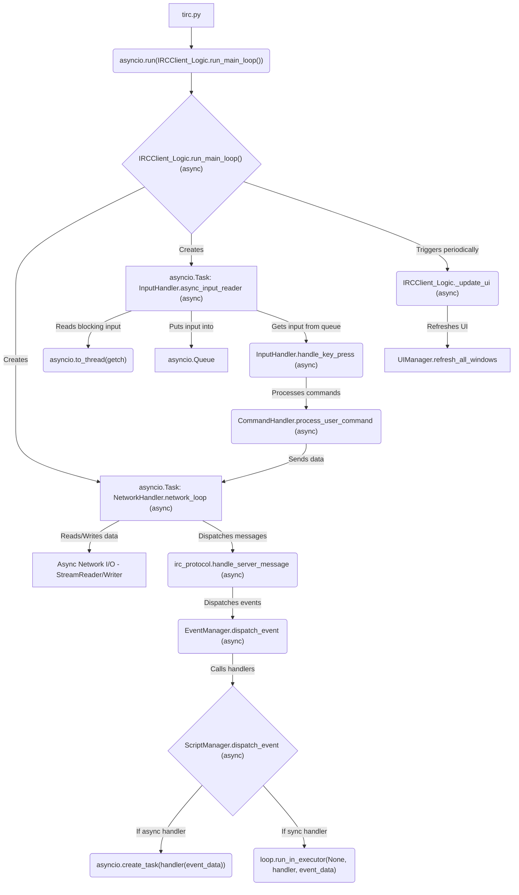

# tIRC - terminal IRC client

[](https://opensource.org/licenses/MIT)
[](https://www.python.org/)
[](http://makeapullrequest.com)

> 💬 **A modern, modular IRC client built for power users and AI integration**

For detailed documentation, command references, and developer guides, please visit the [**Official tIRC Wiki**](https://github.com/edgeof8/tIRC/wiki).

## 🚀 Core Features

- **Modern Async Core**: Fully asynchronous `asyncio`-based core for high performance and responsiveness.
- **Modular Architecture**: Decoupled components for connection management, UI, state, and commands.
- **Extensible Scripting**: Powerful Python scripting API for deep customization and automation.
- **Terminal UI**: Rich curses-based interface with split-screen support and customizable layouts.
- **IRCv3 Support**: Comprehensive protocol compliance including SASL authentication and message tags.
- **Centralized State Management**: Persistent sessions and configuration managed by a single source of truth.
- **DCC Support**: Secure and efficient Direct Client-to-Client file transfers and chat.
- **Inter-Process Communication (IPC)**: Allows external command-line tools to send commands to a running tIRC instance.

## Architecture Overview

tIRC employs a highly modular, event-driven architecture. The `IRCClient_Logic` acts as the central orchestrator, delegating specialized tasks to dedicated managers and coordinators.

## Project Status

**Stable Release** - tIRC is production-ready with regular updates. Recent improvements include:

- Complete migration to asyncio
- Enhanced state management
- Improved UI architecture
- Better IRCv3 support
- More robust scripting API

We welcome contributions and feedback!

## Installation

### Requirements

- Python 3.8+
- `pip` package manager
- `windows-curses` on Windows (included in requirements.txt)
- 
### From Source

1. Clone the repository:
   ```bash
   git clone https://github.com/edgeof8/tIRC.git
   cd tIRC
   ```
2. Set up virtual environment:
   ```bash
   python -m venv venv
   source venv/bin/activate  # Linux/macOS
   venv\Scripts\activate     # Windows
   ```
3. Install dependencies:
   ```bash
   pip install -r requirements.txt
   ```
4. Install package:
   ```bash
   pip install .
   ```

## Configuration

## Architecture Overview - Detailed Event Flow



## Key Architectural Features

### Asyncio-Based Core

- **Complete Migration to asyncio:** The entire client has been refactored to use Python's `asyncio` framework, eliminating the previous threading-based approach for better performance and simplified concurrency management.
- **Non-blocking I/O:** All network operations, user input handling, and UI updates are handled asynchronously, ensuring a responsive user experience even during heavy network traffic.
- **Efficient Resource Usage:** The single-threaded event loop model reduces context switching overhead and simplifies synchronization.
- **Modern Python Features:** Leverages Python 3.9+ features like `asyncio.to_thread` for running blocking operations without blocking the event loop.
- **Centralized State Management with `StateManager`:**
  - The `StateManager` is the _exclusive_ source of truth for all connection, session, and client-specific runtime state.
  - It provides thread-safe, persistent session state that includes:
    - Current connection details and authentication state (e.g., current nick, server, port, SSL status, SASL/NickServ info).
    - Connection statistics (attempts, last error, etc.).
    - List of joined channels and their join status.
    - User preferences and client settings (e.g., logging levels, DCC settings).
    - Message history and scrollback positions for each context.
  - State is automatically persisted to disk and restored on startup, ensuring a seamless experience across client restarts.
- **Dynamic Command System:** All core client commands are implemented in individual Python modules within a structured `commands/` directory. They are dynamically discovered using `pkgutil.walk_packages` and registered at startup, making the client easily extensible.
- **Extensible Scripting System:** A powerful Python scripting system allows for deep customization. Scripts can register commands, subscribe to a wide range of events, and interact with the client through a rich `ScriptAPIHandler`.

## File Structure

```
tIRC/
├── .git/                       # Git version control data
├── .gitignore                  # Specifies intentionally untracked files for Git
├── pyproject.toml              # Build system requirements and project metadata (PEP 518)
├── tirc.py                     # Main application entry point
├── README.md                   # This file
├── requirements.txt            # Project dependencies
├── state.json                  # Persistent client state (auto-generated)
│
├── config/                     # Configuration files
│   ├── tirc_config.ini   # Main configuration file (user-edited)
│   ├── tirc_config.ini.example # Example configuration file
│   └── triggers.json           # Stores persistent user-defined triggers (auto-generated)
│
├── data/                       # General static data files (if any beyond tirc_core/data)
│
├── docs/                       # Project documentation
│   └── wiki/                   # Wiki documentation pages
│
├── downloads/                  # Default directory for DCC downloads
│
├── logs/                       # Log files (auto-generated)
│   ├── tirc_core.log           # Main application log
│   └── tirc_error.log          # Error log (if specific errors are logged separately)
│   └── client_status_messages.log # Log for status window messages
│   └── dcc.log                 # Log for DCC transfers
│   └── (channel_name).log      # Per-channel logs if enabled
│
├── tirc_core/                  # Core application package
│   ├── __init__.py             # Package initialization
├── app_config.py           # Centralized configuration management (configparser)
├── context_manager.py      # Manages chat contexts (channels, queries, server)
├── event_manager.py        # Asynchronous event dispatching system
├── ipc_manager.py          # Manages the local IPC server for remote commands
├── network_handler.py      # Async IRC protocol I/O (asyncio.StreamReader/Writer)
├── script_manager.py       # Script manager
├── state_manager.py        # Thread-safe state management with persistence
│
├── client/                 # Client implementation, UI, and logic
│   ├── __init__.py
│   ├── client_shutdown_coordinator.py # Handles graceful shutdown
│   ├── client_view_manager.py    # Manages different views/layouts
│   ├── connection_orchestrator.py  # Coordinates connection lifecycle
│   ├── curses_manager.py         # Low-level Curses initialization and teardown
│   ├── curses_utils.py           # Safe Curses drawing utilities
│   ├── dummy_ui.py               # Dummy UI for headless mode
│   ├── input_handler.py          # Async input processing and command dispatching
│   ├── input_line_renderer.py    # Renders the input line
│   ├── irc_client_logic.py       # Main application logic
│   ├── message_panel_renderer.py # Renders the message panel
│   ├── sidebar_panel_renderer.py # Renders the sidebar (nicklist)
│   ├── state_change_ui_handler.py # Updates UI based on state changes
│   ├── status_bar_renderer.py    # Renders the status bar
│   ├── ui_manager.py             # Orchestrates UI components
│   └── window_layout_manager.py  # Manages window layout calculations
│
├── commands/               # Built-in command implementations
│   ├── __init__.py
│   ├── command_handler.py    # Command registration and dispatch
│   │
│   ├── channel/            # Commands for channel operations
│   │   ├── __init__.py
│   │   ├── ban_commands.py       # /ban, /unban, /kickban
│   │   ├── cyclechannel_command.py # /cycle
│   │   ├── invite_command.py     # /invite
│   │   ├── join_command.py       # /join
│   │   ├── kick_command.py       # /kick
│   │   ├── mode_command.py       # /mode (channel modes)
│   │   ├── part_command.py       # /part
│   │   ├── simple_mode_commands.py # /op, /deop, /voice, etc.
│   │   └── topic_command.py      # /topic
│   │
│   ├── core/             # Essential client commands
│   │   ├── __init__.py
│   │   └── help_command.py       # /help
│   │
│   ├── dcc/              # DCC file transfer and chat commands
│   │   ├── __init__.py
│   │   ├── dcc_accept_command.py # /dcc accept
│   │   ├── dcc_auto_command.py   # /dcc auto
│   │   ├── dcc_browse_command.py # /dcc browse
│   │   ├── dcc_cancel_command.py # /dcc cancel
│   │   ├── dcc_command_base.py   # Base class for DCC commands
│   │   ├── dcc_commands.py       # Main DCC command handler
│   │   ├── dcc_get_command.py    # /dcc get
│   │   ├── dcc_list_command.py   # /dcc list
│   │   ├── dcc_resume_command.py # /dcc resume
│   │   └── dcc_send_command.py   # /dcc send
│   │
│   ├── information/      # Information retrieval commands
│   │   ├── __init__.py
│   │   ├── list_command.py       # /list
│   │   ├── names_command.py      # /names
│   │   ├── who_command.py        # /who
│   │   ├── whowas_command.py     # /whowas
│   │
│   ├── server/           # Server connection and management
│   │   ├── __init__.py
│   │   ├── connect_command.py    # /connect
│   │   ├── disconnect_command.py # /disconnect
│   │   ├── quit_command.py       # /quit
│   │   ├── raw_command.py        # /raw
│   │   ├── reconnect_command.py  # /reconnect
│   │   └── server_command.py     # /server
│   │
│   ├── ui/               # User interface control commands
│   │   ├── __init__.py
│   │   ├── close_command.py      # /close
│   │   ├── split_screen_commands.py # /split, /unsplit
│   │   ├── status_command.py     # /status
│   │   ├── userlist_scroll_command.py # /scrollusers
│   │   └── window_navigation_commands.py # /window, /next, /prev
│   │
│   ├── user/             # User interaction commands
│   │   ├── __init__.py
│   │   ├── away_command.py       # /away
│   │   ├── ignore_commands.py    # /ignore, /unignore, /listignores
│   │   ├── me_command.py         # /me
│   │   ├── msg_command.py        # /msg
│   │   ├── nick_command.py       # /nick
│   │   ├── notice_command.py     # /notice
│   │   ├── query_command.py      # /query
│   │   └── whois_command.py      # /whois
│   │
│   └── utility/          # Utility and configuration commands
│       ├── __init__.py
│       ├── clear_command.py      # /clear
│       ├── lastlog_command.py    # /lastlog
│       ├── rawlog_command.py     # /rawlog
│       ├── rehash_command.py     # /rehash
│       ├── save_command.py       # /save
│       ├── script_command.py     # /script
│       └── set_command.py        # /set
│       /* Note: trigger_command.py might be in features/triggers now */
│
├── data/                   # Static data files for tirc_core
│   └── default_help/
│       └── command_help.ini  # Fallback help texts for core commands
│
├── dcc/                    # DCC (Direct Client-to-Client) feature implementation
│   ├── __init__.py
│   ├── dcc_command_base.py   # Base class for DCC related logic (if distinct from commands/dcc)
│   ├── dcc_ctcp_handler.py   # Handles incoming DCC CTCP requests
│   ├── dcc_manager.py        # Main orchestrator for all DCC functionality
│   ├── dcc_passive_offer_manager.py # Manages passive (reverse) DCC offers
│   ├── dcc_protocol.py       # Parses and formats DCC CTCP messages
│   ├── dcc_receive_manager.py# Manages all incoming file transfers
│   ├── dcc_security.py       # Filename sanitization and path validation
│   ├── dcc_send_manager.py   # Manages all outgoing file transfers
│   ├── dcc_transfer.py       # Base classes for DCC send/receive transfer logic
│   └── dcc_utils.py          # Shared utility functions (e.g., socket creation)
│
├── features/               # Self-contained, optional features
│   ├── __init__.py
│   └── triggers/           # Implementation of the /on command trigger system
│       ├── __init__.py
│       ├── trigger_commands.py # /on, /off, /listtriggers etc.
│       └── trigger_manager.py  # Manages trigger logic
│
├── irc/                    # IRC protocol logic and message handling
│   ├── __init__.py
│   ├── cap_negotiation_issues.md # Notes on CAP negotiation
│   ├── cap_negotiator.py     # Handles IRCv3 capability negotiation
│   ├── irc_message.py        # Parses raw IRC lines
│   ├── irc_protocol.py       # Main dispatcher for incoming server messages
│   ├── registration_handler.py # Manages NICK/USER registration
│   ├── sasl_authenticator.py   # Handles SASL PLAIN authentication
│   └── handlers/             # Specific handlers for IRC commands/numerics
│       ├── __init__.py
│       ├── irc_numeric_handlers.py # Handlers for server numeric replies
│       ├── membership_handlers.py  # JOIN, PART, QUIT, KICK
│       ├── message_handlers.py     # PRIVMSG, NOTICE
│       ├── protocol_flow_handlers.py # PING, CAP, etc.
│       └── state_change_handlers.py  # NICK, MODE, etc.
│
├── logging/                # Logging-specific components
│   └── channel_logger.py     # Manages per-channel and status window log files
│
├── script_manager.py     # Discovers, loads, and manages user scripts
│
├── scripting/              # The Python scripting engine
│   ├── __init__.py
│   ├── python_trigger_api.py # API for the /on <event> PY <code> trigger action
│   ├── script_api_handler.py # Provides the `api` object for scripts
│   └── script_base.py        # A base class for scripts to inherit from
│
└── utils/                  # Utility functions
    └── __init__.py
│
├── scripts/                    # Directory for user-provided Python scripts
│   ├── default_exit_handler.py   # Example: Handles client exit
│   ├── default_fun_commands.py   # Example: Adds fun commands
│   ├── default_random_messages.py# Example: Sends random messages for testing
│   └── data/                     # Data files specific to scripts
│       └── ...                   # (e.g., ai_api_test_script data, etc.)
│
├── test_configs/               # Configuration files for testing purposes
│   └── ...
```

# Logs are stored in the following locations (auto-created when needed):

# - Main application log: logs/tirc_core.log

# - Error log: logs/tirc_error.log (if configured)

# - Status window log: logs/client_status_messages.log

# - DCC transfer log: logs/dcc.log

# - Per-channel logs (if enabled): logs/(channel_name).log

````

## Project Status

**tIRC is a stable and mature IRC client** that continues to evolve with regular updates and improvements. The current focus is on enhancing stability, improving the user experience, and maintaining compatibility with modern IRC networks. Recent development has focused on robust state management, reliable session persistence, and comprehensive IRCv3 support. We welcome contributions and feedback to help make tIRC even better.

{{ ... }}

## Recent Architectural Refactoring & Improvements

This section highlights the significant architectural changes and robustness improvements implemented in recent development cycles.

- **Asynchronous Core with `asyncio`**: The entire client has been refactored to use Python's `asyncio` framework, providing significant performance improvements for I/O-bound operations and simplified concurrency management.
- **`IRCClient_Logic` as High-Level Orchestrator**: Its role has been refined to primarily coordinate various specialized manager and coordinator components, enhancing modularity and separation of concerns.
- **Modular Connection Management (`ConnectionOrchestrator`)**: Centralizes and manages the entire server connection lifecycle, including TCP/SSL connection, capability negotiation, SASL authentication, and NICK/USER registration.
- **Decoupled Shutdown Logic (`ClientShutdownCoordinator`)**: Encapsulates the complex shutdown sequence, ensuring a graceful and orderly termination of all client components and preventing resource leaks.
- **Isolated View Management (`ClientViewManager`)**: Manages UI-specific logic related to different views (e.g., split-screen), active context switching, and associated event handling, decoupling core application logic from UI concerns.
- **Decomposed UI System**: The `UIManager` now orchestrates a suite of smaller, specialized components (`CursesManager`, `WindowLayoutManager`, and various `...Renderer` classes) for rendering specific parts of the UI, improving modularity and testability.
- **Centralized Configuration (`AppConfig`)**: All application and server settings are loaded and managed centrally, ensuring a single, consistent source of truth for configuration values.
- **Exclusive State Management (`StateManager`)**: The sole authority for all runtime state, featuring robust validation, thread-safe access, and automatic persistence to `state.json`.
- **Dynamic Command System**: The `CommandHandler` now uses `pkgutil` for dynamic discovery and loading of all command modules, making the system more robust and extensible.
- **Refined Event System**: The `EventManager` is a standalone component responsible for all event dispatching, providing a clearer and more consistent API for scripts and internal components.
- **Inter-Process Communication (IPC)**: A new `IPCManager` enables a running tIRC instance to receive commands from external processes via a local socket, supporting the `--send-raw` CLI functionality for scripting and remote control.
- **Enhanced IRCv3 Feature Handling**: Improved `CapNegotiator`, `SaslAuthenticator`, and `RegistrationHandler` with comprehensive timeout mechanisms and refined registration flows.
- **Streamlined DCC Command Handling**: DCC commands are now function-based within `tirc_core/commands/dcc/`, simplifying their structure.
- **Enhanced Headless Testing Framework**: Updated headless test scripts align with the `StateManager` and `ScriptAPIHandler` paradigms, using event-driven waits for increased reliability.

These architectural improvements significantly enhance tIRC's stability, maintainability, and extensibility, laying a solid foundation for future development.

## Key Features

- **Text-based UI:** Clean and navigable interface using the Python `curses` library (optional for headless operation).
- **Split-Screen Support:** Horizontal split-screen mode with independent scrolling and context management for each pane.
- **Multi-Server Configuration & Switching:**
  - Define multiple server connection profiles in `config/tirc_config.ini`.
  - Switch between configured servers using the `/server <config_name>` command (now with event-driven disconnect handling).
- **Channel and Query Windows:** Separate, consistently managed contexts for channels (case-insensitive handling) and private messages.
- **Intuitive UI Flow:** The client starts in the "Status" window and reliably switches to the first auto-joined channel upon successful connection and join, providing a smooth and predictable startup experience.
- **IRCv3 Support:**
  - Robust CAP negotiation (including `sasl`, `multi-prefix`, `server-time`, `message-tags`, `account-tag`, `echo-message`, `away-notify`, `chghost`, `userhost-in-names`, `cap-notify`, `extended-join`, `account-notify`, `invite-notify`) with improved error handling and stability.
  - SASL PLAIN authentication for secure login.
  - Reliable IRCv3 Message Tag parsing that handles modern IRC server messages with enhanced compatibility and robustness.
- **Highly Modular Command System:** _All_ core client commands are implemented in individual Python modules within a structured `commands/` directory. These are dynamically discovered and registered at startup. Each command module defines its handler(s), help text (usage, description, supporting dictionary format for richer help), and aliases.
- **Dynamic & Categorized Help System:** The `/help` system is fully dynamic, sourcing information from core command modules and script registrations. It now displays categories first, allowing users to drill down via `/help <category>` or `/help script <script_name>`. Specific command help (`/help <command>`) provides detailed usage, description, and aliases.
- **Comprehensive Command Set:** Supports a wide array of standard IRC commands and client-specific utility commands (see "Basic Commands" section).
- **Dynamic Configuration:** View and modify client settings on-the-fly using `/set`. Changes are saved to `config/tirc_config.ini`. Reload with `/rehash`.
- **Ignore System:** Powerful ignore list for users/hostmasks with wildcard support, managed via `/ignore`, `/unignore`, `/listignores`.
- **Extensible Scripting System (Python):**
  - Load custom Python scripts from a `scripts/` directory.
  - **Dependency Management:** Scripts can declare dependencies in their metadata, and `ScriptManager` now attempts to load scripts in an order that satisfies these dependencies, warning about missing or circular dependencies.
  - Rich `ScriptAPIHandler` for client interaction (see "Scripting System" section). Many API methods are now `async` and must be `await`ed.
  - Scripts can register commands with structured help (usage, description, aliases).
- **Advanced Event-Driven Trigger System (`/on` command & API):**
  - Define custom actions (client commands or Python code via `PythonTriggerAPI`) based on IRC events.
  - Persistent triggers saved to `config/triggers.json`.
- **Modular Event Management:** A dedicated `EventManager` handles consistent dispatching of script-facing events. Includes a `CLIENT_MESSAGE_ADDED_TO_CONTEXT` event.
- **Headless Operation & Testing:**
  - Full functionality with `--headless` flag. Core logic, scripting (including `ScriptAPIHandler`), `EventManager`, and the trigger system are fully functional, all running on an efficient `asyncio` event loop.
  - Refactored headless test script (`scripts/test_headless.py`) using an event-driven verification framework for increased reliability.
- **Logging:**
  - Comprehensive main application log (`logs/tirc_core.log`).
  - Dedicated Status window log (`logs/client_status_messages.log`).
  - Optional per-channel logging. `logs/` directory created automatically.
  - Raw IRC message logging to UI toggleable with `/rawlog`.
- **DCC (Direct Client-to-Client) Support:**
  - SEND and GET (active and passive/reverse offers with tokens).
  - Configurable port range for listening sockets.
  - Option to specify an advertised IP (`dcc_advertised_ip`) for NAT traversal.
  - Automatic cleanup of old/completed DCC transfers to manage resources.
  - File size limits, blocked extensions, auto-accept options.
  - Resume support for sends and receives.
  - Checksum verification (MD5, SHA1, etc.).
  - Bandwidth throttling for sends and receives (KB/s).
  - Dedicated DCC logging.
- **UI Enhancements:**
  - Tab completion for commands and nicks.
  - Ctrl+Y/Ctrl+E scrolling in message windows.
  - SSL/TLS Encryption: Secure connections, with `verify_ssl_cert` option.

## Prerequisites

- Python 3.8 or higher.
- `pip` (Python package installer).
- On Windows, `windows-curses` is required (`pip install windows-curses`). It's included in `requirements.txt`.
- `pyfiglet` for the `/ascii` command (optional, for `default_fun_commands.py` script). It's included in `requirements.txt`.

## Installation

### Option 1: Install via pip

```bash
pip install tirc
````

### Option 2: Install from source

1. **Clone the repository:**

   ```bash
   git clone https://github.com/edgeof8/tIRC.git
   cd tIRC
   ```

2. **Create a virtual environment (recommended):**

   ```bash
   python -m venv venv
   ```

3. **Activate it:**

   - Windows: `venv\Scripts\activate`
   - Linux/macOS: `source venv/bin/activate`

4. **Install dependencies:**

   ```bash
   pip install -r requirements.txt
   ```

5. **Install the package:**
   ```bash
   pip install .
   ```

### Option 3: Use standalone executable

Download the latest release from the [Releases](https://github.com/edgeof8/tIRC/releases) page and run the executable for your platform:

- Windows: `tirc-0.1.0-win64.exe`
- Linux: `tirc-0.1.0-linux`
- macOS: `tirc-0.1.0-macos`

## Configuration

tIRC uses `config/tirc_config.ini` for configuration. To get started:

```bash
cp config/tirc_config.ini.example config/tirc_config.ini
```

### Key Configuration Sections

#### Server Connections

```ini
[Server.Libera]
address = irc.libera.chat
port = 6697
ssl = true
nick = YourNick
channels = #python,#linux
sasl_username = your_account
sasl_password = your_password
```

#### UI Settings

```ini
[UI]
message_history_lines = 1000
colorscheme = dark
```

#### Logging

```ini
[Logging]
log_enabled = true
log_file = tirc.log
log_level = INFO
```

#### DCC File Transfers

```ini
[DCC]
enabled = true
download_dir = ~/downloads
max_file_size = 100MB
auto_accept = false
```

### Managing Configuration In-Client

- `/set`: View or modify settings
- `/rehash`: Reload configuration
- `/save`: Persist changes to disk

Example usage:

```
/set UI.colorscheme light
/rehash
```

## Usage

### Basic Operation

Start tIRC:

```bash
python tirc.py
```

Connect to a server:

```
/connect irc.libera.chat 6697 ssl
```

Join channels:

```
/join #python #linux
```

Send messages:

```
/msg #python Hello everyone!
```

### Common Commands

#### Connection Management

- `/server Libera` - Connect using Libera config
- `/disconnect` - Disconnect from current server
- `/reconnect` - Reconnect to current server

#### Channel Operations

- `/topic` - View or set channel topic
- `/names` - List users in channel
- `/mode` - View or set channel modes

#### Messaging

- `/query Nick` - Open private chat
- `/notice Nick` - Send notice
- `/me waves` - Send action message

#### UI Controls

- `/split` - Toggle split view
- `/next` - Next window
- `/prev` - Previous window
- `/clear` - Clear current window

### Example Workflow

1. Start client and connect:
   ```
   /connect irc.libera.chat 6697 ssl
   ```
2. Authenticate with NickServ:
   ```
   /msg NickServ IDENTIFY your_password
   ```
3. Join channels:
   ```
   /join #python #linux
   ```
4. Chat normally in channels
5. Use `/help` for more commands

## Contributing

We welcome contributions! Please follow these guidelines:

### Getting Started

1. Fork the repository
2. Create a feature branch:
   ```bash
   git checkout -b feature/your-feature
   ```
3. Set up development environment:
   ```bash
   python -m venv venv
   source venv/bin/activate
   pip install -r requirements-dev.txt
   ```

### Code Style

- Follow PEP 8 guidelines
- Use type hints for all new code
- Keep lines under 100 characters
- Document public APIs with docstrings

### Testing

- Write unit tests for new features
- Run tests before submitting:
  ```bash
  pytest tests/
  ```
- For UI changes, test in both:
  - Terminal mode
  - Headless mode (`--headless` flag)

### Submitting Changes

1. Commit with descriptive messages
2. Push to your fork
3. Open a Pull Request with:
   - Description of changes
   - Screenshots if applicable
   - Reference to any related issues

## License

tIRC is licensed under the [MIT License](LICENSE).

---

<p align="center">
  <a href="https://github.com/edgeof8/tIRC">GitHub</a> •
  <a href="https://pypi.org/project/tirc/">PyPI</a> •
  <a href="https://github.com/edgeof8/tIRC/issues">Issues</a> •
  <a href="https://github.com/edgeof8/tIRC/pulls">Pull Requests</a>
</p>

tIRC uses `config/tirc_config.ini` in its root directory. To get started:

1. Copy the example configuration file:
   ```bash
   cp config/tirc_config.ini.example config/tirc_config.ini
   ```
2. Edit `config/tirc_config.ini` to customize your settings.

**Key Config Sections & Settings (Managed by `AppConfig`):**

- **`[Server.YourServerName]`**: Define multiple server profiles.
  - `address`, `port`, `ssl`, `nick`, `channels` (comma-separated).
  - `username`, `realname` (optional, default to nick).
  - `server_password`, `nickserv_password` (optional).
  - `sasl_username`, `sasl_password` (optional, for SASL PLAIN).
  - `verify_ssl_cert` (true/false).
  - `auto_connect` (true for one server).
  - `desired_caps` (optional, comma-separated IRCv3 capabilities).
- **`[UI]`**: `message_history_lines`, `headless_message_history_lines`, `colorscheme`.
- **`[Logging]`**: `log_enabled`, `log_file`, `log_level`, rotation settings, `channel_log_enabled`.
- **`[Features]`**: `enable_trigger_system`.
- **`[Scripts]`**: `disabled_scripts` (comma-separated module names).
- **`[IgnoreList]`**: Managed by `/ignore` commands.
- **`[DCC]`**:
  - `enabled`, `download_dir`, `max_file_size`, `auto_accept`.
  - `blocked_extensions`, `port_range_start`, `port_range_end`, `timeout`.
  - `passive_token_timeout`, `checksum_verify`, `checksum_algorithm`.
  - `bandwidth_limit_send_kbps`, `bandwidth_limit_recv_kbps` (0 for unlimited).
  - `resume_enabled`.
  - `dcc_advertised_ip` (optional manual IP for NAT).
  - `cleanup_enabled`, `cleanup_interval_seconds`, `transfer_max_age_seconds`.
  - DCC logging settings (`log_enabled`, `log_file`, etc.).

Use `/set`, `/rehash`, `/save` in-client to manage configuration. These commands interact directly with the `AppConfig` instance to update and persist settings.

## Usage

Run tIRC from its root directory:

```bash
python tirc.py
```

Command-line overrides (creates a temporary "CommandLine" server configuration):

```bash
python tirc.py [--server <server>] [--port <port>] [--nick <nick>] [--channel <#channel>] [--ssl] [--password <server_pass>] [--nickserv-password <pass>] [--headless] [--disable-script <script_name>] [--send-raw "<raw_command>"]
```

## Basic Commands

tIRC supports a variety of commands, all dynamically loaded. Type `/help` within the client for a list of commands and their aliases, or `/help <command>` for specific command usage. The help system is dynamically built from command module definitions and script registrations, ensuring up-to-date information.

### Connection & Session Management:

- `/connect <server[:port]> [ssl|nossl]`: Initiates a connection to the specified IRC server.
- `/server <config_name>` (Alias: `/s`): Switches to a pre-defined server configuration.
- `/disconnect [reason]` (Alias: `/d`): Gracefully disconnects from the current server.
- `/quit [message]` (Alias: `/q`): Disconnects from the server and exits tIRC.
- `/reconnect`: Reconnects to the current server.
- `/nick <newnickname>` (Alias: `/n`): Changes your nickname.
- `/away [message]`: Sets your away status.

### Channel Operations:

- `/join <channel> [#channel2 ...]` (Alias: `/j`): Joins the specified IRC channel(s).
- `/part [channel] [reason]` (Alias: `/p`): Leaves the specified channel.
- `/topic [<channel>] [<new_topic>]` (Alias: `/t`): Views or sets the topic for a channel.
- `/invite <nick> [channel]` (Alias: `/i`): Invites a user to a channel.
- `/kick <nick> [reason]` (Alias: `/k`): Kicks a user from the current channel.
- `/cyclechannel` (Alias: `/cc`): Parts and then rejoins the current channel.
- `/ban <nick|hostmask>`: Bans a user or hostmask from the current channel.
- `/unban <hostmask>`: Removes a ban from the current channel.
- `/mode [<target>] <modes_and_params>`: Sets or views channel or user modes.
- `/op <nick>` (Alias: `/o`): Grants operator status to <nick> in the current channel.
- `/deop <nick>` (Alias: `/do`): Removes operator status from <nick> in the current channel.
- `/voice <nick>` (Alias: `/v`): Grants voice status to <nick> in the current channel.
- `/devoice <nick>` (Alias: `/dv`): Removes voice status from <nick> in the current channel.

### Messaging & Information:

- `/msg <target> <message>` (Alias: `/m`): Sends a private message or a message to a channel.
- `/query <nick> [message]`: Opens a private chat window.
- `/notice <target> <message>` (Alias: `/no`): Sends a NOTICE.
- `/me <action text>`: Sends an action message (CTCP ACTION).
- `/whois <nick>` (Alias: `/w`): Retrieves WHOIS information.
- `/who [channel|nick]`: Shows WHO information.
- `/whowas <nick> [count] [server]`: Shows WHOWAS information.
- `/list [pattern]`: Lists channels on the server.
- `/names [channel]`: Shows the list of users in a channel.

### Client Utility & UI:

- `Ctrl+Y`/`Ctrl+E`: Scroll message buffer.
- `/clear` (Alias: `/c`): Clears the message history of the current active window.
- `/close [context_name]` (Aliases: `/wc`, `/partchannel`): Closes a window.
- `/help [command_name]` (Alias: `/h`): Displays help.
- `Ctrl+N` (or `/nextwindow`, Alias: `/next`): Switch to the next window.
- `Ctrl+P` (or `/prevwindow`, Alias: `/prev`): Switch to the previous window.
- `/window <name|number>` (Alias: `/win`): Switches to a specific window.
- `/status`: Switches to the Status window.
- `/prevchannel` (Alias: `/pc`): Switches to the previously active channel or Status window.
- `/split`: Toggle split-screen mode.
- `/focus <top|bottom>`: Switch focus between split panes.
- `/setpane <top|bottom> <context_name>`: Set a context in a specific pane.
- `Ctrl+U` (or `/userlistscroll [offset|direction]`, Alias: `/u`): Scrolls the user list.
- `/set [<section.key> [<value>]]` (Alias: `/se`): Views or modifies client configuration settings.
- `/rehash`: Reloads the client configuration.
- `/save`: Saves the current client configuration.
- `/ignore <nick|hostmask>`: Adds a user/hostmask to the ignore list.
- `/unignore <nick|hostmask>`: Removes a user/hostmask from the ignore list.
- `/listignores` (Alias: `/ignores`): Lists all currently ignored patterns.
- `/rawlog [on|off|toggle]`: Toggles or sets the display of raw IRC messages.
- `/lastlog <pattern>`: Searches message history.
- `/raw <raw IRC command>` (Aliases: `/quote`, `/r`): Sends a raw command directly to the IRC server.
- `/on ...`: Manages event-based triggers.

### Remote Control / Scripting

tIRC can be controlled from a second terminal or a script by sending commands to a running instance.

- `/raw <command>`: The primary way to send any IRC line.
- `--send-raw "<command>"`: A command-line flag to send a single command and then exit. This is ideal for scripting.

**Example:**

```bash
# In one terminal, tIRC is running.
# In a second terminal, send a message to #python:
python tirc.py --send-raw "/msg #python Hello from a script!"
```

### Fun Commands (from default_fun_commands.py script):

- `/slap <nickname>`: Slaps a user.
- `/8ball <question>`: Asks the Magic 8-Ball.
- `/dice <NdN>` (Alias: `/roll`): Rolls dice.
- `/rainbow <text>`: Sends text in rainbow colors.
- `/reverse <text>`: Sends text reversed.
- `/wave <text>`: Sends text with a wave effect.
- `/ascii <text>`: Converts text to ASCII art (requires `pyfiglet`).

### DCC (Direct Client-to-Client) Commands:

- `/dcc send [-p|--passive] <nick> <filepath> [filepath2 ...]`: Initiates a DCC SEND to the specified user. Multiple files can be specified and will be queued for sequential transfer. Use `-p` for a passive (reverse) send, where the recipient connects to you after you send them a token.
- `/dcc get <nick> "<filename>" --token <token>`: Accepts a passive DCC SEND offer from `<nick>` for `<filename>` using the provided `<token>`.
- `/dcc accept <nick> "<filename>" <ip> <port> <size>`: Accepts an _active_ incoming DCC SEND offer from a user (where the sender is listening).
- `/dcc list`: Lists current active DCC transfers, recently completed/failed ones, and pending passive offers you've received.
- `/dcc cancel <id_or_token_prefix>` (Alias: `/dcc close`): Cancels an active transfer by its ID prefix or a pending passive offer by its token prefix.
- `/dcc auto [on|off]`: Toggles or sets the global auto-accept feature for incoming DCC offers. Displays current status if no argument.
- `/dcc browse [path]`: Lists contents of the specified local directory path (or current directory if no path given). Useful for finding files to send.
- `/dcc resume <id_or_filename>`: Attempts to resume a previously failed/cancelled outgoing DCC SEND transfer.

## Headless Operation

Run with `--headless`. Core logic, scripting (including `ScriptAPIHandler`), `EventManager`, and the trigger system are fully functional, all running on an efficient `asyncio` event loop. Ideal for bots, AI integrations, and automated testing. The `scripts/test_headless.py` and `scripts/ai_api_test_script.py` scripts provide examples and a framework for such tests.

## Scripting System

tIRC features a Python scripting system in `scripts/`. Scripts inherit from `ScriptBase`, use `ScriptAPIHandler` (`self.api`), and can define dependencies in their `metadata.json`.

Scripts can define event handlers as either standard synchronous functions or as `async def` coroutines. The `EventManager` will correctly `await` asynchronous handlers, allowing for non-blocking I/O operations (like network requests or disk I/O) within scripts without freezing the client.

### Key `ScriptAPIHandler` Capabilities (Summary):

_(This section can remain largely the same, but ensure it's up-to-date with any API changes.)_

- **Sending:** `send_raw`, `send_message`, `send_action`, etc. (now `async`).
- **UI Interaction:** `add_message_to_context` (now `async`).
- **Information Retrieval:** `get_client_nick`, `get_context_messages`, etc.
- **Trigger Management API:** `add_trigger`, `remove_trigger`, etc.
- **Command/Help Registration:** `register_command` (now accepts rich help dict), `register_help_text`, `create_command_help`.
- **Logging & Data:** `log_info`, `request_data_file_path`.

### Key Script Events (Dispatched via `EventManager`)

Events are dispatched with a consistent `event_data` dictionary including `timestamp`, `raw_line` (if applicable), and `client_nick`.

**Client Lifecycle Events:**

- `CLIENT_CONNECTING`: Fired when a new connection attempt is initiated.
  - `event_data` keys: `server` (str), `port` (int), `nick` (str), `ssl` (bool).
- `CLIENT_CONNECTED`: Fired when TCP/IP connection is established and CAP negotiation begins.
  - `event_data` keys: `server` (str), `port` (int), `nick` (str), `ssl` (bool).
- `CLIENT_CAP_NEGOTIATION_START`: Fired when capability negotiation begins.
  - `event_data` keys: `capabilities` (List[str] - requested capabilities).
- `CLIENT_CAP_NEGOTIATION_COMPLETE`: Fired when capability negotiation completes.
  - `event_data` keys: `negotiated_capabilities` (List[str]).
- `CLIENT_AUTHENTICATING`: Fired when SASL authentication begins.
  - `event_data` keys: `mechanism` (str).
- `CLIENT_AUTHENTICATED`: Fired upon successful SASL authentication.
  - `event_data` keys: `account` (str - account name if available).
- `CLIENT_REGISTERING`: Fired when sending NICK/USER registration commands.
  - `event_data` keys: `nick` (str), `username` (str), `realname` (str).
- `CLIENT_REGISTERED`: Fired upon receiving RPL_WELCOME (001).
  - `event_data` keys: `nick` (str), `server_message` (str), `hostname` (str).
- `CLIENT_READY`: Fired after successful registration and initial auto-join actions.
  - `event_data` keys: `nick` (str), `channels` (List[str]).
- `CLIENT_DISCONNECTED`: Fired when connection is lost or closed.
  - `event_data` keys: `server` (str), `port` (int), `reason` (str), `reconnecting` (bool).
- `CLIENT_RECONNECTING`: Fired when a reconnection attempt is initiated.
  - `event_data` keys: `attempt` (int), `max_attempts` (int).
- `CLIENT_MESSAGE_ADDED_TO_CONTEXT`: Fired when any message is added to any context's buffer by `IRCClient_Logic.add_message`.
  - `event_data` keys: `context_name` (str), `text` (str - the full line added, including timestamp/prefix), `color_key_or_attr` (Any), `source_full_ident` (Optional[str]), `is_privmsg_or_notice` (bool).
- `CLIENT_NICK_CHANGED`: Fired specifically when tIRC's own nickname successfully changes.
  - `event_data` additional keys: `old_nick` (str), `new_nick` (str).
- `CLIENT_SHUTDOWN_FINAL`: Fired just before application exit, _after_ `curses` UI is down (if UI was active).

**IRC Message & Command Events:**

- `PRIVMSG`: For channel and private messages.
  - `event_data` additional keys: `nick` (str), `userhost` (str), `target` (str), `message` (str), `is_channel_msg` (bool), `tags` (Dict[str, Any] - parsed IRCv3 message tags).
- `NOTICE`: For IRC NOTICEs.
  - `event_data` additional keys: `nick` (str), `userhost` (str), `target` (str), `message` (str), `is_channel_notice` (bool), `tags` (Dict[str, Any]).
- `JOIN`: When a user (including client) joins.
  - `event_data` additional keys: `nick` (str), `userhost` (str - if available from server, e.g. with extended-join), `channel` (str), `account` (str - if available, e.g. with extended-join), `real_name` (str - if available, e.g. with extended-join), `is_self` (bool).
- `CHANNEL_FULLY_JOINED`: Fired after a channel is successfully joined and RPL_ENDOFNAMES (or equivalent) is received.
  - `event_data` additional keys: `channel_name` (str).
- `PART`: When a user (including client) parts.
  - `event_data` additional keys: `nick` (str), `userhost` (str), `channel` (str), `reason` (str), `is_self` (bool).
- `QUIT`: When a user quits.
  - `event_data` additional keys: `nick` (str), `userhost` (str), `reason` (str).
- `NICK`: When any user changes their nickname.
  - `event_data` additional keys: `old_nick` (str), `new_nick` (str), `userhost` (str), `is_self` (bool).
- `MODE`: When a mode change occurs (raw event).
  - `event_data` additional keys: `nick` (str - setter), `userhost` (str - setter's host), `target` (str - channel/nick affected), `modes_and_params` (str - raw mode string), `parsed_modes` (List[Dict] - structured mode changes).
- `CHANNEL_MODE_APPLIED`: Fired after a channel MODE is processed and applied.
  - `event_data` additional keys: `channel` (str), `setter_nick` (str), `setter_userhost` (str), `mode_changes` (List[Dict] - structured), `current_channel_modes` (List[str]).
- `TOPIC`: When a channel topic is changed or viewed.
  - `event_data` additional keys: `nick` (str - setter), `userhost` (str), `channel` (str), `topic` (str).
- `CHGHOST`: When a user's host changes.
  - `event_data` additional keys: `nick` (str), `new_ident` (str), `new_host` (str), `userhost` (str - old userhost).

**Raw IRC Lines & Numerics:**

- `RAW_IRC_LINE`: Fired for _every_ complete raw line received from the server _before_ tIRC's internal parsing.
  - `event_data` keys: `raw_line` (str).
- `RAW_IRC_NUMERIC`: Fired for all numeric replies from the server.
  - `event_data` keys: `numeric` (int), `source` (str - server name), `params_list` (List[str] - full parameters), `display_params_list` (List[str] - parameters with client nick removed if first), `trailing` (Optional[str]), `tags` (Dict[str, Any]).

**Key UI Navigation:**

- Ctrl+Y/Ctrl+E: Scroll message buffer.
- Ctrl+N / Ctrl+P: Switch windows.
- Ctrl+U: Scroll user list.

## State Management System

tIRC's `StateManager` provides a robust, thread-safe, and persistent solution for managing all client state. It acts as the **single source of truth** for all connection, session, and client-specific runtime data, ensuring:

- Predictable and consistent state across the application.
- Easier debugging and testing due to centralized state.
- Enhanced separation of concerns between data and logic.

### Key Features

- **Centralized State Storage:** Holds all critical client state, including `ConnectionInfo` (server, nick, channels, passwords, SASL details), `ConnectionState` (DISCONNECTED, CONNECTING, REGISTERED, etc.), and various runtime statistics.
- **Robust State Validation:**
  - Employs an extensible validator system (`StateValidator`) to ensure data integrity.
  - Performs comprehensive type checking and validation for all state updates, including complex dataclasses like `ConnectionInfo`.
  - Provides clear error messages for invalid configurations or state transitions.
- **Efficient Change Notifications:**
  - Implements an event-based notification system (`StateChange`) for fine-grained updates.
  - Supports both key-specific and global handlers, allowing components to react precisely to relevant state changes.
  - Ensures thread-safe event dispatching.
- **Reliable State Persistence:**
  - Automatically loads state from a JSON file (`state.json`) on startup.
  - Offers configurable auto-save intervals and manual save capabilities.
  - Handles file operation errors gracefully to prevent data corruption.
- **Thread Safety:** All state access and modification methods are thread-safe, protecting against race conditions in a multi-threaded environment.

### Usage Example

````python
from tirc_core.state_manager import StateManager, StateValidator, ConnectionInfo, ConnectionState
from typing import Optional, Dict, Any

# Example: A custom validator for connection details
class ConnectionInfoValidator(StateValidator[ConnectionInfo]):
    def validate(self, value: ConnectionInfo) -> bool:
        value.config_errors.clear()
        is_valid = True
        if not value.server:
            value.config_errors.append("Server address is required")
            is_valid = False
        if not value.nick:
            value.config_errors.append("Nickname is required")
            is_valid = False
        # Example: SASL validation (simplified)
        if value.sasl_username and not value.sasl_password:
            value.config_errors.append("SASL username provided but no password")
            is_valid = False
        return is_valid

    def get_error_message(self, value: ConnectionInfo) -> Optional[str]:
        if value.config_errors:
            return "\n".join(value.config_errors)
        return None

# Initialize state manager
state_manager = StateManager(
    state_file="app_state.json",
    auto_save=True,
    save_interval=30,  # Save every 30 seconds
    validate_on_change=True
)

# Register a validator for connection information
state_manager.register_validator("connection_info", ConnectionInfoValidator())

# Register a handler for connection state changes
def on_connection_state_change(change: StateChange[ConnectionState]):
    print(f"Connection state changed from {change.old_value.name if change.old_value else 'N/A'} to {change.new_value.name}")
    if change.new_value == ConnectionState.CONFIG_ERROR:
        errors = change.metadata.get("config_errors", [])
        print(f"Configuration errors: {'; '.join(errors)}")

state_manager.register_change_handler("connection_state", on_connection_state_change)

# Example usage: Setting and validating connection info
initial_conn_info = ConnectionInfo(server="irc.example.com", port=6667, ssl=False, nick="TestNick")
if state_manager.set_connection_info(initial_conn_info):
    print("Connection info set successfully.")
else:
    print("Failed to set connection info due to validation errors.")

# Attempt to set invalid connection info (missing nick)
invalid_conn_info = ConnectionInfo(server="irc.bad.com", port=6667, ssl=False, nick="")
if not state_manager.set_connection_info(invalid_conn_info):
    print(f"Attempted to set invalid connection info. Errors: {state_manager.get_config_errors()}")

```python
# Get current state
current_nick = state_manager.get_connection_info().nick if state_manager.get_connection_info() else "N/A"
current_state = state_manager.get_connection_state().name
print(f"Current nick: {current_nick}, Current state: {current_state}")
````

### Best Practices for State Management

1. **Access State via `StateManager`:** Always use `state_manager.get()` and `state_manager.set()` (or specific helper methods like `set_connection_info()`) to interact with state. Avoid direct attribute access on `_state` dictionary.
2. **Utilize `ConnectionInfo`:** For connection-specific details, retrieve the `ConnectionInfo` dataclass via `state_manager.get_connection_info()`. Modify its attributes and then call `state_manager.set_connection_info()` to persist changes and trigger validation.
3. **Handle Validation Results:** When setting state that has a registered validator, check the boolean return value of `set()` or `set_connection_info()`. If `False`, retrieve and display `config_errors` from the `StateManager`.
4. **Subscribe to Changes:** Register change handlers for specific keys (`register_change_handler`) or for all changes (`register_global_handler`) to react to state updates in a decoupled manner.
5. **Thread Safety:** Remember that `StateManager` methods are thread-safe. When reading or modifying state from different threads, always use the provided methods.
6. **Error Handling:** Implement robust error handling around state interactions, especially when dealing with user input or external data that might lead to invalid states.

## Contributing

Contributions are welcome! Please:

1.  Fork the repository.
2.  Create a new branch (`git checkout -b feature/your-feature-name`).
3.  Make your changes and commit them (`git commit -am 'Add some feature'`).
4.  Push to the branch (`git push origin feature/your-feature-name`).
5.  Create a new Pull Request.

For major changes, please open an issue first to discuss your ideas.

## Quick Start

### Installation

```bash
# Install from PyPI
pip install tirc

# Or install the latest development version
pip install git+https://github.com/edgeof8/tIRC.git
```

### Running tIRC

Start the client with default settings:

```bash
tirc
```

Connect to a server directly:

```bash
tirc --connect irc.libera.chat
```

Run in headless mode (for testing/automation):

```bash
tirc --headless --connect irc.libera.chat
```

## Configuration

tIRC uses `config/tirc_config.ini` in its root directory as the main configuration file.
The `state.json` (persistent state) and `logs/` (application logs) directories are created in the current working directory.

### Example `config.ini`

```ini
[server]
host = irc.libera.chat
port = 6697
ssl = true
sasl = true

[identity]
nick = YourNick
username = yourusername
realname = Your Real Name

[ui]
theme = dark
message_format = {timestamp} <{nick}> {message}

[logging]
level = INFO
file = tirc.log
```

## Core Features

### Asynchronous Core

- Single-threaded event loop for all I/O operations
- Non-blocking UI updates and network operations
- Efficient resource usage with Python's asyncio

### Modern IRC Features

- Full IRCv3 support with capability negotiation
- SASL authentication
- Message tags and metadata
- DCC file transfers

### Rich Terminal UI

- Responsive layout that adapts to terminal size
- Split view for multiple channels
- Tab completion for nicks, commands, and channels
- Customizable color schemes
- Mouse support for scrolling and clicking

### Extensibility

- Python scripting API
- Event-driven architecture
- Custom command support
- Plugin system

### State Management

- Persistent connection state
- Automatic reconnection
- Channel and user tracking
- Message history and search

## Scripting API

tIRC provides a powerful Python API for automation and extension. Scripts can:

- Listen for and respond to events
- Register custom commands
- Interact with the IRC server
- Modify the UI
- Access and modify application state

### Example Script

```python
# ~/.config/tirc/scripts/example.py

async def on_connect(event_data):
    """Automatically join channels after connecting."""
    client = event_data['client']
    await client.send('JOIN #python #linux')

def on_message(event_data):
    """Respond to messages containing 'hello'."""
    if 'hello' in event_data['message'].lower():
        target = event_data['target']
        nick = event_data['nick']
        return f'PRIVMSG {target} :Hello, {nick}!'

# Register event handlers
handlers = {
    'CLIENT_CONNECTED': on_connect,
    'CHANNEL_MESSAGE': on_message,
    'PRIVATE_MESSAGE': on_message,
}
```

## License

This project is licensed under the MIT License.

## Building from Source

### Prerequisites

- Python 3.8 or higher
- pip (Python package manager): `pip install pip`
- build (Python package): `pip install build`
- PyInstaller: `pip install pyinstaller`

### Build Steps

1. **Clone and setup:**

   ```bash
   git clone https://github.com/edgeof8/tIRC.git
   cd tIRC
   python -m venv venv
   # Activate virtual environment (see above)
   pip install -r requirements.txt
   ```

2. **Run the build script:**

   ```bash
   python build.py
   ```

This will:

- Build the Python package (wheel and source distribution)
- Create standalone executables for your platform
- Output artifacts to the `dist/` directory

### Testing the Build

After building, you can validate the package and executable:

```bash
python test_build.py
```

This will run tests to verify:

- Package installation
- Executable functionality
- Headless mode
- Configuration file handling

### Build Output

The build process creates the following files in the `dist/` directory:

- Python package:
  - `tirc-0.1.0.tar.gz` (source distribution)
  - `tirc-0.1.0-py3-none-any.whl` (wheel)
- Standalone executable:
  - Windows: `tirc-0.1.0-win64.exe`
  - Linux: `tirc-0.1.0-linux`
  - macOS: `tirc-0.1.0-macos`

## Support

For support, please [open an issue](https://github.com/edgeof8/tIRC/issues) on GitHub.

## Acknowledgments

- Built with ❤️ by the tIRC contributors
- Thanks to all the open source projects that made this possible

---

<p align="center">
  <a href="https://github.com/edgeof8/tIRC">GitHub</a> •
  <a href="https://pypi.org/project/tirc/">PyPI</a> •
  <a href="https://github.com/edgeof8/tIRC/issues">Issues</a> •
  <a href="https://github.com/edgeof8/tIRC/pulls">Pull Requests</a>
</p>
