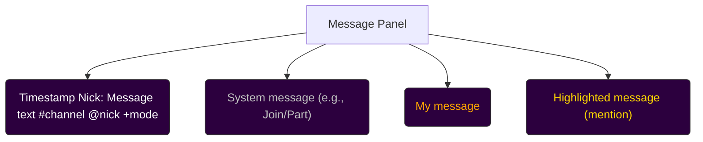
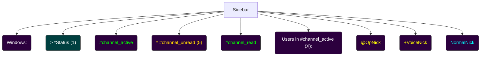

# PyRC UI Overhaul Plan

### 1. Vision & Core Principles

The goal is to transform PyRC's UI into a modern, consistent, and highly readable experience, significantly enhancing visual aesthetics and functional clarity.

- **Visual Appeal & Eye Strain Reduction:** The UI will be "much nicer," prioritizing visual comfort.
- **Main Backgrounds:** Dark but distinctly colored, specifically using **dark purple/magenta tones**, avoiding pure black.
- **Status Bar:** Visually distinct and "stark" through high contrast, avoiding pure black. It will feature a **minimalist, high-contrast look with a light grey or white foreground on a dark, distinct background**.
- **Input Bar:** The _sole_ UI element permitted to use **pure black as a background**.
- **Consistent Highlighting:** Robust system for consistent color-highlighting of `#channels`, `@nicks`, and `+modes` across _all_ UI windows (chat, user lists, topic bars). This will extend to standard event members (server names, timestamps, message types).
- **256-Color Support:** Implement full 256-color support using hex codes if the terminal supports it, falling back to 8-color if not.

### 2. Detailed Color Palette Specification

This palette will define the hex codes and their semantic usage. We will use a base dark purple/magenta for backgrounds and select complementary colors for highlighting.

**Base Colors:**

- **Main Background (Dark Purple/Magenta):** `#2C003E` (A deep, dark purple with a hint of magenta)
  - _Semantic Usage:_ Default background for message panels, sidebar, and general window areas.
- **Input Bar Background (Pure Black):** `#000000`
  - _Semantic Usage:_ Exclusive background for the input line.
- **Status Bar Background (Dark Cyan/Teal):** `#004040` (A dark, distinct teal for high contrast with foreground)
  - _Semantic Usage:_ Background for the status bar.

**Highlighting System Colors:**

- **Channels (`#channels`):** `#00FF00` (Bright Green)
  - _Semantic Usage:_ Identifies IRC channels.
- **Nicks (`@nicks`):** `#00FFFF` (Cyan)
  - _Semantic Usage:_ Identifies user nicknames.
- **Modes (`+modes`):** `#FFFF00` (Bright Yellow)
  - _Semantic Usage:_ Identifies user modes (e.g., op, voice).
- **My Messages:** `#FFA500` (Orange)
  - _Semantic Usage:_ Messages sent by the current user.
- **Other Messages:** `#FFFFFF` (White)
  - _Semantic Usage:_ Messages from other users.
- **System Messages:** `#C0C0C0` (Silver/Light Gray)
  - _Semantic Usage:_ General system information, joins/parts, server notices.
- **Error Messages:** `#FF0000` (Red)
  - _Semantic Usage:_ Critical errors, connection failures.
- **Highlight (Mentions):** `#FFD700` (Gold)
  - _Semantic Usage:_ When your nick is mentioned.
- **Timestamps:** `#808080` (Gray)
  - _Semantic Usage:_ Timestamp prefixes for messages.
- **Server Names:** `#ADD8E6` (Light Blue)
  - _Semantic Usage:_ Server names in status messages or events.
- **Active Window (Sidebar):** `#FFFFFF` (White foreground) on `#004040` (Dark Cyan/Teal background)
  - _Semantic Usage:_ Highlights the currently active window in the sidebar.
- **Unread Window (Sidebar):** `#FFD700` (Gold foreground) on `#2C003E` (Dark Purple/Magenta background)
  - _Semantic Usage:_ Indicates windows with unread messages.
- **Status Bar Foreground:** `#E0E0E0` (Light Grey)
  - _Semantic Usage:_ Text on the status bar.

### 3. Mockups/Wireframes (Mermaid Diagrams & Textual Descriptions)

Since direct visual mockups are not possible, I will use Mermaid diagrams to illustrate the structural layout and highlight areas, complemented by detailed textual descriptions of the appearance.

#### 3.1. Overall UI Structure

```mermaid
graph TD
    A[Terminal Window] --> B(Message Panel)
    A --> C(Sidebar)
    A --> D(Status Bar)
    A --> E(Input Bar)

    subgraph Message Panel
        B1[Chat Messages]
        B2[Event Messages]
    end

    subgraph Sidebar
        C1[Windows List]
        C2[User List]
    end

    style B fill:#2C003E,stroke:#333,stroke-width:2px
    style C fill:#2C003E,stroke:#333,stroke-width:2px
    style D fill:#004040,stroke:#333,stroke-width:2px
    style E fill:#000000,stroke:#333,stroke-width:2px
```

**Textual Description:**

- **Message Panel:** Occupies the main left/center area. Background: `#2C003E` (Dark Purple/Magenta). Text colors will vary based on message type and highlighting rules.
- **Sidebar:** Located on the right. Background: `#2C003E` (Dark Purple/Magenta). Contains the "Windows" list and "Users" list.
- **Status Bar:** A single line at the bottom, above the input bar. Background: `#004040` (Dark Cyan/Teal). Foreground: `#E0E0E0` (Light Grey).
- **Input Bar:** The very bottom line. Background: `#000000` (Pure Black). Foreground: `#FFFFFF` (White).

#### 3.2. Message Panel Highlighting Example

**Textual Description:**

- **General Message:** `[Timestamp] <Nick>: Message text`
  - Timestamp: `#808080` (Gray)
  - Nick: `#00FFFF` (Cyan)
  - Message Text: `#FFFFFF` (White)
  - `#channel` within message: `#00FF00` (Bright Green)
  - `@nick` within message: `#00FFFF` (Cyan)
  - `+mode` within message: `#FFFF00` (Bright Yellow)
- **My Message:** `[Timestamp] <MyNick>: My message text`
  - MyNick: `#FFA500` (Orange)
  - Message Text: `#FFA500` (Orange)
- **System Message (Join/Part):** `[Timestamp] -- Nick has joined #channel --`
  - All text: `#C0C0C0` (Silver/Light Gray)
- **Highlighted Message (Mention):** `[Timestamp] <OtherNick>: Hey MyNick, check this out!`
  - `MyNick` (when mentioned): `#FFD700` (Gold)
  - Rest of message: `#FFFFFF` (White)

#### 3.3. Sidebar Highlighting Example

**Textual Description:**

- **Windows Header:** "Windows:" - Foreground: `#FFFFFF` (White), Background: `#2C003E` (Dark Purple/Magenta).
- **Active Window:** `> *Status (1)` or `> #channel_active`
  - Prefix `>`: `#FFFFFF` (White) on `#004040` (Dark Cyan/Teal)
  - Text (e.g., `Status`, `channel_active`): `#FFFFFF` (White) on `#004040` (Dark Cyan/Teal)
  - `#` for channel: `#00FF00` (Bright Green) on `#004040` (Dark Cyan/Teal)
- **Unread Window:** `* #channel_unread (5)`
  - Prefix `*`: `#FFD700` (Gold) on `#2C003E` (Dark Purple/Magenta)
  - Text (e.g., `channel_unread`): `#FFD700` (Gold) on `#2C003E` (Dark Purple/Magenta)
  - `#` for channel: `#00FF00` (Bright Green) on `#2C003E` (Dark Purple/Magenta)
- **Read Window:** `  #channel_read`
  - Prefix ` `: `#2C003E` (Dark Purple/Magenta)
  - Text (e.g., `channel_read`): `#00FF00` (Bright Green) on `#2C003E` (Dark Purple/Magenta)
- **Users Header:** "Users in #channel (X):" - Foreground: `#FFFFFF` (White), Background: `#2C003E` (Dark Purple/Magenta).
- **User List Items:**
  - `@OpNick`: `@` in `#FFFF00` (Bright Yellow), `OpNick` in `#00FFFF` (Cyan). Background: `#2C003E` (Dark Purple/Magenta).
  - `+VoiceNick`: `+` in `#FFFF00` (Bright Yellow), `VoiceNick` in `#00FFFF` (Cyan). Background: `#2C003E` (Dark Purple/Magenta).
  - `NormalNick`: `#00FFFF` (Cyan). Background: `#2C003E` (Dark Purple/Magenta).

### 4. Technical Roadmap & Implementation Steps

This section outlines the necessary modifications and estimated effort.

#### Phase 1: Color System Modernization (Estimated Effort: 3-5 days)

1.  **CursesManager Refactor for 256-colors:**
    - Modify `pyrc_core/client/curses_manager.py` to support `curses.init_color` and `curses.can_change_color`.
    - Introduce a mechanism to check `curses.COLORS` and `curses.has_colors()` to determine 256-color support.
    - If 256-color is supported, use `curses.init_color` to define custom RGB values from hex codes.
    - Map the hex codes from the new color palette to curses color numbers (0-255).
    - Update `_init_color_pair` to use these new color numbers.
    - Add a fallback mechanism to map hex codes to the closest 8-color curses palette if 256-color is not supported. This will involve a simple mapping function.
2.  **Centralized Color Definitions:**
    - Create a new module (e.g., `pyrc_core/client/ui_colors.py`) to store the hex codes and their semantic names. This will replace the `DEFAULT_COLOR_` constants in `pyrc_core/config_defs.py` for UI purposes.
    - Update `CursesManager` to import colors from this new module.
    - Remove `DEFAULT_COLOR_` constants related to UI from `pyrc_core/config_defs.py`.
3.  **Apply New Backgrounds:**
    - Modify `pyrc_core/client/curses_manager.py` and `pyrc_core/client/window_layout_manager.py` to use the new background color pairs (`message_panel_bg`, `list_panel_bg`, `status_bar`, `input`) as defined in the palette.
    - Ensure `input_win` specifically uses pure black background.

#### Phase 2: Consistent Highlighting System (Estimated Effort: 5-7 days)

1.  **Message Panel Highlighting (`pyrc_core/client/message_panel_renderer.py`):**
    - Implement a text parsing function that identifies `#channels`, `@nicks`, `+modes`, timestamps, and server names within message strings.
    - This function should return a list of `(text, color_pair_id)` tuples for each segment of the message.
    - Integrate this parsing logic into `_draw_messages_in_window` to apply the correct color pairs for each segment.
    - Ensure "My Messages" and "Highlight (Mentions)" override other highlighting for the entire line or specific words.
2.  **Sidebar Highlighting (`pyrc_core/client/sidebar_panel_renderer.py`):**
    - **Context List:**
      - Update `_draw_sidebar_context_list` to use `sidebar_active` and `sidebar_unread` color pairs as defined.
      - Ensure `#channel` names within the context list are highlighted with the `channel` color, while respecting the active/unread background. This will require careful handling of `curses.init_pair` for temporary foreground/background combinations.
    - **User List:**
      - Update `_draw_sidebar_user_list_items_and_indicators` to apply `user_prefix` color for `@` and `+` symbols and `nick` color for the actual nicknames.
      - Ensure the background for user list items remains the `list_panel_bg` color.
3.  **Status Bar Rendering (`pyrc_core/client/status_bar_renderer.py`):**
    - Ensure the status bar uses the `status_bar` color pair (light grey foreground on dark cyan/teal background).
    - If any dynamic elements like server names or nicks appear in the status bar, ensure they use their respective highlighting colors while maintaining the status bar's background.

#### Phase 3: Architectural & Documentation Strategy (Estimated Effort: 2-3 days)

1.  **Refactor `pyrc_core/client/` directory:**
    - Review all renderer classes (`MessagePanelRenderer`, `SidebarPanelRenderer`, `StatusBarRenderer`, `InputLineRenderer`) to ensure they consistently use the `colors` dictionary passed from `UIManager` and `CursesManager`.
    - Ensure `SafeCursesUtils` is used consistently for all curses operations.
    - Consider if any new helper functions are needed in `SafeCursesUtils` for complex text rendering with multiple colors on a single line (e.g., a function that takes a list of `(text, color_pair_id)` tuples).
2.  **Integration with `pyrc_core/commands/ui/`:**
    - The UI commands (e.g., `window_navigation_commands.py`, `split_screen_commands.py`) primarily interact with `ClientViewManager` and `UIManager` to change state (active window, split mode).
    - No direct color or rendering logic changes are expected here, but ensure that state changes correctly trigger `UIManager.refresh_all_windows()` to apply the new UI.
3.  **Documentation Update (`PyRC.wiki/UI-System.md`):**
    - Update the "Core UI Components" section to reflect the new `ui_colors.py` module.
    - Add a new section "UI Color Palette & Highlighting System" detailing the hex codes, semantic usage, and the 256-color/8-color fallback details.
    - Describe the 256-color support implementation and fallback.
    - Add a section on "UI Redesign Principles" outlining the dark backgrounds, stark status bar, and pure black input bar.
    - Include the Mermaid diagrams and textual descriptions from this plan.
    - Update any other relevant sections to reflect the UI overhaul.

#### Phase 4: Cross-Platform Consistency & Performance (Ongoing)

1.  **Cross-Platform Consistency:**
    - The `curses` library itself handles much of the terminal compatibility. The 256-color implementation with an 8-color fallback directly addresses this.
    - Thorough testing on different terminal emulators (e.g., `xterm`, `gnome-terminal`, `Windows Terminal`, `PuTTY`) will be crucial during implementation to ensure consistent appearance.
    - Document any known limitations or variations across platforms in `PyRC.wiki/UI-System.md`.
2.  **Performance Implications & Maintainability:**
    - **Performance:**
      - The current `curses_utils.py` already includes safe wrappers to prevent errors.
      - Batching updates with `noutrefresh` and `doupdate` (as seen in `UIManager.refresh_all_windows`) is good practice and should be maintained.
      - Minimize redundant `erase()` and `bkgd()` calls within renderers; `WindowLayoutManager` should set the background once during window creation. (Noted and addressed in my analysis of the current code).
      - Efficient string slicing and rendering in `MessagePanelRenderer` and `SidebarPanelRenderer` will be key. Avoid re-calculating or re-parsing text unnecessarily.
    - **Maintainability:**
      - Centralizing color definitions in `ui_colors.py` improves maintainability.
      - The modular renderer approach is already good; ensure new highlighting logic is encapsulated within these renderers.
      - Clear comments and docstrings for new functions and modifications.

### 5. Estimated Effort Summary

- **Phase 1: Color System Modernization:** 3-5 days
- **Phase 2: Consistent Highlighting System:** 5-7 days
- **Phase 3: Architectural & Documentation Strategy:** 2-3 days
- **Total Estimated Effort:** 10-15 days (excluding testing and refinement)

### 6. Proposed Updates to UI System Documentation

The `PyRC.wiki/UI-System.md` will be updated to include:

- A new "UI Redesign Principles" section.
- A detailed "UI Color Palette & Highlighting System" section with hex codes, semantic usage, and 256-color/8-color fallback details.
- The Mermaid diagrams and textual descriptions provided in this plan.
- Updates to "Core UI Components" to reflect any new modules (e.g., `ui_colors.py`).
- A "Cross-Platform Consistency" section outlining testing and known variations.
- A "Performance and Maintainability" section summarizing the architectural considerations.
