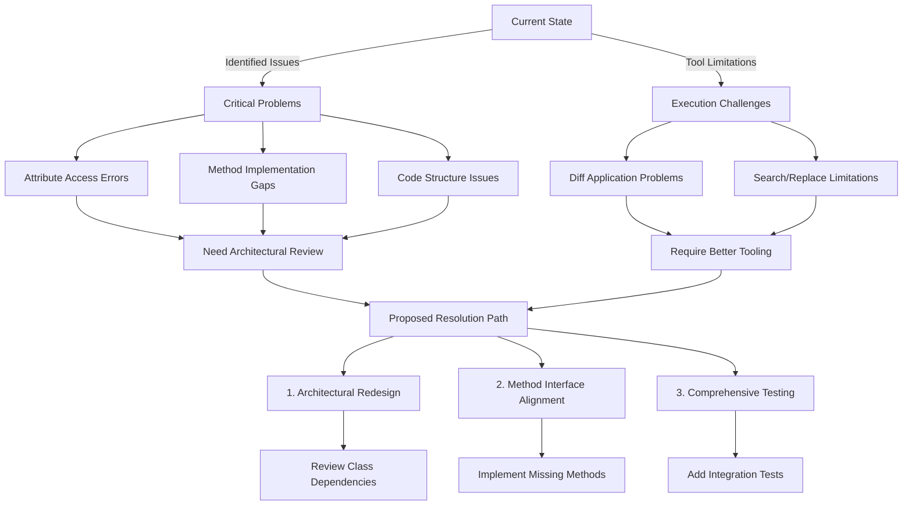

# PyRC Architectural Issues Summary

## Core Problems Identified

1. **Attribute Access Errors**

   - Missing method implementations in `IRCClient_Logic`:
     - `_add_status_message()`
     - `handle_server_message()`
     - `add_message()`
   - Affected files:
     - `pyrc_core/network_handler.py`
     - `pyrc_core/irc/cap_negotiator.py`

2. **Method Implementation Gaps**

   - Undefined internal methods in `IRCClient_Logic`:
     - `_create_initial_state()`
     - `_log_startup_status()`
     - `_start_connection_if_auto()`

3. **Structural Issues**
   - Duplicate `cancel_and_wait` function definition
   - Incorrect indentation in async handlers
   - Missing return statements in bool-returning functions

## Recommended Resolution Path

## Immediate Next Steps

1. Add base method implementations to `IRCClient_Logic`
2. Remove duplicate function definitions
3. Verify async/await patterns
4. Add return type annotations

## Tracking

|     | Issue                        | Location            | Priority |     |
| --- | ---------------------------- | ------------------- | -------- | --- |
| 1   | Missing \_add_status_message | network_handler.py  | Critical |
| 2   | Duplicate cancel_and_wait    | irc_client_logic.py | High     |
| 3   | Undefined handler methods    | Multiple            | High     |
