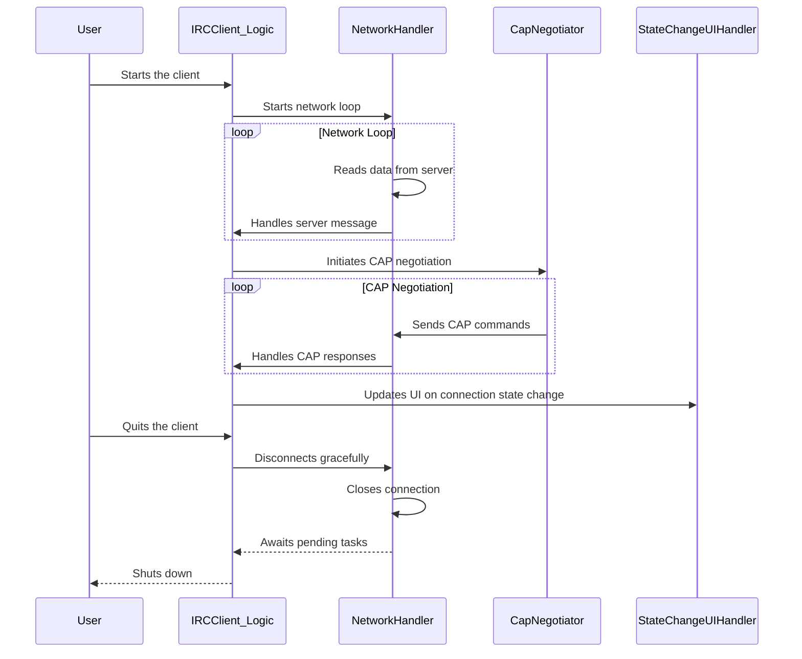

# asyncio Migration Debug Plan

**Objective:**

Address the following errors that arose after the asyncio migration:

- `Network task already running`
- `CapNegotiator: start_negotiation called while already pending`
- `ssl.SSLError: [SSL: APPLICATION_DATA_AFTER_CLOSE_NOTIFY] application data after close notify`
- `Task was destroyed but it is pending`

**Plan:**

1.  **Investigate the "Network task already running" error:**

    - Examine the code to identify where the network loop is started.
    - Ensure that the network loop is only started once and that there are no redundant calls to start it.
    - Implement a check to prevent starting the network loop if it is already running.

2.  **Investigate the "CapNegotiator: start_negotiation called while already pending" error:**

    - Examine the code to identify where the CAP negotiation is initiated.
    - Ensure that the CAP negotiation is only started once per connection.
    - Implement a check to prevent starting a new CAP negotiation if one is already in progress.

3.  **Investigate the "ssl.SSLError: [SSL: APPLICATION_DATA_AFTER_CLOSE_NOTIFY] application data after close notify" error:**

    - Examine the network loop and disconnection logic to identify where data is being sent after the SSL connection has been closed.
    - Ensure that data is not sent after the SSL connection has been closed.
    - Implement proper error handling to catch and log SSL errors.

4.  **Investigate the "Task was destroyed but it is pending" error:**
    - Examine the shutdown logic to identify which tasks are not being properly cleaned up.
    - Ensure that all tasks are properly cancelled and awaited during shutdown.
    - Implement proper error handling to catch and log any errors that occur during task cancellation.

**Mermaid Diagram:**

