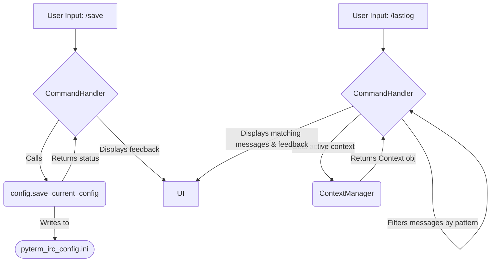

# Plan: Implement /lastlog and /save Client Commands

**Source:** User feedback.
**Goal:** Add commands for searching message history and saving the current configuration.

## Affected Files (Likely):

- `command_handler.py`: To add command map entries and handlers.
- `irc_client_logic.py` or `context_manager.py`: For understanding `/lastlog` logic (message storage).
- `config.py`: For `/save` logic.

## Phase 1: Implement `/save` Command

1.  **Modify `config.py`:**

    - Add a new function `save_current_config()`:

      ```python
      # In config.py
      import logging # Ensure logging is imported if not already at the top

      # ... (other code)

      def save_current_config():
          global config, CONFIG_FILE_PATH
          try:
              with open(CONFIG_FILE_PATH, "w") as configfile:
                  config.write(configfile)
              logging.info("Configuration explicitly saved by /save command.")
              return True
          except Exception as e:
              logging.error(f"Error writing to config file '{CONFIG_FILE_PATH}' during /save: {e}")
              return False
      ```

2.  **Modify `command_handler.py`:**
    - **Add Import:**
      - Ensure `config` module is accessible. This might involve adding `import config` at the top of `command_handler.py` or ensuring `save_current_config` is imported via an existing `from config import ...` statement. The handler will call `config.save_current_config()`.
        ```python
        # Example: At the top of command_handler.py
        import config
        # ... other imports
        from config import (
            get_all_settings, set_config_value, get_config_value, # other existing imports
            # save_current_config # if not importing 'config' directly
        )
        ```
    - **Add Usage String:**
      - In the `COMMAND_USAGE_STRINGS` dictionary, add:
        ```python
        "save": "Usage: /save - Saves the current configuration to pyterm_irc_config.ini.",
        ```
    - **Implement Handler Method:**
      - Add a new method to the `CommandHandler` class:
        ```python
        # In CommandHandler class
        def _handle_save_command(self, args_str: str):
            """Handles the /save command."""
            if config.save_current_config(): # Call via imported config module
                self.client.add_message(
                    "Configuration saved to pyterm_irc_config.ini.",
                    self.client.ui.colors["system"],
                    context_name=self.client.context_manager.active_context_name or "Status"
                )
            else:
                self.client.add_message(
                    "Failed to save configuration.",
                    self.client.ui.colors["error"],
                    context_name=self.client.context_manager.active_context_name or "Status"
                )
        ```
    - **Update Command Map:**
      - In the `command_map` dictionary, add:
        ```python
        "save": self._handle_save_command,
        ```

## Phase 2: Implement `/lastlog <pattern>` Command

1.  **Modify `command_handler.py`:**

    - **Add Usage String:**
      - In `COMMAND_USAGE_STRINGS`, add:
        ```python
        "lastlog": "Usage: /lastlog <pattern> - Searches message history of the active window for <pattern> (case-insensitive).",
        ```
    - **Implement Handler Method:**

      - Add a new method to the `CommandHandler` class:

        ```python
        # In CommandHandler class
        def _handle_lastlog_command(self, args_str: str):
            """Handles the /lastlog command."""
            active_context_obj = self.client.context_manager.get_active_context()
            active_context_name = self.client.context_manager.active_context_name or "Status"
            system_color = self.client.ui.colors.get("system", 0)
            error_color = self.client.ui.colors.get("error", 0)

            if not args_str.strip():
                self.client.add_message(self.COMMAND_USAGE_STRINGS["lastlog"], error_color, context_name=active_context_name)
                return

            pattern = args_str.strip()

            if not active_context_obj:
                self.client.add_message("Cannot use /lastlog: No active window.", error_color, context_name="Status")
                return

            self.client.add_message(f"Searching lastlog for \"{pattern}\" in {active_context_obj.name}...", system_color, context_name=active_context_name)

            found_matches = False
            # Iterate a copy in case messages are added during iteration
            messages_to_search = list(active_context_obj.messages)

            for msg_text, color_attr in messages_to_search:
                if pattern.lower() in msg_text.lower():
                    self.client.add_message(f"[LastLog] {msg_text}", color_attr, context_name=active_context_name)
                    found_matches = True

            if not found_matches:
                self.client.add_message(f"No matches found for \"{pattern}\" in the current log.", system_color, context_name=active_context_name)
            self.client.add_message("End of lastlog search.", system_color, context_name=active_context_name)
        ```

    - **Update Command Map:**
      - In `command_map`, add:
        ```python
        "lastlog": self._handle_lastlog_command,
        ```

## Visual Plan (Mermaid Diagram):


