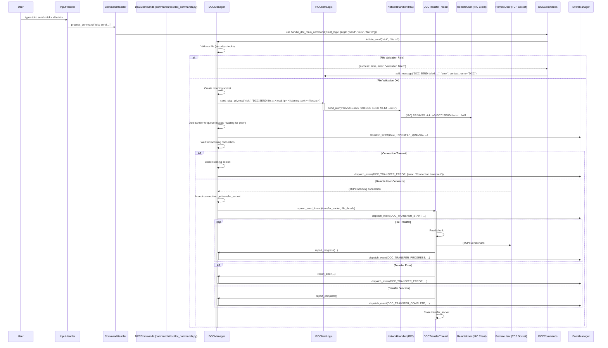

# PyRC DCC File Sharing Implementation Plan

This document outlines the plan to implement DCC (Direct Client-to-Client) file sharing capabilities into the PyRC IRC client.

## 1. Overall Architecture and New Modules

The DCC functionality will be encapsulated in several new Python modules, designed to integrate smoothly with PyRC's existing architecture. These modules will reside in the project's root directory alongside other core modules like `irc_client_logic.py`.

- **`dcc_manager.py`**:

  - **Responsibilities**:
    - Central coordination for all DCC operations.
    - Manages a list/queue of active and pending `DCCTransfer` objects.
    - Handles incoming DCC CTCP requests (parsed and forwarded by `irc_client_logic.py` / `irc_protocol.py`).
    - Initiates outgoing DCC SEND requests by formatting and sending CTCP messages via `irc_client_logic.py`.
    - Manages listening sockets for incoming DCC connections.
    - Instantiates `DCCSendTransfer` or `DCCReceiveTransfer` objects.
    - Dispatches DCC-related events via the `EventManager`.
    - Provides an API for `commands/dcc/dcc_commands.py` to interact with.
    - Reads DCC configuration settings from `config.py`.
  - **Integration**:
    - Instantiated by `IRCClient_Logic` and will be an attribute of it (e.g., `self.client_logic.dcc_manager`).
    - Receives DCC CTCP data from `IRCClient_Logic`.
    - Uses `IRCClient_Logic` to send CTCP messages and display UI messages.
    - Uses `EventManager` to dispatch events.

- **`dcc_transfer.py`**:

  - **Responsibilities**:
    - Defines a base `DCCTransfer` class (attributes: ID, filename, peer nick, size, status, progress, rate; methods: start, stop, update_progress).
    - `DCCSendTransfer(DCCTransfer)`: Handles outgoing file transfers. Manages socket connection, reads file in chunks, sends data, tracks progress.
    - `DCCReceiveTransfer(DCCTransfer)`: Handles incoming file transfers. Manages socket connection, receives data, writes to file, tracks progress.
    - Each transfer instance runs in its own thread.
    - Implements resume logic (Phase 4 for send, Phase 2 for receive).
    - Implements checksum calculation/verification (Phase 2).
  - **Integration**:
    - Instantiated by `DCCManager`.
    - Communicates status updates to `DCCManager`.
    - Uses `dcc_security.py` for filename/path validation.

- **`dcc_protocol.py`**:

  - **Responsibilities**:
    - Parsing incoming CTCP DCC messages (e.g., `DCC SEND`, `DCC ACCEPT`, `DCC RESUME`).
    - Formatting outgoing CTCP DCC messages.
    - Converting IP addresses between string and packed integer format.
    - Handling protocol-specific details like tokens for passive DCC.
  - **Integration**:
    - Used by `IRCClient_Logic` (or a helper within `irc_protocol.py`) to parse incoming CTCPs.
    - Used by `DCCManager` to format outgoing CTCPs.

- **`dcc_security.py`**:
  - **Responsibilities**:
    - Filename sanitization (preventing directory traversal, removing illegal characters).
    - Path validation (ensuring downloads/uploads are within configured directories).
    - File extension filtering (auto-reject based on `DCC_BLOCKED_EXTENSIONS`).
    - File size checking (enforcing `DCC_MAX_FILE_SIZE`).
    - (Phase 4) Hooks for optional virus scanning.
  - **Integration**:
    - Used by `DCCManager` before initiating transfers.
    - Used by `DCCReceiveTransfer` before writing to disk.

## 2. Command Module (`commands/dcc/dcc_commands.py`)

- **Location**: `commands/dcc/dcc_commands.py`
- **Responsibilities**:
  - Implements the user-facing `/dcc` command and its subcommands.
  - Interacts with `DCCManager` (via `client_logic.dcc_manager`) to perform DCC actions.
  - Provides user feedback via `client_logic.add_message(...)`.
- **Registration**:
  - A `register_dcc_commands(client_logic, command_handler)` function in this module will be called from `IRCClient_Logic.__init__` to register `/dcc` with the main `CommandHandler`.
- **Subcommands**:
  - `/dcc send <nick> <filepath>`
  - `/dcc get <nick> [filename]`
  - `/dcc accept <nick> <filename> <ip> <port> <size>` (manual accept for Phase 1)
  - `/dcc list`
  - `/dcc close <transfer_id>`
  - `/dcc resume <transfer_id>` (Phase 4 for send, Phase 2 for receive)
  - `/dcc auto [on|off|friends]`
  - `/dcc browse [path]` (Phase 1 simple listing, Phase 3 interactive)

## 3. Configuration Integration (`config.py`)

New DCC-specific options will be added to `config.py` and loaded from a `[DCC]` section in `pyterm_irc_config.ini`.

- `DCC_ENABLED` (bool, default: True)
- `DCC_DOWNLOAD_DIR` (str, default: "downloads")
- `DCC_UPLOAD_DIR` (str, default: "uploads")
- `DCC_AUTO_ACCEPT` (bool, default: False)
- `DCC_AUTO_ACCEPT_FROM_FRIENDS` (bool, default: True)
- `DCC_MAX_FILE_SIZE` (int, default: 100MB)
- `DCC_PORT_RANGE_START` (int, default: 1024)
- `DCC_PORT_RANGE_END` (int, default: 65535)
- `DCC_TIMEOUT` (int, default: 300 seconds)
- `DCC_RESUME_ENABLED` (bool, default: True)
- `DCC_CHECKSUM_VERIFY` (bool, default: True) - Phase 2
- `DCC_BANDWIDTH_LIMIT` (int, default: 0, bytes/sec) - Phase 4
- `DCC_BLOCKED_EXTENSIONS` (list, default: ['.exe', '.bat', ...])
- `DCC_PASSIVE_MODE_TOKEN_TIMEOUT` (int, default: 120 seconds) - Phase 2
- `DCC_VIRUS_SCAN_CMD` (str, default: "") - Phase 4

## 4. Event System Integration (`event_manager.py`)

New event types for DCC operations:

- `DCC_SEND_OFFER_INCOMING` (data: `nick`, `filename`, `size`, `ip`, `port`, `token` (if passive))
- `DCC_GET_OFFER_INCOMING` (data: `nick`, `filename`, `size`, `token` (if passive from remote))
- `DCC_TRANSFER_QUEUED` (data: `transfer_id`, `type`, `nick`, `filename`, `size`)
- `DCC_TRANSFER_START` (data: `transfer_id`, `type`, `nick`, `filename`, `local_path`)
- `DCC_TRANSFER_PROGRESS` (data: `transfer_id`, `type`, `bytes_transferred`, `total_size`, `rate_bps`, `eta_seconds`)
- `DCC_TRANSFER_COMPLETE` (data: `transfer_id`, `type`, `nick`, `filename`, `local_path`, `checksum_status`)
- `DCC_TRANSFER_ERROR` (data: `transfer_id`, `type`, `nick`, `filename`, `error_message`)
- `DCC_TRANSFER_CANCELLED` (data: `transfer_id`, `type`, `nick`, `filename`)
- `DCC_RESUME_OFFERED` (data: `nick`, `filename`, `port`, `position`, `token`)
- `DCC_RESUME_ACCEPTED` (data: `nick`, `filename`, `port`, `position`)

`DCCManager` will dispatch these events. The UI and other scripts can subscribe to them.

## 5. Network Layer Integration

- **`irc_protocol.py` / `irc_client_logic.py`**:
  - `handle_server_message` will detect CTCP `PRIVMSG`/`NOTICE`.
  - If CTCP `DCC`, `dcc_protocol.py` functions parse arguments.
  - Parsed DCC command forwarded to `DCCManager.handle_incoming_dcc_ctcp(...)`.
- **DCC Sockets**:
  - Managed by `DCCSendTransfer` / `DCCReceiveTransfer` instances in their own threads.
  - `DCCManager` orchestrates listening sockets for incoming DCC connections.

## 6. UI Integration (`ui_manager.py` & `context_manager.py`)

- **New "DCC" Context**:
  - `self.context_manager.create_context("DCC", context_type="dcc_transfers")` in `IRCClient_Logic.__init__`.
  - `context_type="dcc_transfers"` allows `UIManager` to render it specially.
- **Displaying DCC Transfers (Phase 1)**:
  - `UIManager` will have a method like `draw_dcc_transfers(self, window, context, dcc_manager)` called when the "DCC" context is active.
  - This method will get transfer statuses from `dcc_manager.get_transfer_statuses()` (this method will need to be added to `DCCManager`).
  - Each transfer item will display basic info: Type, Peer, Filename, Progress (e.g., "1.2MB/5MB"), Status.
  - Example status string: `SEND to <nick>: <file.txt> (1.2MB/5.0MB, Connecting)`
  - Updates based on `DCC_TRANSFER_*` events.
- **Sidebar Integration**:
  - The "DCC" window will appear in the sidebar's "Windows" list.
- **File Selection (Phase 1)**:
  - `/dcc send <nick> <filepath>`: User types path.
  - `InputHandler.get_completions` in `input_handler.py` to be enhanced for file path tab-completion using `os` and `glob`.
  - `/dcc browse [directory_path]`: Lists directory contents to the "DCC" or "Status" window.
- **User Feedback**:
  - `client_logic.add_message(...)` used for DCC-related messages in the "DCC" context or active context.
  - `IRCClient_Logic` will have a handler for DCC events (e.g., `handle_dcc_events`) to update the UI.

## 7. Error Handling Strategy

- **Error Categories**: Configuration, File, Network, Protocol, Security.
- **`dcc_manager.py`**: Central error coordination. Methods return `{success: bool, error: str}`.
- **`dcc_transfer.py`**: Threads catch socket/IO exceptions, report to `DCCManager` via `report_error(message)`.
- **`dcc_protocol.py`**: Validates CTCP formats, returns errors for malformed input.
- **`dcc_security.py`**: Returns error details for validation failures.
- **User Feedback**: Errors reported to user via `client_logic.add_message(...)` in the "DCC" context or "Status" window. Clear, informative messages.
- **Logging**: Comprehensive logging of errors in all DCC modules.
- **Graceful Recovery**: Transfers are cleaned up on error. Connection attempts have timeouts.

## 8. Data Flow Diagram (Mermaid Sequence for Active DCC SEND - Phase 1)

## 9. Phased Implementation

- **Phase 1: Basic DCC SEND/RECEIVE (Active DCC Focus)**

  - **Modules**: Initial `dcc_manager.py`, `dcc_transfer.py`, `dcc_protocol.py`, `dcc_security.py` (basic).
  - **Config**: `DCC_ENABLED`, `DCC_DOWNLOAD_DIR`.
  - **Network**: Active DCC SEND (sender listens, receiver connects).
  - **Commands**: `/dcc send <nick> <filepath>`, `/dcc accept ...` (manual), tab-completion, `/dcc browse` (simple list).
  - **UI**: "DCC" context, basic text status updates.
  - **Events**: `DCC_SEND_OFFER_INCOMING`, `DCC_TRANSFER_START`, `DCC_TRANSFER_COMPLETE`, `DCC_TRANSFER_ERROR`.
  - **Security**: Download dir restriction, filename sanitization.
  - **NAT**: Document limitations, manual port forwarding suggestion, error messages.

- **Phase 2: Transfer Management, Passive DCC, Checksums (COMPLETED)**

  - **Modules**: `DCCManager` (queue, pending passive offer management, cleanup), `DCCTransfer` (checksum calculation and status), `dcc_protocol.py` (passive DCC CTCPs, `DCC ACCEPT` for passive flow, `DCCCHECKSUM` CTCP).
  - **Config**: `DCC_CHECKSUM_VERIFY`, `DCC_CHECKSUM_ALGORITHM`, `DCC_PASSIVE_MODE_TOKEN_TIMEOUT`, `DCC_AUTO_ACCEPT` (global on/off).
  - **Network**: Passive DCC SEND (sender offers with token, waits for ACCEPT) and Passive DCC RECV (receiver listens, sends ACCEPT with token).
  - **Commands**:
    - `/dcc get <nick> "<filename>" --token <token>`: Accepts a pending passive offer.
    - `/dcc list`: Now lists active transfers AND pending passive offers (incoming offers awaiting user action).
    - `/dcc cancel <id_or_token_prefix>` (alias `/dcc close`): Cancels active transfers or pending passive offers.
    - `/dcc auto [on|off]`: Toggles global auto-acceptance of DCC offers (both active and passive).
  - **UI**: `DCCManager.get_transfer_statuses()` provides detailed transfer list including checksum status and pending passive offers.
  - **Events**: `DCC_TRANSFER_QUEUED`, `DCC_TRANSFER_CANCELLED`, `DCC_SEND_OFFER_INCOMING` (distinguishes passive), `DCC_TRANSFER_CHECKSUM_VALIDATED`.

- **Phase 3: UI/UX Enhancements & Robustness**

  - **Detailed DCC Window/Tab:**
    - Create/Enhance a dedicated UI context (e.g., "DCC Transfers") if the current "DCC" context isn't sufficient.
    - Display a sortable, filterable list of all transfers (active, pending, completed, failed) using `UIManager`.
    - Show detailed progress: percentage, speed (KB/s, MB/s), ETA, bytes transferred/total.
    - Allow actions directly from this UI (e.g., selecting a transfer and hitting 'c' to cancel, 'o' to open file/folder, 'x' to clear completed).
  - **Notifications:**
    - Implement more prominent notifications for new DCC offers, transfer completions, and errors.
    - This could involve a specific area in the UI, or if feasible, system tray notifications (requires platform-specific libraries, likely out of scope for terminal UI, but consider distinct UI alerts/highlights).
  - **Bandwidth Limiting (Optional/Advanced - Consider for Phase 4 if complex):**
    - Add configuration option `DCC_BANDWIDTH_LIMIT_SEND` and `DCC_BANDWIDTH_LIMIT_RECV` (in KB/s, 0 for unlimited).
    - Modify `DCCSendTransfer` and `DCCReceiveTransfer` to throttle data transfer if a limit is set. This involves careful timing and buffer management.
  - **File Queueing for Sending (Basic):**
    - Allow `/dcc send <nick> <file1> <file2> ...` or a way to queue multiple files to the _same user_.
    - `DCCManager` would manage a send queue per user, initiating the next transfer automatically after the current one completes. This does _not_ mean sending multiple files over a single DCC connection.
  - **Logging Improvements:**
    - Implement a dedicated DCC log file (e.g., `logs/dcc.log`).
    - Configure `DCCManager` and `DCCTransfer` instances to log detailed information (negotiation, connection attempts, data transfer, errors, checksums) to this file.
    - Ensure log entries are structured and informative for debugging.
  - **Refine `/dcc browse`:**
    - Currently lists directory contents.
    - Phase 3 could make this more interactive within the Curses UI if a file navigator is built, allowing selection of a file to send. For now, ensure it's robust for path display.
  - **Error Handling and Edge Cases:**
    - Review and test various error scenarios (disk full, permissions, network drops during transfer, malformed CTCPs beyond initial parsing).
    - Ensure graceful failure and clear user feedback.

- **Phase 4: Advanced Features (Resume, Advanced Security, UPnP)**

  - **Modules**: `DCCTransfer` (full resume), `dcc_security.py` (virus scan hooks).
  - **Config**: `DCC_BANDWIDTH_LIMIT_SEND_KBPS`, `DCC_BANDWIDTH_LIMIT_RECV_KBPS`, `DCC_RESUME_ENABLED`, `DCC_VIRUS_SCAN_CMD`.
  - **Network**: Bandwidth throttling (COMPLETED), (Optional) UPnP.
  - **Commands**: `/dcc resume` (COMPLETED - for sender-initiated resume of outgoing sends).
  - **Security**: Virus scan hook.

- **Phase 5: Testing and Optimization**
  - Unit tests, integration tests, security tests, performance tests, NAT/firewall tests.
  - Code cleanup, optimization, documentation.

This plan should now be comprehensive and aligned with your project's structure and requirements.
