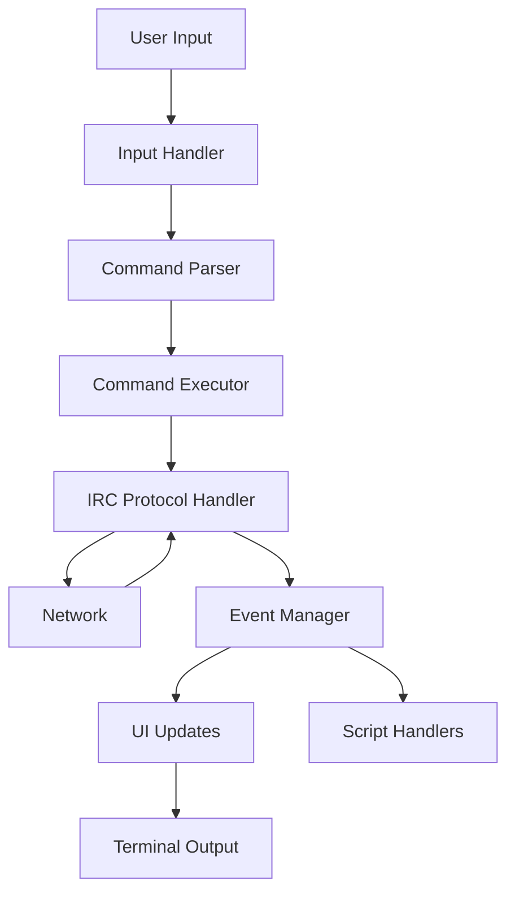

# PyRC Development Guide

## Table of Contents
1. [Introduction](#introduction)
2. [Codebase Overview](#codebase-overview)
3. [Architecture](#architecture)
4. [Development Setup](#development-setup)
5. [Core Components](#core-components)
6. [Event System](#event-system)
7. [State Management](#state-management)
8. [UI Framework](#ui-framework)
9. [Command System](#command-system)
10. [Scripting API](#scripting-api)
11. [Testing Strategy](#testing-strategy)
12. [Debugging](#debugging)
13. [Performance Considerations](#performance-considerations)
14. [Contribution Guidelines](#contribution-guidelines)
15. [AI Development Notes](#ai-development-notes)

## Introduction

This document serves as the central hub for understanding and working with the PyRC codebase. It's designed to be useful for both human developers and AI systems that might interact with or extend PyRC.

## Codebase Overview

### Directory Structure
```
pyrc/
├── pyrc/                    # Main package
│   ├── core/                # Core functionality
│   ├── ui/                  # User interface components
│   ├── commands/            # Built-in commands
│   ├── irc/                 # IRC protocol implementation
│   └── utils/               # Utility functions
├── tests/                   # Test suite
├── scripts/                 # Example and utility scripts
└── docs/                    # Documentation
```

### Key Files
- `pyrc/__main__.py`: Application entry point
- `pyrc/core/__init__.py`: Core package initialization
- `pyrc/core/connection.py`: Connection management
- `pyrc/core/event_manager.py`: Event dispatching system
- `pyrc/core/state_manager.py`: Application state management

## Architecture

### High-Level Architecture



### Design Patterns
- **Observer Pattern**: Used extensively in the event system
- **Singleton**: For managers like StateManager and EventManager
- **Factory**: For creating UI components and commands
- **Strategy**: For different connection and authentication methods

## Development Setup

### Prerequisites
- Python 3.9+
- pip
- git
- (Optional) virtualenv or pyenv

### Installation
```bash
# Clone the repository
git clone https://github.com/edgeof8/PyRC.git
cd PyRC

# Create and activate virtual environment
python -m venv venv
source venv/bin/activate  # On Windows: venv\Scripts\activate

# Install development dependencies
pip install -e ".[dev]"

# Run tests to verify setup
pytest
```

### IDE Setup
Recommended VS Code extensions:
- Python
- Pylance
- Python Test Explorer
- Mermaid Preview (for .md files)
- GitLens

## Core Components

### 1. Event System
- Central event bus for all application events
- Supports synchronous and asynchronous event handlers
- Event types are defined in `pyrc/core/events.py`

### 2. State Management
- Centralized state store
- Thread-safe operations
- State persistence
- Change notifications

### 3. Connection Management
- Handles IRC server connections
- Manages reconnection logic
- Handles SSL/TLS

## Event System

### Event Types
- **System Events**: Application lifecycle events
- **IRC Events**: Raw and parsed IRC protocol messages
- **UI Events**: User interface interactions
- **Command Events**: Command execution and completion

### Subscribing to Events
```python
from pyrc.core.events import EventType, EventManager

def on_message_received(event):
    print(f"Message received: {event.data}")

# Subscribe to message events
EventManager.subscribe(EventType.MESSAGE_RECEIVED, on_message_received)
```

## State Management

### State Structure
```python
{
    "connection": {
        "connected": bool,
        "server": str,
        "port": int,
        "ssl": bool
    },
    "identity": {
        "nick": str,
        "username": str,
        "realname": str
    },
    "ui": {
        "theme": str,
        "layout": str
    }
}
```

### State Operations
```python
from pyrc.core.state_manager import StateManager

# Get state
state = StateManager.get_state()

# Update state
StateManager.update_state('connection.connected', True)

# Subscribe to state changes
def on_connection_change(new_value, old_value):
    print(f"Connection state changed to {new_value}")

StateManager.subscribe('connection.connected', on_connection_change)
```

## UI Framework

### Components
- **WindowManager**: Manages terminal windows
- **InputHandler**: Handles user input
- **MessageRenderer**: Renders chat messages
- **StatusBar**: Displays status information

### Creating a New UI Component
1. Create a new class in `pyrc/ui/components/`
2. Inherit from `BaseComponent`
3. Implement the required methods
4. Register the component in `pyrc/ui/__init__.py`

## Command System

### Command Structure
```python
from pyrc.core.commands import Command

class MyCommand(Command):
    """Description of what the command does"""
    
    name = "mycommand"
    aliases = ["mc"]
    
    async def execute(self, args, context):
        """Execute the command"""
        # Command logic here
        pass
```

### Registering Commands
Commands are automatically discovered and registered when placed in the `pyrc/commands/` directory.

## Scripting API

### Script Structure
```python
from pyrc.scripting import Script

class MyScript(Script):
    """My custom script"""
    
    def __init__(self, client):
        super().__init__(client)
        self.name = "My Script"
    
    async def on_load(self):
        """Called when the script is loaded"""
        self.log("Script loaded!")
    
    async def on_unload(self):
        """Called when the script is unloaded"""
        self.log("Script unloaded!")
```

### Available Hooks
- `on_load()`: When script is loaded
- `on_unload()`: When script is unloaded
- `on_message(event)`: When a message is received
- `on_command(cmd, args)`: When a command is executed

## Testing Strategy

### Unit Tests
- Test individual components in isolation
- Mock dependencies
- Focus on edge cases

### Integration Tests
- Test component interactions
- Use a test IRC server
- Test real user scenarios

### Running Tests
```bash
# Run all tests
pytest

# Run a specific test file
pytest tests/test_events.py

# Run with coverage
pytest --cov=pyrc
```

## Debugging

### Logging
```python
import logging

logger = logging.getLogger(__name__)
logger.debug("Debug message")
logger.info("Info message")
logger.warning("Warning message")
logger.error("Error message")
```

### Debug Mode
Run PyRC in debug mode for more verbose output:
```bash
python -m pyrc --debug
```

## Performance Considerations

### Memory Management
- Use weak references for event handlers
- Clear caches periodically
- Monitor for memory leaks

### Async Best Practices
- Use `asyncio.gather()` for concurrent operations
- Avoid blocking I/O in event loop
- Use `asyncio.create_task()` for background tasks

## Contribution Guidelines

### Code Style
- Follow PEP 8
- Use type hints
- Document public APIs
- Write docstrings

### Pull Request Process
1. Fork the repository
2. Create a feature branch
3. Make your changes
4. Write tests
5. Update documentation
6. Submit a pull request

## AI Development Notes

### For AI Assistants
- The codebase is designed to be AI-friendly
- Use type hints for better code understanding
- Follow the established patterns
- Document your changes

### Common Tasks
1. **Adding a New Command**: Create a new class in `pyrc/commands/`
2. **Handling Events**: Subscribe to events in `__init__.py`
3. **Modifying UI**: Update the relevant component in `pyrc/ui/`
4. **Adding Tests**: Create tests in `tests/`

### Gotchas
- Be careful with thread safety in async code
- Always clean up resources
- Handle errors gracefully
- Consider performance implications

---

This guide is a living document. Please help keep it up to date as the codebase evolves.