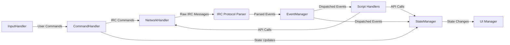

## Architecture Overview

PyRC is built with a highly modular, event-driven architecture designed for extensibility, maintainability, and high performance, leveraging Python's `asyncio` framework for all I/O operations.

**Design Philosophy:** PyRC adheres to the principle of separation of concerns, with clear boundaries between components. A strong emphasis is placed on asynchronous operations, thread-safe state management, and a robust event dispatching system to ensure responsiveness and stability.

### Overall Architecture Diagram

```mermaid
graph TD
    subgraph "Application Entry (pyrc.py)"
        A[main()] --> B(curses.wrapper)
        B --> C[asyncio.run()]
    end

    subgraph "Main Loop (IRCClient_Logic)"
        C --> D{run_main_loop}
        D -- creates & manages --> Task_Input[Input Task]
        D -- creates & manages --> Task_Network[Network Task]
        D -- on exit --> E[shutdown_coordinator.execute_shutdown()]
    end

    subgraph "Connection Lifecycle (ConnectionOrchestrator)"
        F[establish_connection]
        F --> G[initialize_handlers]
        F --> H[network_handler.start]
    end

    subgraph "UI & View (ClientViewManager & UIManager)"
        I[switch_active_context]
        J[UIManager]
        I --> J
    end

    D -- on /server, /connect --> F
    Task_Input --> I

    E -- stops --> Task_Input
    E -- stops --> Task_Network
```

### Key Architectural Features

#### Asyncio-Based Core

- **Complete Migration to asyncio:** The entire client has been refactored to use Python's `asyncio` framework, eliminating the previous threading-based approach for better performance and simplified concurrency management.
- **Non-blocking I/O:** All network operations, user input handling, and UI updates are handled asynchronously, ensuring a responsive user experience even during heavy network traffic.
- **Efficient Resource Usage:** The single-threaded event loop model reduces context switching overhead and simplifies synchronization.
- **Modern Python Features:** Leverages Python 3.9+ features like `asyncio.to_thread` for running blocking operations without blocking the event loop.

#### Centralized State Management with `StateManager`

- The `StateManager` is the _exclusive_ source of truth for all connection, session, and client-specific runtime state.
- It provides thread-safe, persistent session state that includes:
  - Connection details (server, port, SSL status)
  - Authentication state (SASL/NickServ info)
  - Connection statistics and error history
  - Joined channels and their states
  - User preferences and client settings
  - Message history and scrollback positions
- State is automatically persisted to disk and restored on startup.

##### Example State Access:

```python
# Get current connection info
conn_info = client.state_manager.get_connection_info()
if conn_info:
    print(f"Connected to {conn_info.server}:{conn_info.port}")

# Subscribe to state changes
def on_nick_change(change):
    print(f"Nick changed from {change.old_value} to {change.new_value}")

client.state_manager.register_change_handler("nick", on_nick_change)
```

#### Dynamic Command System

- All core client commands are implemented in individual Python modules within a structured `commands/` directory.
- Commands are dynamically discovered using `pkgutil.walk_packages` and registered at startup, making the client easily extensible.

#### Extensible Scripting System

- A powerful Python scripting system allows for deep customization.
- Scripts can register commands, subscribe to a wide range of events, and interact with the client through a rich `ScriptAPIHandler`.

#### Modular Connection Management (`ConnectionOrchestrator`)

- The `ConnectionOrchestrator` is a critical component responsible for centralizing and meticulously managing the entire lifecycle of a server connection.
- It orchestrates the complex sequence of operations required to establish a connection, including:
  - Establishing the initial TCP/SSL socket connection (via `NetworkHandler`).
  - Performing IRCv3 capability negotiation (coordinating with `CapNegotiator`) to agree on supported features with the server.
  - Handling SASL (Simple Authentication and Security Layer) authentication (coordinating with `SaslAuthenticator`) for secure logins.
  - Managing the NICK/USER registration process (coordinating with `RegistrationHandler`) to formally identify the client to the server.
- By delegating these responsibilities, it significantly simplifies the `IRCClient_Logic`, abstracting away the intricate details of connection state transitions, error handling (e.g., connection refused, authentication failure), and timeout management for each phase.
- This leads to more robust, maintainable, and testable connection handling, as each part of the connection sequence is managed by a specialized handler under the orchestrator's control.
- It implements comprehensive timeout mechanisms for each step (e.g., CAP negotiation timeout, SASL authentication timeout) and can trigger appropriate error recovery or retry logic.

#### Decoupled Shutdown Logic (`ClientShutdownCoordinator`)

- The `ClientShutdownCoordinator` was introduced to provide a dedicated and centralized mechanism for gracefully shutting down all parts of the PyRC client.
- Previously, shutdown logic was dispersed, notably within `IRCClient_Logic`'s main loop's `finally` block and other areas. This new coordinator encapsulates all shutdown responsibilities.
- Its primary role is to ensure an orderly and complete termination sequence, which includes:
  - Signaling all active asynchronous tasks (like network loops and input handlers) to terminate.
  - Disconnecting from the IRC server cleanly, sending QUIT messages if appropriate.
  - Releasing resources held by UI components (e.g., properly closing curses).
  - Ensuring script managers unload scripts and release their resources.
  - Saving any final state via the `StateManager`.
- This focused approach improves the reliability of the client's exit process, preventing resource leaks, zombie processes, or abrupt terminations that could lead to data loss or an inconsistent state.

#### Isolated View Management (`ClientViewManager`)

- The `ClientViewManager` is a new component designed to isolate and manage UI-specific logic related to different views and context switching.
- Responsibilities previously handled by `UIManager` or directly within `IRCClient_Logic`, such as managing split-screen layouts, determining which chat window (context) is currently active, and handling events like `ACTIVE_CONTEXT_CHANGED`, are now delegated to this manager.
- Key functions include:
  - Maintaining the state of available views (e.g., single pane, top/bottom split).
  - Tracking the currently focused context (e.g., a specific channel, a query window, or the status window).
  - Orchestrating UI updates when the active context changes (e.g., ensuring the correct message history and user list are displayed).
  - Handling user commands related to window navigation and view manipulation (e.g., `/next`, `/split`).
- This separation decouples core application logic (like message processing or connection management) from the specifics of how views are presented and interacted with. It makes the UI system more flexible, allowing for easier modifications to existing views or the introduction of new view types without impacting other parts of the client.

#### Decomposed UI System

- The previously monolithic `UIManager` has been refactored into a set of specialized components: `CursesManager`, `WindowLayoutManager`, `MessagePanelRenderer`, `SidebarPanelRenderer`, `StatusBarRenderer`, `InputLineRenderer`, and `SafeCursesUtils`.
- This decomposition significantly improves separation of concerns, making the UI system more modular, testable, and easier to extend. `UIManager` now acts as an orchestrator for these components.

### Detailed Connection Flow

The connection process in PyRC is orchestrated by the `ConnectionOrchestrator`, which ensures a robust and compliant connection to the IRC server.

1. **TCP/SSL Connection:** Initiated by the `NetworkHandler`.
2. **CAP Negotiation:** The `CapNegotiator` handles IRCv3 capabilities, requesting and confirming features like `sasl`, `multi-prefix`, and `message-tags`.
3. **SASL Authentication:** If configured and supported, the `SaslAuthenticator` performs secure authentication (e.g., SASL PLAIN).
4. **NICK/USER Registration:** The `RegistrationHandler` sends the NICK and USER commands to formally register the client with the server.
5. **Post-registration Actions:** After successful registration (receiving RPL_WELCOME), PyRC proceeds with auto-joining channels and other startup tasks.

### Component Interaction and Data Flow



Data flows through PyRC via two main pathways:

1. **Server → Client:**
   - Raw IRC messages are received by `NetworkHandler`
   - Parsed by `irc_protocol.py` into structured events
   - Dispatched by `EventManager` to registered handlers
   - Handlers may update `StateManager` or trigger UI updates
2. **User → Server:**
   - Input captured by `InputHandler`
   - Processed by `CommandHandler`
   - Results in IRC commands sent via `NetworkHandler`
   - Or state updates via `StateManager`

##### Example Event Handling:

```python
# Script event handler
async def on_message(event_data):
    if "hello" in event_data["message"].lower():
        await api.send_message(
            event_data["target"],
            f"Hello {event_data['nick']}!"
        )

# Subscribe to PRIVMSG events
api.subscribe_event("PRIVMSG", on_message)
```
