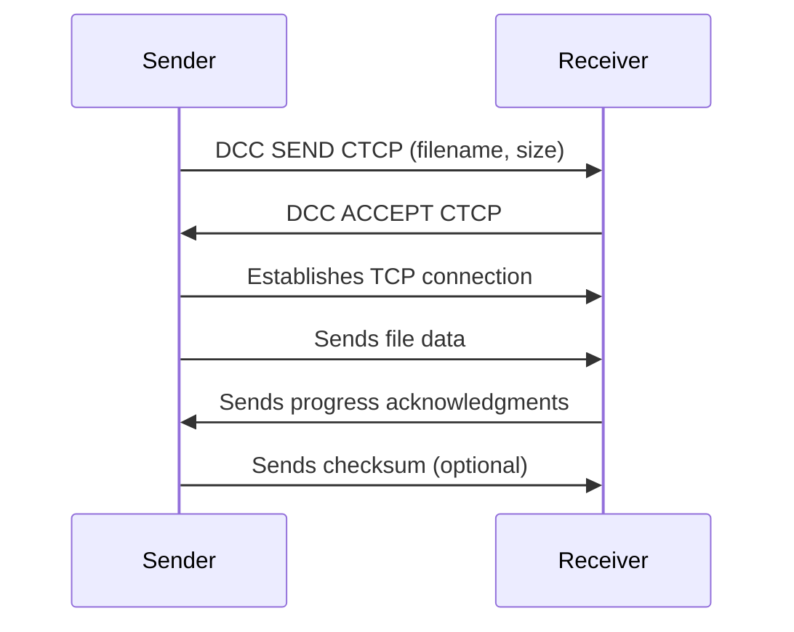
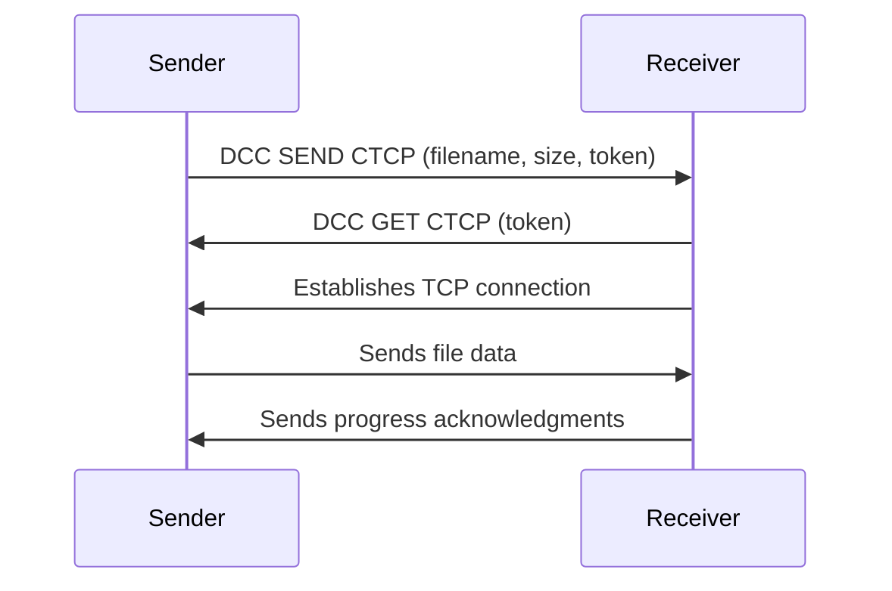

## Direct Client-to-Client (DCC)

PyRC implements the DCC protocol, enabling secure and efficient direct communication and file transfers between IRC clients without relaying data through the IRC server. This provides better speed and reliability for large transfers.

**DCC Overview:** DCC establishes a direct TCP connection between two IRC clients. PyRC's DCC implementation is robust, supporting various transfer modes and security features.

### DCC Features

#### Transfer Types

- **`DCC SEND`**: Initiates an outgoing file transfer to another user.
- **`DCC GET`**: Accepts an incoming file transfer offer from another user.
- **`DCC CHAT`**: Establishes a direct chat connection between two clients (currently not fully implemented for interactive use in PyRC, primarily for file transfer control messages).
- **`DCC RESUME`**: Allows resuming interrupted file transfers from where they left off.

#### Transfer Modes & Capabilities

- **Active Mode**: The sender initiates a connection to the receiver's specified IP/port.
- **Passive Mode (Reverse DCC)**: The receiver initiates a connection to the sender's specified IP/port, useful for clients behind NAT/firewalls. PyRC supports token-based passive offers.
- **Configurable Port Range**: Define a range of local ports for listening sockets.
- **Advertised IP**: Option to manually specify an advertised IP address for NAT traversal.
- **Checksum Verification**: Supports MD5, SHA1, etc., to verify file integrity after transfer.
- **Bandwidth Throttling**: Limit send and receive speeds (in KB/s) to manage network usage.
- **Automatic Cleanup**: Configurable cleanup of old or completed transfers to free resources.
- **Security Features**: File size limits, blocked extensions, and filename sanitization (via `dcc_security.py`) to mitigate risks.

### Key DCC Components

- **`DCCManager`** (`pyrc_core/dcc/dcc_manager.py`): The central orchestrator for all DCC functionality. It manages the lifecycle of all active transfers, delegates specific tasks to `DCCSendManager` and `DCCReceiveManager`, and handles incoming DCC CTCP requests.
- **`DCCSendManager`** (`pyrc_core/dcc/dcc_send_manager.py`): Manages all outgoing DCC file transfers, including queuing multiple files for a single peer, initiating connections, and tracking progress.
- **`DCCReceiveManager`** (`pyrc_core/dcc/dcc_receive_manager.py`): Manages all incoming DCC file transfers, handling acceptance of offers, establishing connections, and saving received data.
- **`DCCPassiveOfferManager`** (`pyrc_core/dcc/dcc_passive_offer_manager.py`): Specifically handles passive (reverse) DCC offers, generating and tracking unique tokens for these transfers.
- **`DCCTransfer` (Base Class)** (`pyrc_core/dcc/dcc_transfer.py`): Abstract base class defining common properties and methods for both send and receive transfers. Concrete classes like `DCCSendTransfer` and `DCCReceiveTransfer` inherit from it.
- **`dcc_protocol.py`**: Contains utilities for parsing and formatting DCC CTCP messages (e.g., `DCC SEND filename ip port size`).
- **`dcc_security.py`**: Provides functions for filename sanitization and path validation to prevent malicious file operations.

### Using DCC in PyRC

#### Initiating a File Transfer (`/dcc send`)

To send a file to another user, use the `/dcc send` command. You can specify multiple files, and they will be queued for sequential transfer. The `-p` or `--passive` flag initiates a passive (reverse) DCC send, where the recipient connects to your client.

```plaintext
/dcc send <nick> <filepath> [filepath2 ...]
/dcc send -p <nick> <filepath> # Passive send
```

Example using the scripting API:

```python
# Example: Initiate a DCC SEND via ScriptAPIHandler
# This would typically be called from a script command handler
await self.api.dcc_manager.initiate_sends(
    peer_nick="friend",
    local_filepaths=["/path/to/my_document.pdf", "another_file.zip"],
    passive=False # Set to True for passive send
)
```

#### Handling Incoming Transfers (`/dcc get`, `/dcc accept`)

When an incoming DCC offer is received, PyRC will display a notification in the Status window. You can then accept the transfer using the appropriate command.

- **Passive Offer (`DCC SEND token`)**: Use `/dcc get` with the provided filename and token.
  ```plaintext
  /dcc get <nick> "<filename>" --token <token>
  ```
- **Active Offer (`DCC SEND ip port size`)**: Use `/dcc accept` with the provided details.
  ```plaintext
  /dcc accept <nick> "<filename>" <ip> <port> <size>
  ```
  Example of handling an incoming DCC offer via a script event handler:

```python
# Example: Script event handler for incoming DCC SEND offers
# Event: INCOMING_DCC_SEND_OFFER
async def handle_incoming_dcc_offer(event_data: Dict[str, Any]):
    nick = event_data["nick"]
    dcc_info = event_data["dcc_info"]
    command = dcc_info["command"] # e.g., "SEND"
    filename = dcc_info["filename"]
    ip_str = dcc_info["ip_str"]
    port = dcc_info["port"]
    file_size = dcc_info["filesize"]
    token = dcc_info.get("token") # Present for passive offers

    self.api.log_info(f"Incoming DCC {command} from {nick}: {filename} ({file_size} bytes)")

    if self.api.config.dcc.auto_accept: # Check auto-accept setting
        if command == "SEND":
            if token:
                # Accept passive offer
                await self.api.dcc_manager.accept_passive_offer_by_token(nick, filename, token)
            else:
                # Accept active offer
                await self.api.dcc_manager.accept_active_offer(nick, filename, ip_str, port, file_size)
            self.api.add_message_to_context(
                f"Auto-accepting incoming DCC {filename} from {nick}.", "info", context_name="Status"
            )
        else:
            self.api.add_message_to_context(
                f"Auto-accept not configured for DCC {command} type.", "warning", context_name="Status"
            )
    else:
        self.api.add_message_to_context(
            f"Incoming DCC {command} from {nick}: {filename} ({file_size} bytes). Use /dcc get or /dcc accept.", "notice", context_name="Status"
        )
```

#### Monitoring Transfer Progress (`/dcc list`)

The `/dcc list` command shows all current, recently completed, or failed DCC transfers. Scripts can monitor progress via dedicated DCC events.

```plaintext
/dcc list # List all active and recent transfers
```

Example of monitoring progress via script events:

```python
# Example: Script event handler for DCC transfer progress
# Event: DCC_TRANSFER_PROGRESS
async def on_dcc_progress(event_data: Dict[str, Any]):
    transfer_id = event_data["transfer_id"]
    filename = event_data["filename"]
    bytes_transferred = event_data["file_size"] # Should be bytes_transferred, assuming typo in original
    file_size = event_data["total_file_size"] # Assuming this is the total size
    current_rate_bps = event_data["current_rate_bps"]
    estimated_eta_seconds = event_data["estimated_eta_seconds"]

    progress_percent = (bytes_transferred / file_size) * 100 if file_size > 0 else 0
    speed_kbps = current_rate_bps / 1024 if current_rate_bps else 0

    eta_display = f"ETA: {int(estimated_eta_seconds)}s" if estimated_eta_seconds is not None else ""

    self.api.log_info(
        f"DCC Progress [{transfer_id[:8]}]: {filename} - "
        f"{progress_percent:.1f}% ({speed_kbps:.1f} KB/s) {eta_display}"
    )

# Event: DCC_TRANSFER_STATUS_CHANGE (for completion/failure)
async def on_dcc_status_change(event_data: Dict[str, Any]):
    transfer_id = event_data["transfer_id"]
    filename = event_data["filename"]
    status = event_data["status"]
    error_message = event_data["error_message"]
    local_filepath = event_data["local_filepath"]

    if status == "COMPLETED":
        self.api.add_message_to_context(
            f"DCC Transfer COMPLETE: {filename} saved to {local_filepath}", "success", context_name="Status"
        )
    elif status == "FAILED":
        self.api.add_message_to_context(
            f"DCC Transfer FAILED: {filename}. Error: {error_message}", "error", context_name="Status"
        )
    self.api.log_info(f"DCC Transfer [{transfer_id[:8]}] status: {status}")
```

### DCC Configuration (`pyterm_irc_config.ini`)

The `[DCC]` section in your `pyterm_irc_config.ini` file provides extensive options for customizing DCC behavior:

```ini
[DCC]
enabled = true                  ; Enable or disable all DCC functionality
download_dir = downloads        ; Default directory for incoming files
upload_dir = uploads            ; Default directory for files to send
auto_accept = false             ; Automatically accept incoming DCC SEND offers
max_file_size = 104857600       ; Maximum allowed file size in bytes (e.g., 100MB)
port_range_start = 1024         ; Start of the port range for listening sockets
port_range_end = 65535          ; End of the port range for listening sockets
timeout = 300                   ; General timeout for DCC connections/transfers in seconds
resume_enabled = true           ; Allow resuming interrupted transfers
checksum_verify = true          ; Verify file checksum after transfer
checksum_algorithm = md5        ; Algorithm for checksum verification (md5, sha1, sha256)
bandwidth_limit_send_kbps =     ; KB/s limit for sending (0 for unlimited)
bandwidth_limit_recv_kbps =     ; KB/s limit for receiving (0 for unlimited)
blocked_extensions = .exe,.bat,.sh ; Dangerous file extensions to block
dcc_advertised_ip =             ; Manual IP for NAT traversal
cleanup_enabled = true          ; Automatically clean up old transfers
cleanup_interval_seconds = 3600 ; How often to run cleanup
transfer_max_age_seconds = 86400; Max age of completed transfers to keep
```

### Security Considerations

**Important Security Notes:**

- Only accept files from trusted users
- Verify checksums of important files
- Use the blocked extensions list to prevent dangerous file types
- Consider disabling auto-accept in untrusted environments
- Regularly review your download directory contents

### Troubleshooting

Common Issues and Solutions:

- **Transfers failing behind NAT:** Try passive mode (`-p` flag) or set `dcc_advertised_ip`
- **Slow transfers:** Check bandwidth limits and network conditions
- **File corruption:** Enable checksum verification
- **Port issues:** Ensure port range is open in firewall

### Transfer Flow Diagrams




