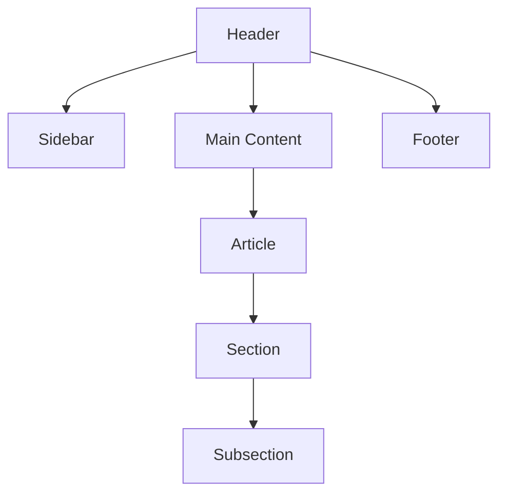
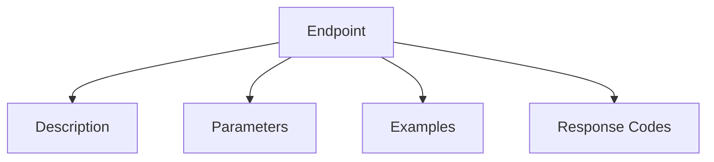

# PyRC Wiki Style Guide

## Design System

### Color Palette

- **Primary**: `#4361ee` (Royal Blue)
- **Secondary**: `#3a0ca3` (Dark Blue)
- **Accent**: `#f72585` (Pink)
- **Light**: `#f8f9fa` (Off White)
- **Dark**: `#212529` (Near Black)
- **Gray**: `#6c757d` (Medium Gray)

### Typography

- **Primary Font**: Inter (400, 500, 600 weights)
- **Code Font**: 'Courier New', monospace
- **Base Size**: 16px
- **Scale**: 1.125 (Major Third)

### Spacing

- **Base Unit**: 1rem (16px)
- **Grid Gutter**: 1.5rem
- **Section Padding**: 2rem

## UI Components

### Navigation

```html
<nav class="sidebar">
  <ul>
    <li class="sidebar-header">Category</li>
    <li>
      <a href="#"><i class="fas fa-icon"></i> Link</a>
    </li>
  </ul>
</nav>
```

### Cards

```html
<div class="card">
  <h3><i class="fas fa-icon"></i> Title</h3>
  <p>Content</p>
</div>
```

### Alerts

```html
<div class="alert-box [info|warning|error]">
  <i class="fas fa-icon"></i>
  <p>Message</p>
</div>
```

### Code Blocks

```html
<pre><code class="language-python">
def example():
    print("Hello World")
</code></pre>
```

## Content Guidelines

### Headings

- Use proper hierarchy (h1 > h2 > h3)
- Include lead paragraph after main heading
- Limit to 3 heading levels per page

### Links

- Use descriptive anchor text
- External links open in new tab
- Internal links use relative paths

### Images

- Max width: 100%
- Include alt text
- Use SVG where possible

## Layout Templates

### Documentation Page



### API Reference



Would you like me to:

1. Add more component examples
2. Include specific CSS rules
3. Proceed with implementation
