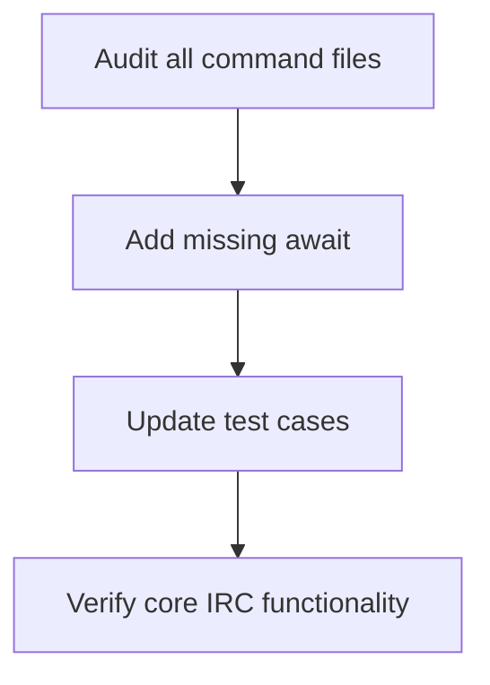
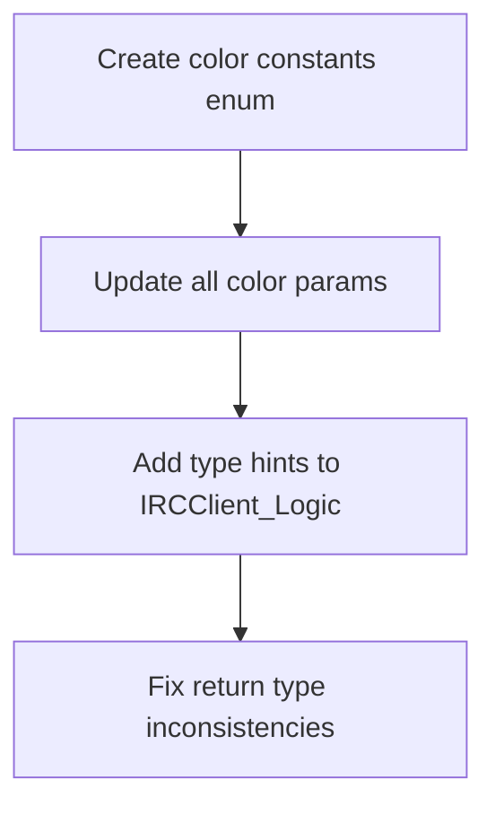
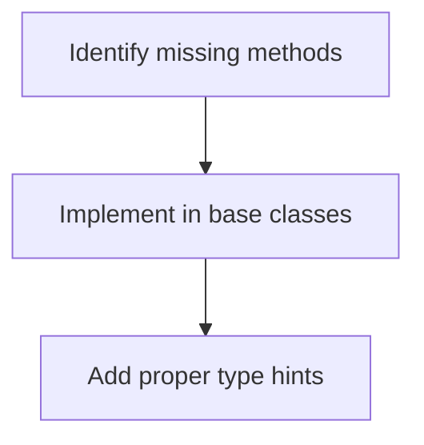

# PyRC Pylance Error Fix Plan

## Overview

This document outlines the systematic approach to resolve the ~400 Pylance errors across the codebase.

## Error Categories

1. **Async/Await Issues (45%)**

   - Missing await for async function calls
   - Mostly in command handlers and event dispatchers

2. **Type System Problems (30%)**

   - Color attribute type mismatches
   - Missing method type hints
   - Inconsistent return types

3. **Missing Attributes (15%)**

   - Undefined methods like get_enabled_caps
   - Accessing non-existent properties

4. **Index Issues (10%)**
   - Incorrect async result handling
   - Missing **getitem** implementations

## Implementation Strategy

### Phase 1: Async Foundation (2 days)

### Phase 2: Type System Overhaul (3 days)

### Phase 3: Attribute Cleanup (1 day)

### Phase 4: Final Testing (1 day)

- Unit test coverage
- Integration testing
- Manual verification

## Risk Mitigation

- Implement in small batches
- Maintain backward compatibility
- Document all changes

## Suggested Order

1. server_command.py (most critical)
2. membership_handlers.py
3. script_api_handler.py
4. All other command files
