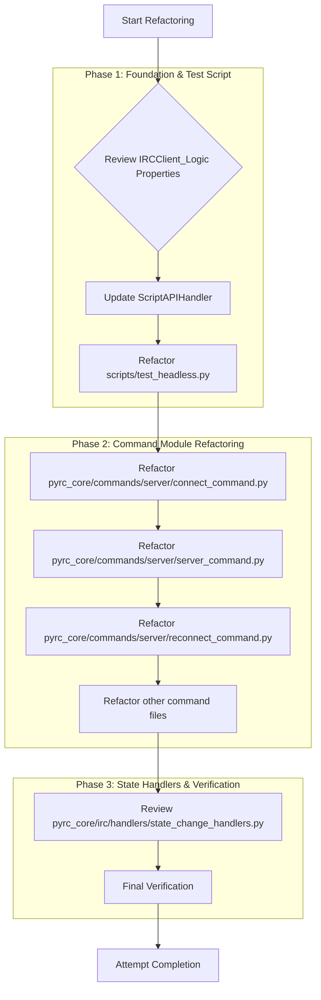

# Refactoring Plan: Enforce StateManager as Single Source of Truth

This document outlines the plan to refactor the PyRC client to strictly use `StateManager` for all runtime state, eliminating direct access to state-like attributes on the `IRCClient_Logic` instance and replacing them with properties that delegate to `StateManager`.

## Overview



## Detailed Plan

### Phase 1: Foundation & Test Script

1.  **Review `IRCClient_Logic` Properties:**

    - **Action:** Confirm that `nick`, `server`, `port`, and `use_ssl` in `pyrc_core/client/irc_client_logic.py` are already implemented as `@property` methods that delegate to `self.state_manager.get_connection_info()`. (This step is already confirmed as complete based on initial review).
    - **Rationale:** Ensures that direct attribute access on the `IRCClient_Logic` instance for these stateful attributes is funneled through `StateManager`.

2.  **Update `ScriptAPIHandler`:**

    - **File:** `pyrc_core/scripting/script_api_handler.py`
    - **Action:** Add a new method `get_connection_state()` to `ScriptAPIHandler` that retrieves the connection state from `client_logic.state_manager` and returns its name as a string.
      ```python
      # In ScriptAPIHandler:
      def get_connection_state(self) -> Optional[str]:
          """Returns the current connection state as a string (e.g., 'DISCONNECTED', 'REGISTERED')."""
          state_enum = self.client_logic.state_manager.get_connection_state()
          return state_enum.name if state_enum else None
      ```
    - **Rationale:** This provides the necessary API for scripts to query connection state without directly accessing `StateManager`.

3.  **Refactor `scripts/test_headless.py`:**
    - **File:** `scripts/test_headless.py`
    - **Action 1:** In `run_connection_test`, replace direct access to `client_logic.state_manager.get_connection_state()` with `self.api.get_connection_state()`.
      ```python
      # In test_headless.py, run_connection_test:
      current_state_name = self.api.get_connection_state()
      is_connected_state = current_state_name in ["CONNECTED", "REGISTERED", "READY"]
      ```
    - **Action 2:** In `run_channel_join_test`, replace direct access to `client_logic.context_manager` for join status with `self.api.get_context_info()`.
      ```python
      # In test_headless.py, run_channel_join_test:
      ctx_info = self.api.get_context_info(normalized_test_channel)
      ctx_status = ctx_info.get('join_status', 'N/A') if ctx_info else 'N/A'
      ```
    - **Rationale:** Ensures test scripts adhere to the `ScriptAPIHandler` interface for state access, promoting decoupling.

### Phase 2: Command Module Refactoring

1.  **Refactor `pyrc_core/commands/server/connect_command.py`:**

    - **File:** `pyrc_core/commands/server/connect_command.py`
    - **Action 1:** Remove direct assignments to `client.server`, `client.port`, `client.use_ssl` (lines 82-84).
    - **Action 2:** Modify `handle_connect_command` to create a `ConnectionInfo` object with the `new_server_host`, `new_port`, and `new_ssl` values, and then set this `ConnectionInfo` object in the `StateManager` using `client.state_manager.set_connection_info()`.
    - **Action 3:** Update `client.add_message` and `logger.info` calls to use the new properties `client.server`, `client.port`, `client.use_ssl` (which now delegate to `StateManager`).
    - **Rationale:** Centralizes connection parameter updates through `StateManager`, maintaining the single source of truth.

2.  **Refactor `pyrc_core/commands/server/server_command.py`:**

    - **File:** `pyrc_core/commands/server/server_command.py`
    - **Action:** Ensure that `_proceed_with_new_server_connection` exclusively uses `client._configure_from_server_config` to set connection information, rather than direct `client` attribute assignments. (I will double-check for any lingering direct assignments).
    - **Rationale:** Reinforces the use of the dedicated helper method for server configuration, ensuring state is managed via `StateManager`.

3.  **Refactor `pyrc_core/commands/server/reconnect_command.py`:**

    - **File:** `pyrc_core/commands/server/reconnect_command.py`
    - **Action:** Replace direct accesses to `client.server`, `client.port`, `client.use_ssl` with the new properties (e.g., `client.server`, `client.port`, `client.use_ssl`).
    - **Rationale:** Ensures consistency in accessing connection information through the `StateManager`-backed properties.

4.  **Refactor other command files:**
    - **Files:** `pyrc_core/commands/user/msg_command.py`, `pyrc_core/commands/ui/close_command.py`, `pyrc_core/commands/server/quit_command.py`, `pyrc_core/commands/channel/part_command.py`.
    - **Action:** Replace any direct accesses to `client.nick`, `client.server` with the new properties (e.g., `client.nick`, `client.server`).
    - **Rationale:** Ensures all command modules consistently retrieve state information via the `StateManager`-backed properties.

### Phase 3: State Handlers & Verification

1.  **Review `pyrc_core/irc/handlers/state_change_handlers.py`:**

    - **File:** `pyrc_core/irc/handlers/state_change_handlers.py`
    - **Action:** Confirm that `handle_nick_message` correctly modifies the `ConnectionInfo` object retrieved from `state_manager` and then calls `client.state_manager.set("connection_info", conn_info)`. (This was already confirmed in the initial review of the file).
    - **Rationale:** Verifies adherence to the correct pattern for modifying state through `StateManager`.

2.  **Final Verification:**
    - **Action:** After all modifications, I will perform a final search across the relevant directories (`pyrc_core/client/`, `pyrc_core/commands/`, `pyrc_core/irc/handlers/`, `scripts/`) for any remaining direct accesses to `client.nick`, `client.server`, `client.port`, `client.use_ssl` that are not through the new properties or the `ScriptAPIHandler`.
    - **Rationale:** Ensures comprehensive refactoring and eliminates all direct attribute access.
