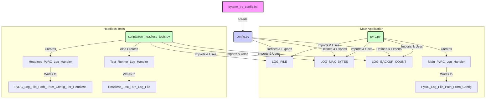

# Detailed Plan for Refactoring PyRC (Logging & Configuration)

**Approved:** 2025-06-04

**Overall Goal:** Ensure `config.py` (and by extension, `pyterm_irc_config.ini`) is the Single Source of Truth for all user-configurable settings, especially for logging. Other modules should read configuration from `config.py` rather than defining their own defaults or hardcoding values for shared settings.

---

**I. Logging Configuration Centralization**

1.  **Modify `scripts/run_headless_tests.py` - `setup_logging()` function:**

    - **Import necessary config variables:**
      - Add `from config import LOG_FILE as PYRC_CORE_LOG_FILE_CONFIG, LOG_MAX_BYTES, LOG_BACKUP_COUNT` at the top of the file.
    - **Update `pyrc_log_file` path:**
      - Change the line that defines `pyrc_log_file` (e.g., `pyrc_log_file = log_dir / "pyrc.log"`)
      - To: `pyrc_log_file = log_dir / PYRC_CORE_LOG_FILE_CONFIG` (using the imported variable).
    - **Update `fh_pyrc` (File Handler for "pyrc" logger) parameters:**
      - Modify the instantiation of `logging.handlers.RotatingFileHandler` for `fh_pyrc`.
      - Change `maxBytes` parameter to use `LOG_MAX_BYTES` (imported from `config.py`).
      - Change `backupCount` parameter to use `LOG_BACKUP_COUNT` (imported from `config.py`).
    - **Update `fh_headless` (File Handler for "pyrc.test.runner" logger) parameters (for consistency):**
      - Modify the instantiation of `logging.handlers.RotatingFileHandler` for `fh_headless`.
      - Change `maxBytes` parameter to use `LOG_MAX_BYTES` (imported from `config.py`).
      - Change `backupCount` parameter to use `LOG_BACKUP_COUNT` (imported from `config.py`).
    - **Verify logging message:**
      - Ensure the log message (e.g., `pyrc_logger.info(f"Main PyRC logging (from headless test) to: {pyrc_log_file}")`) correctly reflects the new path derived from the config.

2.  **Verify `pyrc.py` - `setup_logging()` function:**

    - This function already correctly uses `LOG_FILE`, `LOG_MAX_BYTES`, `LOG_BACKUP_COUNT`, etc., from `config.py`. No changes are anticipated here.

3.  **Verify Channel Logging (`irc_client_logic.py`):**

    - `get_channel_logger()` in `irc_client_logic.py` correctly derives log file names programmatically and places them in `logs/` based on `BASE_DIR` from `config.py`. No changes are anticipated here.

4.  **General Logging Review (Conceptual):**
    - Based on file searches, no other obvious instances of Python files adding handlers to `logging.getLogger("pyrc")` or the root logger with hardcoded file paths for general application logging were found. The primary case was `scripts/run_headless_tests.py`.

---

**II. Configuration Value Usage Consistency**

1.  **Identify Hardcoded Configurable Values:**

    - File searches did not reveal significant instances of hardcoded default values (those with `DEFAULT_` counterparts in `config.py`) in other modules that need to be replaced by reads from `app_config` (which is `import config as app_config`).
    - Values found (e.g., in test script argument parsing or internal flags) are generally appropriate for their local context and do not represent user-configurable global defaults being overridden.

2.  **Refactor to Use `config.py`:**
    - No specific refactoring actions identified under this point beyond the logging changes in `scripts/run_headless_tests.py`.

---

**III. `ai_api_test_script.py` (Verification)**

- `scripts/ai_api_test_script.py` correctly imports and uses `HEADLESS_MAX_HISTORY` from `config.py` for its `_test_history_limit` function. The local constant `TEST_HISTORY_MESSAGES_COUNT` is for controlling how many messages the test itself sends, which is distinct and appropriate. This is consistent with the goal.

---

**IV. `irc_client_logic.py` (Verification)**

- `trigger_manager` is correctly initialized (or set to `None`) based on `ENABLE_TRIGGER_SYSTEM` from `config.py`.
- `process_trigger_event()` correctly guards access to `trigger_manager`.
- `handle_channel_fully_joined()` correctly dispatches the `CHANNEL_FULLY_JOINED` event.
  These aspects remain correct.

---

**Mermaid Diagram (Illustrating Logging Configuration Flow):**

This diagram shows that both the main application (`pyrc.py`) and the headless tests (`scripts/run_headless_tests.py`) will source their core "pyrc" logger's file name and rotation parameters from `config.py`, which in turn reads from `pyterm_irc_config.ini`. The test runner's specific log (`headless_test_run.log`) will also (as per the approved plan) use the same rotation parameters from config.

---
