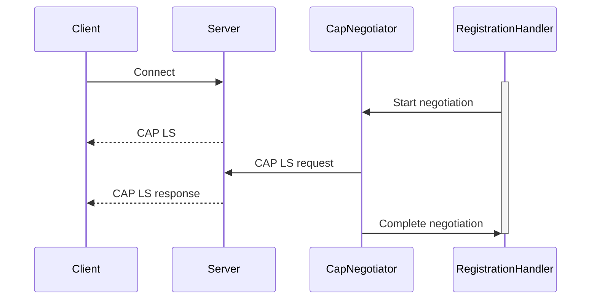

# CAP Negotiation and Pylance Error Documentation

## Current Issues

### 1. CAP Negotiation Problem

- **Symptoms**:
  - Server sends CAP LS but negotiation isn't pending (`Received CAP LS but negotiation is not pending. Ignoring`)
  - Occurs during initial connection handshake
- **Root Cause**:
  - Timing/state synchronization issue between connection and CAP initiation
- **Affected Files**:
  - `pyrc_core/irc/cap_negotiator.py`
  - `pyrc_core/irc/registration_handler.py`

### 2. Pylance Errors in who_command.py

- **Error Types**:
  - Unused coroutines
  - Type mismatches in message color parameters
- **Affected Files**:
  - `pyrc_core/commands/information/who_command.py`
  - Related message handling components

## Proposed Solutions

### CAP Negotiation Fix

### Pylance Error Resolution

1. Add proper await handling
2. Standardize color parameter types
3. Document expected message formats

## Next Steps

1. Implement CAP negotiation fixes
2. Resolve Pylance type errors
3. Test connection stability
4. Verify message handling consistency
